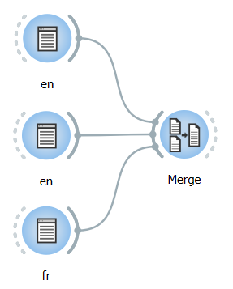

.. meta::
   :description: Orange Textable documentation, annotating by merging
   :keywords: Orange, Textable, documentation, annotation, merging

Annotating by merging
=====================

Widget
:doc:`Merge <merge>`
makes it possible to convert the labels of its input segmentations into
annotation values. Suppose that three instances of :doc:`Text Field <text_field>`
have been created: two instances containing a text in English, and one
containing a text in French. We might want to merge these three
segmentations into a single one, where each segment would be associated
with an annotation whose key is *language* and whose value is either
*en* or *fr*. The first step would then be to rename each :doc:`Text Field <text_field>`
instance with the desired annotation value for this text, as shown on
:ref:`figure 1 <annotating_merging_fig1>`
below.

.. _annotating_merging_fig1:

    Figure 1: Specifying annotations values using the label of :doc:`Text Field <text_field>` instances.

The three instances of :doc:`Text Field <text_field>`
should then be connected to an instance of
:doc:`Merge <merge>`
as shown on :ref:`figure 2 <annotating_merging_fig2>`
below.

.. _annotating_merging_fig2:

Figure 2: Example workflow for creating annotations with
:doc:`Merge <merge>`.

One must still specify, in the interface of
:doc:`Merge <merge>`,
the annotation key to which values *en* and *fr* should be associated.
This can be done by entering the string *language* in field **Import
labels with key**, having previously ensured that labels would actually
be converted into annotation values by checking the box at the left of
this line (see :ref:`figure 3 <annotating_merging_fig3>` below).

We also have the option to give a distinct, numeric annotation value to
each segment; to that effect, check the **Auto-number with key** box. A
sensible key for this annotation might be e.g. *num*.

.. _annotating_merging_fig3:

    Figure 3: Importing labels as annotation values with :doc:`Merge <merge>`.

The result of these operations can be viewed using an instance of
:doc:`Display <display>`,
whose output is shown on :ref:`figure 4 <annotating_merging_fig4>` below. For each segment in the merged
segmentation, an annotation value *en* or *fr* associated with key
*language* is displayed above the segment’s content, as well as a numeric
annotation with key *num*:

.. _annotating_merging_fig4:

    Figure 4: Annotations created with :doc:`Merge <merge>`.

2.1. See also
-----------------

- :doc:`Reference: Merge widget <merge>`