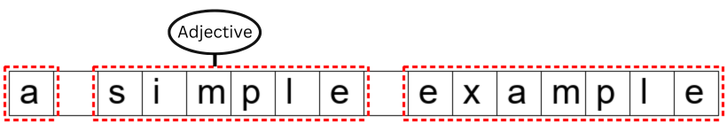
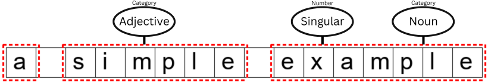

.. meta::
   :description: Orange Textable documentation, uses of annotating segments
   :keywords: Orange, Textable, documentation, annotation

The uses of annotating segments
===============================

In Orange Textable, an *annotation* is a piece of information attached
to a segment. Annotations consist of two parts : *key* and *value*. For
instance, in the now classical case of the word segmentation of *a
simple example*, segment *simple* could be associated with the
annotation *{category : adjective}*; this annotation’s key is
*category* and its value is *adjective* .

.. _annotating_uses_fig1:

    Figure 1 : Annotating *simple* as an adjective.

A segment can have zero, one, or several annotations attached to it. The
same segment could be simultaneously associated with another annotation
such as *{word type : lexical}* , or any *{key : value}* pair deemed
relevant.

.. _annotating_uses_fig2:

    Figure 2 : Segments with various annotations

Note that annotation keys are unique : Since they serve to recognize
various annotation values attached to a single segment, annotation keys
cannot be duplicated within the segment. On :ref:`figure 2 <annotating_uses_fig2>` above, *simple* can
only have one value at a time for key *category*.

Even though they have been ignored so far in this tutorial, annotations
play a fundamental role in text data processing and analysis. They make
it possible to go beyond the basic level of forms that are “physically”
present in a text and tap into the interpretation of these forms–which
is often more interesting.

For instance, the texts composing a given corpus could be annotated with
respect to their genre (*novel*, *short story*, and so on), and the
parts of these texts might be annotated with regard to their discourse
type (*narrative*, *description*, *dialogue*, and so on). Such data
could be exploited to study the distribution of discourse types as a
function of genre, which would be at best extremely difficult, if ever
possible, without having encoded the relevant information by means of
annotations.

Whenever Textable widgets manipulate text contents, they can manipulate
annotations instead: you can search for segments attached to specific
annotations, count annotations, merge data based on their annotations,
etc.

There are several ways of creating annotations in Orange Textable. In
the following section, we will see a simple method based on the
:doc:`Merge <merge>`
widget. Later on in the :doc:`Tables <tables>` section, we will discover various ways of
exploiting such annotations.