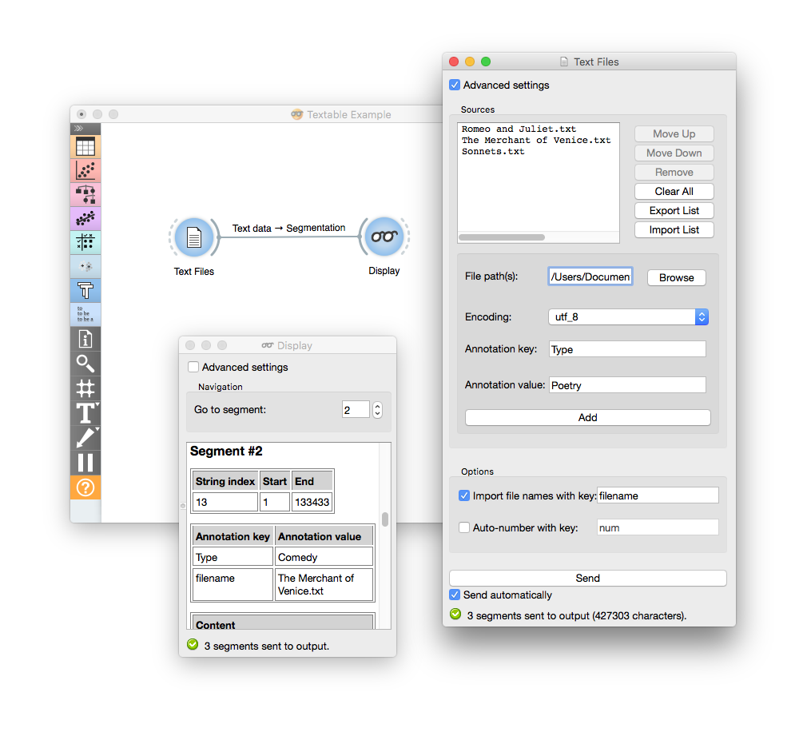

Text Files
==========

.. figure:: icons/textfiles.png

Import data from raw text files.

Signals
-------

**Inputs**:

-  Message

JSON Message controlling the list of imported text files

**Outputs**:

-  Text data

Segmentation covering the content of imported text files

Description
-----------

This widget is designed to import the contents of one or several text files. It outputs a segmentation containing a (potentially annotated) segment for each imported file. The imported textual content is normalized in several ways: converted to Unicode, subjected to canonical Unicode-recomposition `technique <http://unicode.org/reports/tr15>`_, stripped from the utf8 byte-order `mark <https://en.wikipedia.org/wiki/Byte_order_mark#UTF-8>`_ and various forms of line endings (in particular \r\n and \r) are converted to a single form (namely \n). The widget is available in two versions, according to whether or not the *Advanced Settings* checkbox is selected.

The basic interface
-------------------

The basic interface of the widget enables the input of a single file. 

.. figure:: images/textfiles-basic-stamped.png

1. Select a file. The selected file later appears in the *File Path* text field. 

2. Specify the encoding of the file by using the `encoding <https://en.wikipedia.org/wiki/Character_encoding>`_ drop-down menu.

3. By clicking *Send*, changes are communicated to the output of the widget. Alternatively, tick *Send automatically* and changes will be communicated to the widget's output at every modification. 

4. Information about the output:  the number of characters in a single segment contained in the output segmentation, or the reasons why no segmentation is emitted (no input data, encoding issue, etc.).

The advanced interface
----------------------

The advanced interface of the widget enables the import of several files in a determined order. The user can decide to annotate and encode each file accordingly. 

.. figure:: images/textfiles-advanced-stamped.png

1. Select the input files as well as their encoding, determine the order in which they appear in the output segmentation, and (optionally) assign annotations. The list of imported files with additional information about the corresponding annotations and encodings appears at the top of the window. 

2. Modify the selection of sources by:

	a) changing the order in which the files appear in the output: *Move Up*, *Move Down*
	b) deleting individual files from the list: *Remove*
	c) clearing the list of all files: *Clear All*
	d) import a file list in JSON format and add it to the previously selected sources: *Import List*
	e) export the source list in a JSON file: *Export List*

3. The *Browse* button opens a selection dialog. After having selected one or more files in this dialog and validated the choice by clicking on *Open*, the files appear in the *File path(s)* field and can be added to the list by clicking on the *Add* button. It is also possible to type the complete paths of the files directly in the text field, separating the paths corresponding to the successive files with the string ” ” (space + slash + space).

4. Select the *Encoding*.

5. Assign an annotation by specifying its key in the *Annotation key* field and the corresponding value in the *Annotation value field. 

6. Specify the label affected to the output segmentation. The *Import filenames with key* checkbox enables the program to create for each imported file an annotation whose value is the file name (as displayed in the list) and whose key is specified by the user in the text field on the right of the checkbox. Similarly, the button *Auto-number with key* enables the program to automatically number the imported files and to associate the number to the annotation key specified in the text field on the right.

7. By clicking *Send* changes are communicated to the output of the widget. Alternatively, tick *Send automatically* and changes will be communicated to the output at every modification. 

8. Information about the number of segments in the output segmentation or the reasons why no segmentation is emitted.

Example
-------

For the purpose of this example, we have decided to make use of the advanced interface and explore the additional options offered by it. 
We opened the **Text Files** widget and selected the advanced settings option. We imported several text files and annotated them. We got our data from the `Project Gutenberg <https://www.gutenberg.org/>`_ website and chose to focus on annotating Shakespeare's works by genre. We selected `Romeo and Juliet <https://www.gutenberg.org/ebooks/1112>`_, `The Merchant of Venice <https://www.gutenberg.org/ebooks/2243>`_ and Shakespeare's `Sonnets <https://www.gutenberg.org/ebooks/1041>`_ and annotated them according to type (tragedy, comedy, poetry). We then displayed our results in the **Display** widget. 

