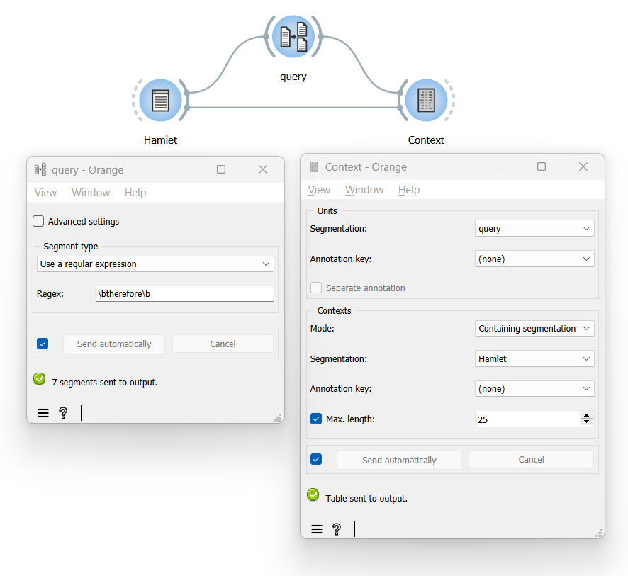

Build a concordance (aka “keyword in context”)
==================================================

Goal
--------

Build a concordance to examine the context of occurrence of a given
query string.

Prerequisites
-----------------

Some text has been imported in Orange Textable (see :doc:`Cookbook: Text input <text_input>`)
and possibly further processed (see :doc:`Cookbook: Segmentation manipulation <segmentation_manipulation>`).

Ingredients
---------------

 ==============   =================================  =================================
   **Widget**      :doc:`Segment <segment>`           :doc:`Context <context>`
   **Icon**        |segment_icon|                     |context_icon|
   **Quantity**    1                                  1
 ==============   =================================  =================================

.. |segment_icon| image:: figures/Segment_36.png
.. |context_icon| image:: figures/Context_36.png

Procedure
-------------

.. _build_concordance_fig1:

   Figure 1: Widgets used build a concordance and their interfaces

1.  Create an instance of
    :doc:`Segment <segment>`
    and an instance of
    :doc:`Context <context>`.

2.  Drag and drop from the output (righthand side) of the widget that
    emits the segmentation in which occurrences of the query string will
    be retrieved, here :doc:`Text Field <text_field>`
    (*Hamlet*), to the input of
    :doc:`Segment <segment>`
    (lefthand side).

3.  Also connect both the :doc:`Text Field <text_field>`
    and the
    :doc:`Segment <segment>`
    to
    :doc:`Context <context>`
    (thus forming a triangle).

4.  Double-click on the icon of
    :doc:`Segment <segment>`
    to open its interface and type the query string in the **Regex**
    field (here: ``\btherefore\b``); assign this instance of
    :doc:`Segment <segment>`
    a recognizable name, such as *query*.

5.  Click the **Send** button or tick the **Send automatically**
    checkbox.

6.  Double-click on the icon of
    :doc:`Context <context>`
    to open its interface.

7.  In the **Units** section, select the segmentation that contains the
    occurrences of the query string (here: *query*) using the
    **Segmentation** drop-down menu.

8.  In the **Contexts** section, choose **Mode: Containing
    segmentation** and select the segmentation that contains the
    original text (here: *Hamlet*) using the **Segmentation** drop-down
    menu.

9.  Tick the **Max. length** checkbox and set the maximum number of
    characters that should be displayed on either side of each
    occurrence of the query string.

10. Click the **Send** button or tick the **Send automatically**
    checkbox.

11. A table showing the results is then available at the output of
    :doc:`Context <context>`;
    to display or export it, see :doc:`Cookbook: Table output <table_output>`.

Comment
----------

-  In the **Regex** field of the
   :doc:`Segment <segment>`
   widget you can use all the syntax of Python’s regular expression
   (*cf.* :doc:`Regular expressions <note_regular_expressions>`); for instance, if you wish to restrict
   your search to entire words, you might frame the query string with
   word boundary anchors ``\b`` (in our example ``\btherefore\b``).

See also
------------

-  :doc:`Reference: Segment widget <segment>`
-  :doc:`Reference: Context widget <context>`
-  :doc:`Cookbook: Text input <text_input>`
-  :doc:`Cookbook: Segmentation manipulation <segmentation_manipulation>`
-  :doc:`Cookbook: Table output <table_output>`
