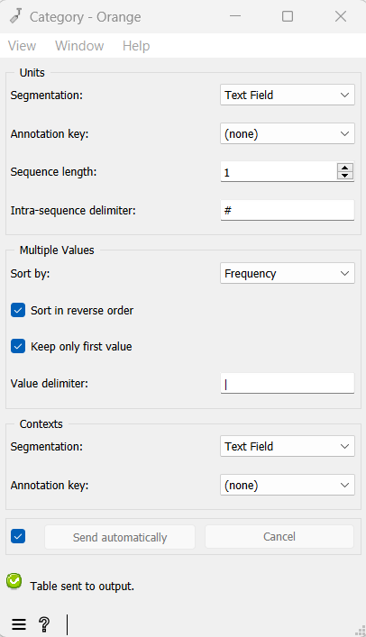

.. meta::
   :description: Orange Textable documentation, Category widget
   :keywords: Orange, Textable, documentation, Category, widget

.. _Category:

Category
========

Build a table with categories defined by segments' content or annotations.

Signals
-------

Inputs:

* ``Segmentation`` (multiple)

  Segmentation whose segments constitute the basis for category extraction.
  

Outputs:

* ``Textable table``

  Table displaying the extracted categories

  
Description
-----------

This widget inputs one or several segmentations and outputs a tabulated
representation of *categories* associated to the segments of one of them;
categories are typically defined on the basis of their annotation values of
segments for a given annotation key, but may also be defined on the basis of
the content of segments.

Typically, tables produced by the **Category** widget are destined to be
merged (by means of the built-in **Merge Data** widget of Orange Canvas) with
quantitative tables produced by widgets :ref:`Count`, :ref:`Length`, or
:ref:`Variety`, in order to associate with each row the piece of categorical
information required to train a text classifier (i.e. a system able to
automatically predict the membership of a text to a category based on the
quantitative profile associated with it). Here is an example of a table with
this structure, where the second column would have been constructed by an
instance of **Category**, and the columns to its right by an instance of
:ref:`Count`:

.. csv-table::
    :header: *__context__*, *__category__*, *noun*, *verb*, ...
    :stub-columns: 1
    :widths: 4 4 2 2 1

    *text1*,    *news*,     35,     12,     ...
    *text2*,    *news*,     20,     8,      ...
    *text3*,    *poetry*,   27,     18,     ...
    ...,        ...,        ...,    ...,    ...

The tables produced by this widget only contain two columns. The first
(header *__context__*) contains the headers corresponding to the 
contexts -- which are essentially defined in the same way as with the
**Containing segmentation** mode of widgets :ref:`Count`, :ref:`Length`, and
:ref:`Variety`: by the segment types appearing in a segmentation. The second
column (header *__category__*) contains the annotation(s) associated
with each segment type.

To take a simple example, consider two segmentations of the string *a simple
example* [#]_:

A) label = *words*

===========  =======  =====  ==================  =================
 content      start    end    *part of speech*    *word category*
===========  =======  =====  ==================  =================
 *a*          1        1      *article*           *grammatical*
 *simple*     3        8      *adjective*         *lexical*
 *example*    10       16     *noun*              *lexical*
===========  =======  =====  ==================  =================

B) label = *letters* (extract)

=========  =======  =====  ===================
 content    start    end    *letter category*
=========  =======  =====  ===================
 *a*        1        1      *vowel*
 *s*        3        3      *consonant*
 *i*        4        4      *vowel*
 ...        ...      ...    ...
 *e*        16       16     *vowel*
=========  =======  =====  ===================

Based on the latter segmentation, we can produce the following table, giving
the annotation value associated with the key *letter category* for each
distinct letter:

.. csv-table::
    :header: *__context__*, *__category__*
    :stub-columns: 1
    :widths: 8 9
    
    *a*,  *vowel*
    *s*,  *consonant*
    *i*,  *vowel*
    *m*,  *consonant*
    *p*,  *consonant*
    *l*,  *consonant*
    *e*,  *vowel*
    *x*,  *consonant*

In this illustration, each letter is only associated to a single category. In
a more general case, the contexts can be associated to several categories;
for example, if the contexts are defined based on the *word category*
annotation of the *words* segmentation and the extracted categories are
defined as the segment contents of the *letters* segmentation:

.. csv-table::
    :header: *__context__*,  *__category__*
    :stub-columns: 1
    :widths: 8 9
    
    *grammatical*,  *a*
    *lexical*,      *e-m-l-p-a-i-s-x*

In this case, the user will have to choose (a) the order (frequential or 
ASCII-betical) in which the multiple values will be sorted and (b) whether
they should all be shown or only the first (in the selected order).

The widget interface (see :ref:`figure 1 <category_fig1>`) has three
separate sections, for unit specification (**Units**), for multiple values
processing specification (**Multiple Values**), and for context specification
(**Contexts**).

In the **Units** section, the **Segmentation** drop-down menu allows the user
to select among the input segmentations the one whose segments will be
examined to determine the categories. The **Annotation key** menu shows the
possible annotation keys associated to the chosen segmentation; if one of
these keys is selected, the corresponding annotation values will be used; if
on the other hand the value *(none)* is selected, the *content* of the
segments will be used. The **Sequence length** drop-down menu allows the user
to indicate if the widget should consider the isolated segments or the
*n--grams* of segments. In this latter case, the (optional) string specified
in the **Intra-sequence delimiter** text field will be used to separate the
content or the annotation value corresponding to each individual segment.

.. _category_fig1:

    Figure 1: Interface of the **Category** widget.
    
In the **Multiple Values** section, the **Sort by** drop-down menu allows the
user to select the sorting criteria of multiple values, namely either the
frequency (**Frequency**) or the ASCII order (**ASCII**). The **Sort in
reverse order** checkbox reverses the sorting order, and the **Keep only first
value** checkbox allows the program to retain only the first value (in the
selected order). The **Value delimiter** field is used to indicate the
character string to insert in-between multiple values.

Unlike other table contruction widgets , here the context specification can
only be done in relation to a segmentation containing the unit segmentation
(thus the equivalent of the **Containing segmentation** mode of widgets
:ref:`Count`, :ref:`Length`, and :ref:`Variety`:). This segmentation is
selected among the input segmentation by means of the **Segmentation**
drop-down menu. The **Annotation key** menu shows the possible annotation
keys associated to the selected segmentation; if one of these keys is
selected, the corresponding annotation values will will constitute the row
headers; if on the other hand the value *(none)* is selected, the *content* of
the segments will be used.

The **Send** button triggers the emission of a table in the internal format
of Orange Textable, to the output connection(s). When it is selected, the
**Send automatically** checkbox disables the button and the widget attempts
to automatically emit a segmentation at every modification of its interface or
when its input data are modified (by deletion or addition of a connection, or
because modified data is received through an existing connection).

The informations generated below the **Send** button indicate if a table has been correctly emitted, or the
reasons why no table is emitted (no input data, typically).

Messages
--------

Information
~~~~~~~~~~~

*Data correctly sent to output.*
    This confirms that the widget has operated properly.

*Settings were* (or *Input has*) *changed, please click 'Send' when ready.*
    Settings and/or input have changed but the **Send automatically** 
    checkbox has not been selected, so the user is prompted to click the 
    **Send** button (or equivalently check the box) in order for computation 
    and data emission to proceed.

*No data sent to output yet: no input segmentation.*
    The widget instance is not able to emit data to output because it receives
    none on its input channel(s).

*No data sent to output yet, see 'Widget state' below.*
    A problem with the instance's parameters and/or input data prevents it
    from operating properly, and additional diagnostic information can be
    found in the **Widget state** box at the bottom of the instance's
    interface (see `Warnings`_ below).

Warnings
~~~~~~~~

*Resulting table is empty.*
    No table has been emitted because the widget instance couldn't find a
    single element in its input segmentation(s). A likely cause for this 
    problem (when using the **Containing segmentation** mode) is that the unit
    and context segmentations do not refer to the same strings, so that the 
    units are in effect *not* contained in the contexts. This is typically a
    consequence of the improper use of widgets :ref:`Preprocess` and/or
    :ref:`Recode` (see :ref:`anchor_to_caveat`).
        
Footnotes
---------

.. [#] By convention, we do not indicate here the string index associated with
       each segment but only its start and end positions, along with the
       various annotation values associated with it; moreover, for the sake of
       readability, we do indicate the content of each segment, though it is
       not formally part of the segmentation (but rather of the string to
       which the segmentation refers).

