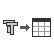
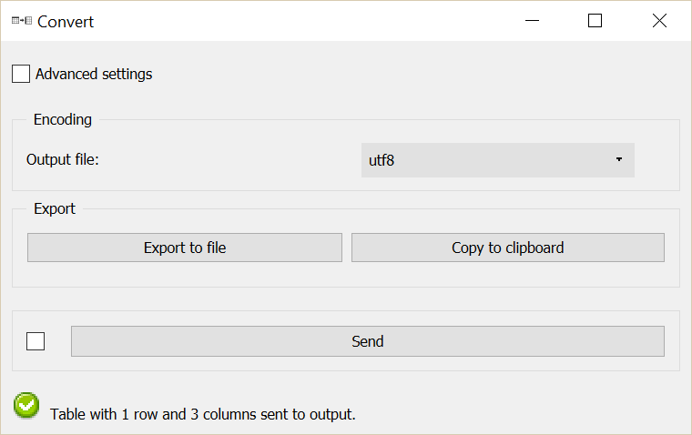
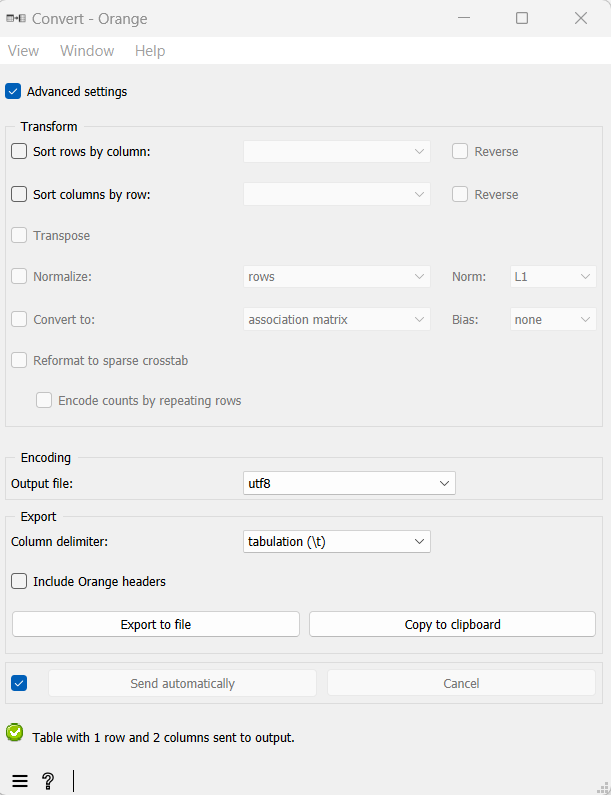

.. meta::
   :description: Orange Textable documentation, Convert widget
   :keywords: Orange, Textable, documentation, Convert, widget

.. _Convert:

Convert
=======

Convert, transform, or export Orange Textable tables

Signals
-------

Inputs:

* ``Textable Table``

  Table in the internal format of Orange Textable.

Outputs:

* ``Orange Table`` (default)

  Data in the standard *Table* format of Orange Canvas (possibly transformed).

* ``Textable Table``

  Table in the internal format of Orange Textable (possibly transformed).

* ``Segmentation``

  Segmentation containing the output table in tab-delimited format.

Description
-----------

**Convert**, inputs data in the internal format of Orange Textable and enables
the user to modify them (sorting, normalization, etc.), to convert them to
other formats, in particular the standard *Table* format of Orange Canvas
(suitable for further processing within Orange Canvas), or to export them
in tab-delimited text format (either to a file or to the clipboard).

.. _anchor_to_table_formats:

Table formats
~~~~~~~~~~~~~

The table representation format of Orange Canvas (*Table* type) presents
compatibility issues with Unicode encoded data. Since this encoding is
emerging as the most widely used standard for languages of the world, Orange
Textable provides its own Unicode-friendly table representation format.

Widgets :ref:`Count`, :ref:`Length`, :ref:`Variety`, :ref:`Category`, and
:ref:`Context`) thus produce tables in Orange Textable format. In order to be
manipulated by the numerous tabulated data processing widgets offered by
Orange Canvas, these data must be converted to the standard *Table* format of
Orange Canvas (and to an encoding supported by this latter format).

Note that the internal Orange Textable *Table* type subdivides in several
subtypes. In particular, the contingency tables (see :ref:`Count` widget)
belong to the *Crosstab* subtype which itself subdivides in *PivotCrosstab*,
*FlatCrosstab*, and *WeightedFlatCrosstab*. These three subtypes are
equivalent with regard to the information they allow the user to store, and
the easiest way to understand what differentiates them is to see an example.

Consider the following contingency table, of *IntPivotCrosstab* [#]_ type
(such as produced by the :ref:`Count` widget):

.. csv-table::
    :header: *__context__*, *unit1*, *unit2*
    :stub-columns: 1
    :widths: 3 2 2

    *context1*,  1,    3
    *context2*,  2,    1

Here is the same information converted in *FlatCrosstab* format:

.. csv-table::
    :header: *__id__*, *__unit__*, *__context__*
    :stub-columns: 1
    :widths: 2 3 3

    1,  *unit1*,  *context1*
    2,  *unit2*,  *context1*
    3,  *unit2*,  *context1*
    4,  *unit2*,  *context1*
    5,  *unit1*,  *context2*
    6,  *unit1*,  *context2*
    7,  *unit2*,  *context2*

This representation contains three columns carrying the headers *__id__*, 
*__unit__* and *__context__*, and a number of rows equal to the total count of
the contingency table. It is the standard way of encoding a contingency table 
in Orange Canvas, and it is required by widgets such as *Correspondence 
Analysis* (after conversion to the *Table* type defined by Orange Canvas).

The *WeightedFlatCrosstab* format produces a more compact representation by 
keeping only one copy of each distinct unit--context pair and by adding a
column *__count__* to save information on the number of repetition of each
pair: 

.. csv-table::
    :header: *__id__*, *__unit__*, *__context__*, *__weight__*
    :stub-columns: 1
    :widths: 2 3 3 3

    1,  *unit1*,  *context1*,  1
    2,  *unit2*,  *context1*,  3
    3,  *unit1*,  *context2*,  2
    4,  *unit2*,  *context2*,  1

This format is sometimes used to represent contingency tables in third-party
data analysis software. It is often called "sparse" matrix format.
format.

Output channels
~~~~~~~~~~~~~~~

Regardless of the selected output table format (or the transforms that have
been applied to the data, see `Advanced interface`_ below), the **Convert**
widget emits data on three distinct output channels:

* The default output channel (*Orange Table*) emits data converted to
  standard *Table* format of Orange Canvas; it will typically be used for
  passing them to built-in Orange Canvas table processing widgets.

* The *Textable Table* channel outputs a table in the internal format of
  Orange Textable (usually after applying some set of transforms); it can then
  be sent to another instance of **Convert** (in cases where it is useful to
  apply transforms in distinct steps) or to an instance of the built-in
  **Python script** widget of Orange Canvas, for accessing the content of the
  table in a programmatic fashion.

* The *Segmentation* channel emits a segmentation with a single segment
  enclosing a version of the (possibly transformed) table in tab-delimited
  text format (in utf-8 encoding), which is suitable for further textual
  processing using Orange Textable widgets such as :ref:`Recode` or
  :ref:`Segment` for instance.

Basic interface
~~~~~~~~~~~~~~~

The basic version of the widget (see :ref:`figure 1 <convert_fig1>` below) is
essentially limited to the **Encoding** section, which allows the user to
select an encoding for the output data. This can be done for the data possibly exported to a text
file in tab-delimited format (**Output File**). If certain characters cannot
be converted to the specified encoding (for example accentuated characters in
the ASCII encoding), they are automatically replaced by corresponding HTML
entities (for example *&#233*; for *é*).

.. _convert_fig1:

    Figure 1: **Convert** widget (basic interface).

The **Export** section allows the user to export a version of the
(possibly transformed) table in tab-delimited text format, either to a text
file (**Export to file**) or to the clipboard (**Copy to clipboard**), in
order to paste it to a spreadsheet opened in a third-party program for
instance. In the former case, the **Output file** drop-down menu (section
**Encoding**) is used to indicate which encoding the data should be converted
to before being saved; typically, except for a limit imposed by the further
processing planned for the saved data (for example by a specific data analysis
program), we will seek to keep here the maximum amount of information by
specifying either the original encoding of the data, or a more general
encoding (a variant of Unicode for example). Note that when the data are
copied to the clipboard, the utf-8 encoding is used by default (regardless of
what has been selected in the **Encoding** section).

Advanced interface
~~~~~~~~~~~~~~~~~~

The advanced version of the **Convert** widget (see :ref:`figure 2
<convert_fig2>` below) contains an additional section (**Transform**) allowing
the user to apply a number of standard modifications to the incoming table.
The different operations defined in this section are applied to input
data in the order in which they appear in the interface, top to bottom.
The modified data can then be emitted on output connections or exported
(either to a file or to the clipboard).

.. _convert_fig2:

    Figure 2: **Convert** widget (advanced interface).

The **Sort rows by column** checkbox triggers row sorting. If it is selected,
the column headers of the table appear in the drop-down menu directly on the
right and the user can thus select the column on the basis of which the rows
will be sorted. If the **Reverse** box on the right of the drop-down menu
is checked, rows will be sorted by *decreasing* value.

**Sort columns by row** controls in a similar way column sorting. It should be
noted in this case that the first column (containing row headers) will always
stay in the same position; the sorting only affects the following columns. To
sort the columns based on the header row, you must select the first option in
the **Sort columns by row** drop-down menu in the right. It will typically
contain a name predefined by Orange Textable but which does not appear in the
table (*__unit__* if it is a contingency table of *PivotCrosstab* type such as
produced by the :ref:`Count` widget, and the generic header *__col__* in 
every other case).

The **Transpose** checkbox allows the user to transpose the table, which 
means invert its rows and columns. This option is only available for
*PivotCrosstab* type contingency tables. 

The **Normalize** checkbox triggers the normalization of the table (in a
rather loose sense of the term); it is only applicable for *PivotCrosstab*
type contingency tables. If it is selected, the user can choose in the
drop-down menu directly on the right whether the normalization should be
applied by rows (**rows**) or by columns (**columns**); the **Norm** drop-down
menu allows the user to select the type of normalization, either **L1**
(division by the sum of the row/column) or **L2** (division by the root of the
sum of the squares of the row/column).

Three more operations (which are not usually classified as normalizations in
the strict sense of the term) can be selected in the drop-down menu, each of
which deactivates the **Norm** drop-down menu on the right:

* In **quotients** mode, the count stored in each cell of a contingency table
  (of *PivotCrosstab* type) is divided by the corresponding "theoretical"
  count under the hypothesis of independence between table rows and columns.
  This quotient is superior to 1 if the row and the column in question are in
  a mutual attraction relation, inferior to 1 in case of repulsion between the
  row and the column, finally equal to 1 if the row and column do not repulse
  nor attract each other particularly.

* In **TF--IDF** mode, the count stored in each cell of a contingency table
  (of *PivotCrosstab* type) is multiplied by the natural log of the ratio of
  the number of rows (i.e. contexts) having nonzero frequency for this column
  (i.e. unit) to the total number of rows.
  
* In **presence/absence** mode, counts greater than 1 are replaced by the
  value 1, so that the resulting table can contain only 0's and 1's.
  
The common property of all operations available in the **Normalize** drop-down
menu is that they preserve the original dimensions of the input contingency
table. On the contrary, the **Convert to** checkbox (only applicable for
*PivotCrosstab* type tables) allows the user to trigger the application of
transforms which actually modify the dimensionality of the table :

* In **document frequency** mode, a new contingency table is created, which
  giver, for each column (i.e. unit) the number of distinct rows (i.e.
  contexts) that have nonzero frequency (hence the resulting table contains
  a single row).
  
* In **association matrix** mode, a new symmetric table is constructed, where
  each cell gives a measure of the (Markov) associativity between a pair of
  columns (i.e. units) in the original contigency table: two columns are thus
  strongly associated if they have similar profiles of attraction/repulsion
  with rows (i.e. contexts). Selecting this mode activates the **Bias**
  drop-down menu on the right, which allows the user to select between three
  predefined ways of weighing the contributions of high versus low frequencies
  in this computation: **frequent** emphasizes strong associations between
  frequent units; **none** provides a balanced compromise between frequent and
  rare units; **rare** emphasizes strong associations between rare units (note
  that in this particular case, values greater than 1 express an attraction
  and values lesser than 1 a repulsion) [#]_.
  
It is worth mentioning that the **Normalize** and **Convert to** checkboxes
are mutually exclusive and deactivate one another.

Finally, the **Reformat to sparse crosstab** checkbox allows the user to
convert a contingency table from the *PivotCrosstab* format to the
*WeightedFlatCrosstab* or from *IntPivotCrosstab* to *IntWeightedFlatCrosstab*
(see the `Table formats`_ section above). In turn, data in
*IntWeightedFlatCrosstab* format can be converted to *FlatCrosstab* by further
selecting option **Encode counts by repeating rows**; the latter option is
only available when dealing with tables containing integer values.

Compared to its basic version (see `Basic interface`_ above), the advanced
version of the **Export** section offers two extra controls. The **Column
delimiter** drop-down menu allows the user to select the column separator that
will be inserted between cell values when exporting a table in text format;
possible choices are *tabulation (\t)*, *comma (,)*, and *semi-colon (;)*.
The **Output Orange headers** checkbox allows the user to indicate if the
output should include every header line of the format *.tab* specific to
Orange Canvas (**Output Orange headers**)--which is useful only for
re-importing the exported table using the built-in **File** widget of Orange
Canvas (and in fact often necessary in that case). Both parameters (**Column
delimiter** and **Output Orange headers** also apply to the data sent on the
*Segmentation* output channel)

The **Send** button triggers data emission to the output connection(s) (see
`Output channels`_ above). When it is selected, the **Send automatically**
checkbox disables the button and the widget attempts to automatically send
data at every modification of its interface or when its input data are
modified (by deletion or addition of a connection, or because modified data is
received through an existing connection).

The informations generated below the **Send** button indicate the number of lines and columns in the output
table, or the reasons why no table is emitted (no input data).

Messages
--------

Information
~~~~~~~~~~~

*Data correctly sent to output: table has <n> and <m> columns.*
    This confirms that the widget has operated properly.

*Settings were* (or *Input has*) *changed, please click 'Send' when ready.*
    Settings and/or input have changed but the **Send automatically** checkbox
    has not been selected, so the user is prompted to click the **Send**
    button (or equivalently check the box) in order for computation and data
    emission to proceed.

*No data sent to output yet: no input table.*
    The widget instance is not able to emit data to output because it receives
    none on its input channel(s).

See also
--------

* :doc:`Cookbook: Display table <display_table>`
* :doc:`Cookbook: Export table <export_table>`

Footnotes
---------

.. [#] *IntPivotCrosstab* is in turn a subtype of *PivotCrosstab* (and
       similarly *IntWeightedFlatCrosstab* is a subtype of
       *WeightedFlatCrosstab*), whose specificity is to be limited to integer
       values.
.. [#] For more details on the calculation of Markov associativities, see
       Bavaud F. and Xanthos A. (2005). Markov associativities. *Journal of
       Quantitative Linguistics, 12*:123--137. Details on the effect of the
       **bias** parameter can be found in Deneulin, P., Gautier, L., Le Fur,
       Y., and Bavaud, F. (2014). Corrélats textuels autour du concept de
       minéralité dans les vins. In Actes des 12èmes Journées
       internationales d'analyse statistique des données textuelles (JADT
       2014), pp. 209--223; the predefined values of this parameter
       (**frequent**, **none**, and **rare**) correspond respectively to
       values 1, 0.5 and 0 of parameter *alpha* in the above cited reference.

