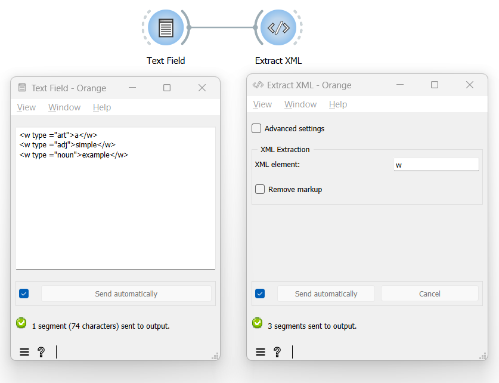

Convert XML tags into Orange Textable annotations
=====================================================

Goal
--------

Convert XML markup into Orange Textable data structures such as segments and their annotations.

Prerequisites
-----------------

Some text containing XML markup has been imported in Orange Textable (see :doc:`Cookbook: Text input <text_input>`) and possibly further processed (see :doc:`Cookbook: Segmentation manipulation <segmentation_manipulation>`).

Ingredients
---------------

  ==============  =================== 
   **Widget**      :doc:`Extract XML <extract_xml>` 
   **Icon**        |extract_xml_icon|  
   **Quantity**    1               
  ==============  ===================

Procedure
-------------

.. _convert_XML_tags_into_Orange_Textable_annotations_fig1:

         Extract XML
   :scale: 80%

   Figure 1: Convert XML tags into Orange Textable annotations with an
   instance of :doc:`Extract XML <extract_xml>`

1. Create an instance of :doc:`Extract XML <extract_xml>`.

2. Drag and drop from the output (righthand side) of the widget that emits the data containing XML markup (e.g. :doc:`Text Field <text_field>`) to the input of :doc:`Extract XML <extract_xml>` (lefthand side).

3. Double-click on the icon of :doc:`Extract XML <extract_xml>` to open its interface.

4. In the **XML Extraction** section, insert the desired **XML element** (here ``w``).

5. Click the **Send** button or tick the **Send automatically** checkbox.

6. A segmentation containing a segment for each occurrence of the specified tag is then available at the output of :doc:`Segment <segment>`; to display or export it, see :doc:`Cookbook: Text output <text_output>`.

Comment
-----------

- The XML tags that have been retrieved are actually discarded from the resulting segmentation: only their content is included in the output.
- The attributes of the XML tags are automatically converted to annotations associated with the created segments.
- Note that it is only possible to extract instances of a single XML element type at a time (here ``w``).
- However, it is possible to chain several :doc:`Extract XML <extract_xml>` instances in order to successively extract instances of different XML elements. For example, a first instance to extract ``div`` type elements, a second to extract ``w`` type elements, and so on. In this case, it is important to make sure that the **Remove markup** option is *not* selected.

See also
------------

- :doc:`Advanced Topics: Converting XML markup to annotations <converting_xml_markup_annotations>`
- :doc:`Reference: Extract XML widget <extract_xml>`
- :doc:`Cookbook: Text input <text_input>`
- :doc:`Cookbook: Segmentation manipulation <segmentation_manipulation>`
- :doc:`Cookbook: Text output <text_output>`