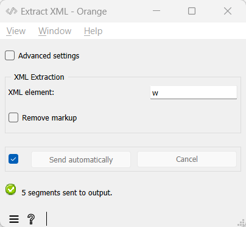

.. meta::
   :description: Orange Textable documentation, converting XML markup to annotations
   :keywords: Orange, Textable, documentation, XML, markup, conversion, annotation

Converting XML markup to annotations
====================================

Often, the best way (and sometimes the only way) to add a specific type
of annotation to a text is by “manually” adding it to the data. This is
frequently done with XML markup. For instance, the text that appears in
the :doc:`Text Field <text_field>` instance of :ref:`figure 1 <converting_xml_markup_annotations_fig1>`
below is segmented into words by means of *<w>* tags whose *type*
attribute indicates the “part of speech” associated with each word (e.g.
*DET*, *NOUN*, *PREP*, and so on).

.. _converting_xml_markup_annotations_fig1:

    Figure 1: Sample text annotated using XML markup.

The role of widget :doc:`Extract XML <extract_xml>`
is to convert XML markup into annotated segments. In its basic version
(see :ref:`figure 2 <converting_xml_markup_annotations_fig2>`
below), the widget’s interface essentially requires the user to specify
the name of the XML element whose content and attributes must be imported, 
namely *w* in this example. The **Remove markup** checkbox indicates whether 
further markup (if any) detected *within* imported tags must be removed (there 
is no further markup in this example, so that this option has no effect here).

.. _converting_xml_markup_annotations_fig2:

    Figure 2: Interface of the :doc:`Extract XML <extract_xml>` widget.

After connecting the above :doc:`Text Field <text_field>`
and :doc:`Extract XML <extract_xml>`
instances, and the latter to an instance of
:doc:`Display <display>`,
you can verify that the resulting segmentation contains a segment for
the content of each *<w>* element in the input text, and that this segment
is annotated with key *type* and value *DET*, *NOUN*, or *PREP* (see :ref:`figure 3 <converting_xml_markup_annotations_fig3>`
below). Each attribute-value pair of each *<w>* element has indeed been
automatically converted to a *{key: value}* annotation.

.. _converting_xml_markup_annotations_fig3:

    Figure 3: Annotations imported using :doc:`Extract XML <extract_xml>`.

See also
-----------------

- :doc:`Reference: Extract XML widget <extract_xml>`
- :doc:`Cookbook: Convert XML tags to Orange Textable annotations <convert_xml_tags_annotations>`