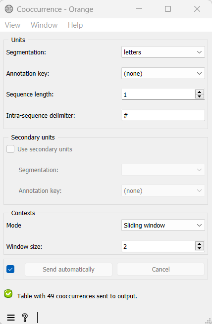
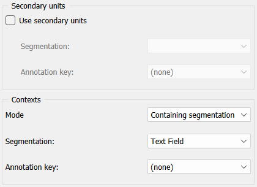
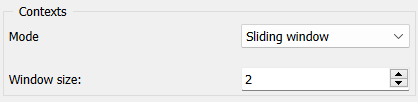
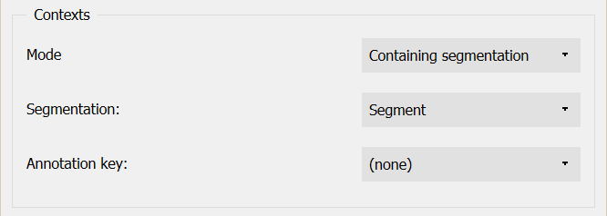

.. meta::
   :description: Orange Textable documentation, Cooccurrence widget
   :keywords: Orange, Textable, documentation, Cooccurrence, widget

.. _Cooccurrence:

Cooccurrence
============

.. image:: figures/Cooccurrence_54.png

Measure the cooccurrence of segments in documents.

Signals
-------

Inputs:

* ``Segmentation`` (multiple)

  Segmentation whose segments constitute the units subject to measurement of
  their cooccurrence or the contexts in which unit cooccurrence will be
  measured

Outputs:

* ``Pivot Crosstab``

  Table displaying the cooccurrence of units in the defined context

Description
-----------

This widget inputs one or several segmentations, measures the number of
documents in which the input segments occur simultaneously, and sends the result
in the form of a *cooccurrence matrix* [1]_.

The cooccurrence matrix produced by this widget is of *IntPivotCrosstab* type,
a subtype of the generic *Table* format (see :ref:`Convert` widget, section
:ref:`Table formats <anchor_to_table_formats>`). Since this table is a
cooccurrence matrix, both rows and columns correspond to *unit* types.
The cell at the intersection of a given column and row represents the number of
documents (*context* types) in which these two *unit* types occur
simultaneously. As the measure of cooccurrence represents absolute frequency,
the resulting table contains integer numbers, and as such it is of
*IntPivotCrosstab* type, a subclass of *PivotCrosstab*.

To take a simple example, consider two segmentations of the string *a simple
example* [2]_:

A) label = *words*

===========  =======  =====  ==================  =================
 content      start    end    *part of speech*    *word category*
===========  =======  =====  ==================  =================
 *a*          1        1      *article*           *grammatical*
 *simple*     3        8      *adjective*         *lexical*
 *example*    10       16     *noun*              *lexical*
===========  =======  =====  ==================  =================

B) label = *letters* (extract)

=========  =======  =====  ===================
 content    start    end    *letter category*
=========  =======  =====  ===================
 *a*        1        1      *vowel*
 *s*        3        3      *consonant*
 *i*        4        4      *vowel*
 ...        ...      ...    ...
 *e*        16       16     *vowel*
=========  =======  =====  ===================

Typically, we could define unit types based on the content of the segments
of the *letters* segmentation.

As for the context types, there are two distinct forms
of contexts for measuring the cooccurrence of the units:
* **Sliding window*** **Containing segmentation**

**Sliding window** relies on the notion of a "window" of *n* segments that we
progressively "slide" from the beginning to the end of the segmentation. In our
example, by applying this principle to the *letters* segmentation and by setting
the window size to 3 segments, we thus define the following contexts:

    1. *a si*
    2. *sim*
    3. *imp*
    4. *mpl*
    5. *ple*
    6. *le e*
    7. *e ex*
    8. *exa*
    9. *xam*
    10. *amp*
    11. *mpl*
    12. *ple*

Considering the letter segmentation as that of the unit types, we would obtain
the following cooccurrence matrix [3]_:

.. csv-table::
    :header: *__unit__*, *a*, *s*, *i*, *m*, *p*, *l*, *e*, *x*
    :stub-columns: 1
    :widths: 1 1 1 1 1 1 1 1 1

    *a*,        4,    1,    1,    2,   1,    0,    1,    2
    *s*,        1,    2,    2,    1,   0,    0,    0,    0
    *i*,        1,    2,    3,    2,   1,    0,    0,    0
    *m*,        2,    1,    2,    6,   4,    2,    0,    1
    *p*,        1,    0,    1,    4,   6,    4,    2,    0
    *l*,        0,    0,    0,    2,   4,    5,    3,    0
    *e*,        1,    0,    0,    0,   2,    3,    5,    2
    *x*,        2,    0,    0,    1,   0,    0,    2,    3

Alternatively, we could consider the *annotation values* of the units instead of
their content. For example, by defining units based on the annotations
associated to the key *letter category* in the *letters* segmentation, and
choosing the mode **Sliding window** for the context with the window size of 3
(see :ref:`figure 1 <cooccurrence_fig1>`), we would obtain the following
cooccurrence
matrix:

.. csv-table::
    :header: *__unit__*, *vowel*, *consonant*
    :stub-columns: 1
    :widths: 3 2 3

    *vowel*,      10,    10
    *consonant*,      10,    12

The mode **Containing segmentation** consists in measuring the cooccurrence of
units in context defined by another segmentation. In the above example we
consider *letter* as the segmentation for unit types and *word* as the
segmentation for context types, and thus the following cooccurrence matrix will
be obtained and is symmetric by definition:

.. csv-table::
    :header: *__unit__*, *a*, *s*, *i*, *m*, *p*, *l*, *e*, *x*
    :stub-columns: 1
    :widths: 1 1 1 1 1 1 1 1 1

    *a*,        2,    0,    0,    1,   1,    1,    1,    1
    *s*,        0,    1,    1,    1,   1,    1,    1,    1
    *i*,        0,    1,    1,    1,   1,    1,    1,    1
    *m*,        1,    1,    1,    2,   2,    2,    2,    1
    *p*,        1,    1,    1,    2,   2,    2,    2,    1
    *l*,        1,    1,    1,    2,   2,    2,    2,    1
    *e*,        1,    1,    1,    2,   2,    2,    2,    1
    *x*,        1,    0,    0,    1,   1,    1,    1,    1

Each cell at the above table represents the number of words (segments of the
context types) in which the unit in the column and the unit in the row are
used simultaneously. For example, "2" in the fifth column and forth row, shows
that there are two words in which *p* and *m* occur together.

In the **Containing segmentation** mode, it is also possible to measure the
cooccurrence of units belonging to distinct segmentations. For instance this
would enable us to know how many times a given vowel and a given consonant occur
simultaneously in each word. By ticking the **Secondary units** checkbox
in the interface of the widget, we will be able to define a segmentation for
secondary unit types. In this case, the resulting cooccurrence matrix will no
longer be symmetric. Therefore, in the above example, vowels as the primary
units segmentation constitute the rows, and consonants as the secondary units
segmentation constitute the columns of the resulting cooccurrence matrix
(see :ref:`figure 2 <cooccurrence_fig2>`):

.. csv-table::
    :header: *__unit__*, *s*, *m*, *p*, *l*, *x*
    :stub-columns: 1
    :widths: 1 1 1 1 1 1

    *a*,        0,    1,    1,    1,   1
    *i*,        1,    1,    1,    1,   0
    *e*,        1,    2,    2,    2,   1

As mentioned in the **Sliding window** mode, it is always possible to measure
the cooccurrence of the annotation values of the units (primary and secondary)
and those of the contexts instead of the content of segments. In the case
of the above example with the secondary units, the resulting crosstab consists
of only one cell indicating the number of words in which every letter with
*vowel* and every letter with *consonant* annotation value have occurred at the
same time:

.. csv-table::
    :header: *__unit__*, *consonant*
    :stub-columns: 1
    :widths: 2 3

    *vowel*,      2

Note that it is up to the user to provide a coherent definition of the units
and contexts. In general, there are three conditions to be met in this
respect: (a) the segment corresponding to the unit and the context are both
associated to the same string, (b) the initial position of the unit segment
in the string is higher or equal to that of the context segment, and
(c) conversely the final position of the unit is lower or equal to that of the
context. In short, the unit must be *contained* within the context.

It is also noteworthy that in order to measure the cooccurrence, it is by
definition necessary to specify a context. The context is set to the **Sliding
window** mode by default.

Finally, in every scenario considered here, we could also take an interest for
the cooccurrence of sequences of 2, 3, ..., *n* segments  (or *n--grams*) rather
than for the frequency of isolated segments. The cooccurrence matrix of
bigrams in **Sliding window** (size 3) is illustrated below:

.. csv-table::
    :header: *__unit__*, *as*, *si*, *im*, *mp*, *pl*, *le*, *ee*, *ex*, *xa*, *am*
    :stub-columns: 1
    :widths: 1 1 1 1 1 1 1 1 1 1 1

    *as*,        1,    1,    0,    0,   0,    0,    0,    0,    0,    0
    *si*,        1,    2,    1,    0,   0,    0,    0,    0,    0,    0
    *im*,        0,    1,    2,    1,   0,    0,    0,    0,    0,    0
    *mp*,        0,    0,    1,    4,   2,    0,    0,    0,    0,    0
    *pl*,        0,    0,    0,    2,   4,    2,    0,    0,    0,    0
    *le*,        0,    0,    0,    0,   2,    3,    1,    0,    0,    0
    *ee*,        0,    0,    0,    0,   0,    1,    2,    1,    0,    0
    *ex*,        0,    0,    0,    0,   0,    0,    1,    2,    1,    0
    *xa*,        0,    0,    0,    0,   0,    0,    0,    1,    2,    1
    *am*,        0,    0,    0,    1,   0,    0,    0,    0,    1,    2

Hereafter the interface of the widget will be introduced (see
figures :ref:`1 <cooccurrence_fig1>` to :ref:`4 <cooccurrence_fig4>`). It
contains three separate sections for unit definition (**Units** and **Secondary
units**) and context definition (**Contexts**).

.. _cooccurrence_fig1:

    Figure 1: **Cooccurrence** widget (**Sliding window** mode as the default mode).

In the **Units** section, the **Segmentation** drop-down menu allows the user
to select among the input segmentations, the one whose segment types will be
subject to the cooccurrence measurement. The **Annotation key** menu displays
the annotation keys associated to the chosen segmentation, if any; if one of the
keys is selected, the corresponding annotation values will be considered; if on
the other hand the value *(none)* is selected, the *content* of the segments
will be taken into consideration. The **Sequence length** drop-down menu allows
the user to indicate if isolated segments or segment *n--grams* should be
considered; in the latter case, the (optional) string specified in the **Intra
sequence delimiter** text field will be used to separate the content or the
annotation value corresponding to each segment in the table headers.

The **Secondary units** section has almost the same characteristics as the
**Units** section, except for the fact that there is no **Sequence length**
menu. This section is by default disabled due to the default mode of the
**Contexts** section being **Sliding window**, in which only one unit
segmentation can be considered for the measure of cooccurrence (see
:ref:`figure 1 <cooccurrence_fig1>`). When changing the mode to *Containing
segmentation*, the box becomes automatically enabled (see
:ref:`figure 2 <cooccurrence_fig2>`).

.. _cooccurrence_fig2:

    Figure 2: **Secondary units** box of **Cooccurrence** widget.

The **Contexts** section is available in two forms, depending on the
selected value in the **Mode** drop-down menu. This allows the user to
choose between the two possible ways of defining contexts described earlier.
The **Sliding window** mode (see :ref:`figure 3 <cooccurrence_fig3>`) implements
the notion of a "sliding window" introduced earlier. Typically, it allows the
user to observe the cooccurrence of the unit types with one another throughout
the unit segmentation. The only parameter is the window size (in number of
segments), defined by the **Window size** cursor, set to 2 by default.

.. _cooccurrence_fig3:

    Figure 3: **Cooccurrence** widget (**Sliding window** mode).

.. _cooccurrence_fig4:

    Figure 4: **Cooccurrence** widget (**Containing segmentation** mode).

Finally, the **Containing segmentation** mode (see :ref:`figure 4
<cooccurrence_fig4>`) corresponds to the case where contexts are defined by the
segment types that appear in another segmentation. This segmentation is selected
among the input segmentations by means of the **Segmentation** drop-down menu.
The **Annotation key** menu displays the annotation keys associated with the
context segmentation, if any; if one of the keys is selected, the corresponding
annotation value types will constitute the row headers; otherwise the value
*(none)* is selected so that *content* of the segments will be exploited.

The **Send** button triggers the emission of a table in the internal format
of Orange Textable, to the output connection(s). When it is selected, the
**Send automatically** checkbox disables the button and the widget attempts
to automatically emit a segmentation at every modification of its interface or
when its input data are modified (by deletion or addition of a connection, or
because modified data is received through an existing connection).

The informations given below the **Send** button indicate whether or not the data is correctly sent to the
output table. If not, the respective error message will be given.

Messages
--------

Information
~~~~~~~~~~~

*Data correctly sent to output.*
    This confirms that the widget has operated properly.

*Settings were* (or *Input has*) *changed, please click 'Send' when ready.*
    Settings and/or input have changed but the **Send automatically**
    checkbox has not been selected, so the user is prompted to click the
    **Send** button (or equivalently check the box) in order for computation
    and data emission to proceed.

*No data sent to output yet: no input segmentation.*
    The widget instance is not able to emit data to output because it receives
    none on its input channel(s).

*No data sent to output yet, see 'Widget state' below.*
    A problem with the instance's parameters and/or input data prevents it
    from operating properly, and additional diagnostic information can be
    found in the **Widget state** box at the bottom of the instance's
    interface (see `Warnings`_ below).

Warnings
~~~~~~~~

*Resulting table is empty.*
    No table has been emitted because the widget instance couldn't find a
    single element in its input segmentation(s). A likely cause for this
    problem (when using the **Containing segmentation** mode) is that the unit
    and context segmentations do not refer to the same strings, so that the
    units are in effect *not* contained in the contexts. This is typically a
    consequence of the improper use of widgets :ref:`Preprocess` and/or
    :ref:`Recode` (see :ref:`anchor_to_caveat`).

See also
--------

* :ref:`Reference: Convert widget (section "Table formats")
  <anchor_to_table_formats>`

Footnotes
---------

.. [1] The definition  of cooccurrence may vary depending on the discipline in
       which this notion is used. In text analytics, the cooccurrence is the
       number of the documents in which two textual units simultaneously occur.
       Here by convention, cooccurrence is the dot product of the transposed
       term-document matrix with itself, which is symmetric when considering
       only one unit type. As a result, and contrary to other definitions, the
       diagonal members of the matrix are not zero; rather, they indicate
       the document frequency of the corresponding textual unit (i.e. the
       number of context types in which it occurs).

.. [2] By convention, we do not indicate here the string index associated with
       each segment but only its start and end positions, along with the
       various annotation values associated with it; moreover, for the sake of
       readability, we do indicate the content of each segment, though it is
       not formally part of the segmentation (but rather of the string to
       which the segmentation refers).

.. [3] The first column header, *__unit__*, is a name predefined by Orange
       Textable.
