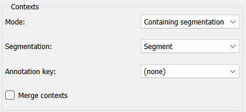

.. meta::
   :description: Orange Textable documentation, Count widget
   :keywords: Orange, Textable, documentation, Count, widget

.. _Count:

Count
=====

.. image:: figures/Count_54.png

Count segment types.

Signals
-------

Inputs:

* ``Segmentation`` (multiple)

  Segmentation whose segments constitute the units to be counted or
  the contexts in which the units will be counted

Outputs:

* ``Pivot Crosstab``

  Table displaying the absolute frequency of units

Description
-----------

This widget inputs one or several segmentations, counts the frequency of
segments defined by one of the segmentations (potentially within segments
defined by another), and sends the result in the form of a *contingency
table* (or *co-occurrence matrix* or also *term--document matrix*).

The contingency tables produced by this widget are of *PivotCrosstab* type,
a subtype of the generic *Table* format (see :ref:`Convert` widget, section
:ref:`Table formats <anchor_to_table_formats>`). In such a table, each column
corresponds to a *unit* type, each line corresponds to a *context* type, and
the cell at the intersection of a given column and line contains the count (or
*absolute frequency*, or also number of occurrences) of this unit type in this
context type.

To take a simple example, consider two segmentations of the string *a simple
example* [#]_:

A) label = *words*

===========  =======  =====  ==================  =================
 content      start    end    *part of speech*    *word category*
===========  =======  =====  ==================  =================
 *a*          1        1      *article*           *grammatical*
 *simple*     3        8      *adjective*         *lexical*
 *example*    10       16     *noun*              *lexical*
===========  =======  =====  ==================  =================

B) label = *letters* (extract)

=========  =======  =====  ===================
 content    start    end    *letter category*
=========  =======  =====  ===================
 *a*        1        1      *vowel*
 *s*        3        3      *consonant*
 *i*        4        4      *vowel*
 ...        ...      ...    ...
 *e*        16       16     *vowel*
=========  =======  =====  ===================

Typically, we could define unit types based on the content of the segments
of the *letters* segmentations, and context types based on the content of
the segments of the *words* segmentations. Counting these unit types in these
contexts types would thus produce the following contingency table [#]_:

.. csv-table::
    :header: *__context__*, *a*, *s*, *i*, *m*, *p*, *l*, *e*, *x*
    :stub-columns: 1
    :widths: 3 1 1 1 1 1 1 1 1

    *a*,        1,    0,    0,    0,    0,    0,    0,    0
    *simple*,   0,    1,    1,    1,    1,    1,    1,    0
    *example*,  1,    0,    0,    1,    1,    1,    2,    1

Alternatively, we could rather count the *annotation values* (instead of
the content) of the units and/or of the contexts. For example, by defining
units on the basis of the annotations associated to the key *letter category*
in the *letters* segmentation, and contexts on the basis of the annotations
associated to the key *word category* in the *words* segmentation, we would
obtain the following table:

.. csv-table::
    :header: *__context__*, *vowel*, *consonant*
    :stub-columns: 1
    :widths: 3 2 3

    *grammatical*,  1,    0
    *lexical*,      5,    8

This way of selecting segmentations and annotation keys constitutes an
extremely flexible mechanism which enables the user to easily produce a
variety of contingency tables. Note that it is up to the user to provide a
coherent definition of the units and contexts. In general, a given unit is
considered to occur in a given context if, (a) the segment corresponding
to the unit and the context are both be associated to the same string, (b)
the initial position of the unit segment in the string is higher or equal to
that of the context segment, and (c) conversely the final position of the unit
is lower or equal to that of the context. In short, the unit must be
*contained* within the context.

A borderline case made possible by this *modus operandi* consists of defining
units and contexts on the basis of the same segmentation. Indeed since every
segment is contained in itself, nothing keeps us from using a single
segmentation, *words* for example, and defining units with the key *part of
speech* and contexts with the key *word category*:

.. csv-table::
    :header: *__context__*, *article*, *noun*, *verb*
    :stub-columns: 1
    :widths: 3 2 2 2

    *grammatical*,  1,    0,    0
    *lexical*,      1,    1,    0

Orange Textable offers two other ways to define contexts while still using a
single segmentation. The first relies on the notion of a "window" of *n*
segments that we progressively "slide" from the beginning to the end of the
segmentation. In our example, by applying this principle to the *letters*
segmentation and by setting the window size to 11 segments, we thus define
the following contexts:

    1. *a simple exam*
    2. *simple examp*
    3. *imple exampl*
    4. *mple example*

By otherwise defining the units based on the *letter category* annotations for
example, we thus obtain the following counts (where the contexts are
represented by their successive positions):

.. csv-table::
    :header: *__context__*, *vowel*, *consonant*
    :stub-columns: 1
    :widths: 3 2 3

    1,    5,    6
    2,    4,    7
    3,    4,    7
    4,    4,    7

The last context specification mode that Count offers and which involves a
single segmentation consists of defining the contexts as *n* segments
immediately to the left and/or to the right of each segment. For example,
based on the *letter category* annotations of segmentation *letters*, defining
the contexts as the two segments immediately on the left and on the right of
the segment results in the following contingency table (where the '+' symbol
separates the successive segments of the context and the underscore symbol '_'
separates the left and right parts of the context):

.. csv-table::
    :header: *__context__*, *consonant*, *vowel*
    :stub-columns: 1
    :widths: 4 2 1

    *vowel+consonant_consonant*,    2,  2
    *consonant+vowel_consonant*,    2,  1
    *consonant+consonant_vowel*,    2,  1
    *vowel+vowel_vowel*,            1,  0

Such a table notably indicates that in a context composed, on the left, of a
*vowel+consonant* sequence and, on the right, of a consonant (for example
*ex_m* or *am_l*), we have twice observed a vowel and thrice a consonant. A
particular case of this type of table is that of the *transition matrix* that
defines a *Markov chain*, where we only consider the context on the left of
the segments:

.. csv-table::
    :header: *__context__*, *vowel*, *consonant*
    :stub-columns: 1
    :widths: 3 2 3

    *vowel*,        o,    5
    *consonant*,    5,    4

Let us also note that context specification, unlike unit specification, is
optional. Indeed, it is always possible to globally count the frequency of
segmentation units and thus produce a table that only contains a single row
corresponding to the whole concerned segmentation (thus *letters*, in the
following example):

.. csv-table::
    :header: *__context__*, *a*, *s*, *i*, *m*, *p*, *l*, *e*, *x*
    :stub-columns: 1
    :widths: 3 1 1 1 1 1 1 1 1

    *__global__*,    2,    1,    1,    2,    2,   2,    3,    1

Finally, in every scenario considered here, we could also take an interest for
the frequency of the sequences from 2, 3, ..., *n* segments  (or *n--grams*)
rather that to the frequency of isolated segments:

.. csv-table::
    :header: *__context__*, *as*, *si*, *im*, *mp*, *pl*, *le*, *ex*, *xa*, *am*
    :stub-columns: 1
    :widths: 3 1 1 1 1 1 1 1 1 1

    *__global__*,    1,    1,    1,    2,    2,   2,    1,    1,   1

After having thus outlined the range of contingency table types that the
**Count** widget can produce, we can take a look at its interface (see
figures :ref:`1 <count_fig1>` to :ref:`4 <count_fig4>`). It contains two
separate sections for unit definition (**Units**) and context definition
(**Contexts**).

.. _count_fig1:

.. figure:: figures/count_example.png
    :align: center
    :alt: Count widget in mode "No context"

    Figure 1: **Count** widget (**No context** mode).

In the **Units** section, the **Segmentation** drop-down menu allows the user
to select among the input segmentations the one whose segment types will be
counted. The **Annotation key** menu displays the annotation keys associated
to the chosen segmentation, if any; if one of the keys is selected, the
corresponding annotation values will be counted; if on the other hand the
value *(none)* is selected, the *content* of the segments will be counted. The
**Sequence length** drop-down menu allows the user to indicate if isolated
segments or segment *n--grams* should be counted; in this latter case, the
(optional) string specified in the **Intra sequence delimiter** text field
will be used to separate the content or the annotation value corresponding to
each segment in the column headers. [#]_

The **Contexts** section is available in several variants, depending on the
selected value in the **Mode** drop-down menu. The latter allows the user to
choose between the different ways of defining contexts described earlier. The
**No context** mode (see :ref:`figure 1 <count_fig1>`) corresponds to the case
where units are counted globally in the whole segmentation specified in the
**Units** section (to which we will refer by the term *unit segmentation*).

The **Sliding window** mode (see :ref:`figure 2 <count_fig2>`) implements the
notion of a "sliding window" introduced earlier. Typically it allows the user
to observe the evolution of frequency throughout the unit segmentation. The
only parameter is the window size (in number of segments), defined by the
**Window size** cursor.

.. _count_fig2:

    Figure 2: **Count** widget (**Sliding window** mode).

.. _count_fig3:

    Figure 3: **Count** widget (**Left--right neighborhood** mode).

.. _count_fig4:

    Figure 4: **Count** widget (**Containing segmentation** mode).

The **Left--right neighborhood** mode (see :ref:`figure 3 <count_fig3>`)
allows the user to specify context types based on the *n* segments immediately
to the left and/or right of each segment; this mode notably allows the user to
build a Markov chain transition matrix. The **Left context size** and **Right
context size** parameters determine the number of segments taken into
consideration in each part of the context. The **Unit position marker** text
field allows the user to specify the (possibly empty) character chain to
insert in-between the left and right parts of the context in the row headers.
The checkbox (**Treat distinct strings as contiguous**) enables the user to to choose 
if separate strings should be treated as if they were actually contiguous, so that 
the end of each string is adjacent to the beginning of the next string. 

Finally, the **Containing segmentation** mode (see :ref:`figure 4
<count_fig4>`) corresponds to the case where contexts are defined by the
segment types that appear in a segmentation (which can be that of the units or
another). This segmentation, that we will call *context segmentation* by
analogy, is selected among the input segmentations by means of the
**Segmentation** drop-down menu. The **Annotation key** menu displays the
annotation keys associated with the context segmentation, if any; if one of
the keys is selected, the corresponding annotation value types will constitute
the row headers; if however the value *(none)* is selected, the *content* of
the segments will be exploited. The **Merge** contexts checkbox enables the
program to globally count the units in the whole context segmentation.

Below the **Send button**, the user finds indications such as the sum of frequencies in the output table, or
the reasons why not table is emitted (no input data or total frequency is
zero).

The **Compute** button triggers the emission of a table in the internal format
of Orange Textable, to the output connection(s). When it is selected, the
**Compute automatically** checkbox disables the button and the widget attempts
to automatically emit a segmentation at every modification of its interface or
when its input data are modified (by deletion or addition of a connection, or
because modified data is received through an existing connection).

Messages
--------

Information
~~~~~~~~~~~

*Data correctly sent to output: total count is <n>.*
    This confirms that the widget has operated properly.

*Settings were* (or *Input has*) *changed, please click 'Compute' when ready.*
    Settings and/or input have changed but the **Compute automatically**
    checkbox has not been selected, so the user is prompted to click the
    **Compute** button (or equivalently check the box) in order for computation
    and data emission to proceed.

*No data sent to output yet: no input segmentation.*
    The widget instance is not able to emit data to output because it receives
    none on its input channel(s).

*No data sent to output yet, see 'Widget state' below.*
    A problem with the instance's parameters and/or input data prevents it
    from operating properly, and additional diagnostic information can be
    found in the **Widget state** box at the bottom of the instance's
    interface (see `Warnings`_ below).

Warnings
~~~~~~~~

*Resulting table is empty.*
    No table has been emitted because the widget instance couldn't find a
    single element in its input segmentation(s). A likely cause for this
    problem (when using the **Containing segmentation** mode) is that the unit
    and context segmentations do not refer to the same strings, so that the
    units are in effect *not* contained in the contexts. This is typically a
    consequence of the improper use of widgets :ref:`Preprocess` and/or
    :ref:`Recode` (see :ref:`anchor_to_caveat`).

Examples
--------

* :doc:`Getting started: Counting segment types <counting_segment_types>`
* :doc:`Getting started: Counting in specific contexts
  <counting_specific_contexts>`
* :doc:`Cookbook: Count unit frequency <count_unit_frequency>`
* :doc:`Cookbook: Count occurrences of smaller units in larger segments
  <count_occurrences_smaller_units_larger_segments>`
* :doc:`Cookbook: Count transition frequency between adjacent units
  <count_transition_frequency_adjacent_units>`
* :doc:`Cookbook: Examine the evolution of unit frequency along the text
  <examine_evolution_unit_frequency>`

See also
--------

* :ref:`Reference: Convert widget (section "Table formats")
  <anchor_to_table_formats>`

Footnotes
---------

.. [#] By convention, we do not indicate here the string index associated with
       each segment but only its start and end positions, along with the
       various annotation values associated with it; moreover, for the sake of
       readability, we do indicate the content of each segment, though it is
       not formally part of the segmentation (but rather of the string to
       which the segmentation refers).
.. [#] The first column header, *__context__*, is a name predefined by Orange
       Textable.
.. [#] The same character string will be inserted between the successive
       segments that build up the left and/or right context if the
       **Left--right neighborhood** mode is selected.
