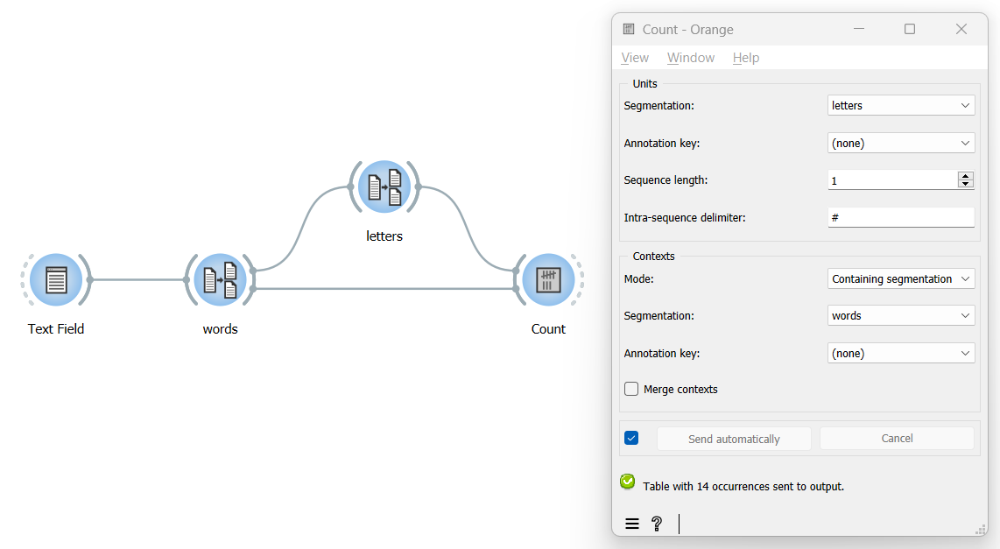

Count occurrences of smaller units in larger segments
=========================================================

Goal
--------

Count the occurrences of smaller units (for instance letters) in larger
segments (for instance words), and report the results by means of a
two-dimensional contingency table (e.g. with words in rows and letters
in columns).

Prerequisites
-----------------

Some text has been imported in Orange Textable (see :doc:`Cookbook: Text input <text_input>`)
and it has been segmented in at least two hierarchical levels, e.g.
words and letters (see :doc:`Cookbook: Segment text in smaller units <segment_text>`).

Ingredients
---------------

  ==============  =============
   **Widget**      :doc:`Count <count>`   
   **Icon**        |count_icon|  
   **Quantity**    1          
  ==============  =============

.. |count_icon| image:: figures/Count_36.png

Procedure
-------------

.. _count_occurrences_smaller_units_in_larger_segments_fig1:

         instance of Count

   Figure 1: Count occurrences of smaller units in larger segments with an 
   instance of :doc:`Count <count>`

1. Create an instance of :doc:`Count <count>`.

2. Drag and drop from the output (righthand side) of both widgets that
   have been used to segment the text, here
   :doc:`Segment <segment>`
   (*words*) and
   :doc:`Segment <segment>`
   (*letters*), to the input of :doc:`Count <count>`
   (lefthand side), thus forming a triangle.

3. Double-click on the icon of :doc:`Count <count>`
   to open its interface.

4. In the **Units** section, select the segmentation into smaller units
   (here: *letters*).

5. In the **Context** section, choose **Mode: Containing segmentation**.

6. In the **Segmentation** field, select the context segmentation, i.e.
   the segmentation into larger segments (here *words*).

7. Click the **Send** button or tick the **Send automatically**
   checkbox.

8. A table showing the results is then available at the output of :doc:`Count <count>`;
   to display or export it, see :doc:`Cookbook: Table output <table_output>`.

Comment
-----------

-  The total number of segments in your segmentation appears at the
   bottom of
   :doc:`Count <count>`’s
   interface (here: 14).

-  It is also possible to define units as segment pairs (*bigrams*),
   triples (*trigrams*), and so on, by increasing the **Sequence
   length** parameter in the **Units** section.

-  If **Sequence length** is set to a value greater than 1, the string
   appearing in the **Intra-sequence delimiter** field will be inserted
   between the elements composing each *n*-gram in the column headers,
   which can enhance their readability. The default is ``#`` but you can
   change it to the delimiter of your choice.

See also
------------

-  :doc:`Textable's Basics: Counting in specific contexts <counting_specific_contexts>`
-  :doc:`Reference: Count widget <count>`
-  :doc:`Cookbook: Text input <text_input>`
-  :doc:`Cookbook: Segment text in smaller units <segment_text>`
-  :doc:`Cookbook: Table output <table_output>`