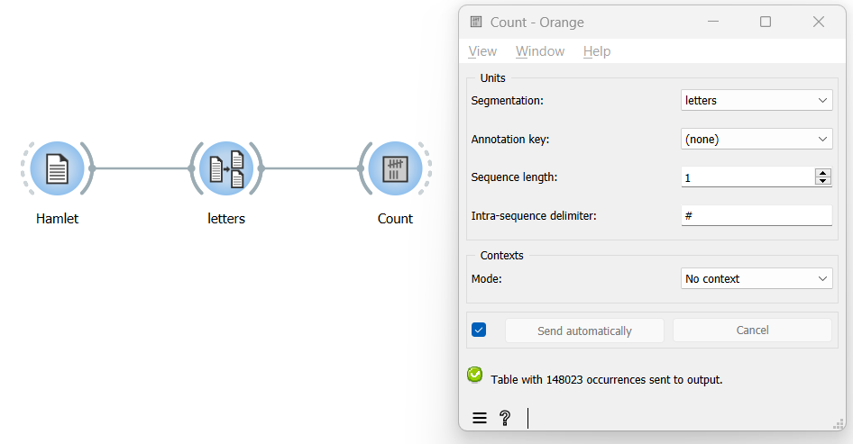

Count unit frequency
========================

Goal
--------

Count the frequency of each segment type that appears in a segmentation.

Prerequisites
-----------------

Some text has been imported in Orange Textable (see :doc:`Cookbook: Text input <text_input>`)
and it has been segmented in smaller units (see :doc:`Cookbook: Segment text in smaller units <segment_text>`).

Ingredients
---------------

  ==============  =======
   **Widget**      :doc:`Count <count>`
   **Icon**        |count_icon|
   **Quantity**    1
  ==============  =======

.. |count_icon| image:: figures/Count_36.png

Procedure
-------------

.. _count_unit_frequency_fig1:

   Figure 1: Count unit frequency with an instance of :doc:`Count <count>`.

1. Create an instance of :doc:`Count <count>`.

2. Drag and drop from the output (righthand side) of the widget that
   emits the segments that will be counted, here
   :doc:`Segment <segment>`
   (*letters*), to the input of :doc:`Count <count>`
   (lefthand side).

3. Double-click on the icon of
   :doc:`Count <count>`
   to open its interface.

4. In the **Units** section, select the segmentation containing units to
   be counted in the **Segmentation** drop-down menu (here: *letters*).

5. Click the **Send** button or tick the **Send automatically**
   checkbox.

6. A table showing the results is then available at the output of
   :doc:`Count <count>`;
   to display or export it, see :doc:`Cookbook: Table output <table_output>`.

Comment
-----------

-  The total number of segments in your segmentation appears at the
   bottom of
   :doc:`Count <count>`’s
   interface (here: 148023).

-  It is also possible to define units as segment pairs (*bigrams*),
   triples (*trigrams*), and so on, by increasing the **Sequence
   length** parameter in the **Units** section.

-  If **Sequence length** is set to a value greater than 1, the string
   appearing in the **Intra-sequence delimiter** field will be inserted
   between the elements composing each *n*-gram in the column headers,
   which can enhance their readability. The default is ``#`` but you can
   change it to the delimiter of your choice.

See also
------------

-  :doc:`Textable's Basics : Counting segment types <counting_segment_types>`
-  :doc:`Reference: Count widget <count>`
-  :doc:`Cookbook: Text input <text_input>`
-  :doc:`Cookbook: Segment text in smaller units <segment_text>`
-  :doc:`Cookbook: Table output <table_output>`
