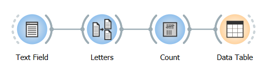

.. meta::
   :description: Orange Textable documentation, counting segment types
   :keywords: Orange, Textable, documentation, count, types, frequency,
              distribution

Counting segment types
======================

Widget :ref:`Count` takes in input one or more segmentations and
produces frequency tables such as tables 1 and 2
:doc:`here <segmentations_tables>`. To try it out, create a schema such as
illustrated on :ref:`figure 1 <counting_segment_types_fig1>` below. As usual,
we will suppose that the :ref:`Text Field` instance contains
*a simple example*. The :ref:`Segment` instance is configured for
letter segmentation (**Regex:** ``\w`` and **Widget Segment label:**
*letters*). The default configuration of *Data Table* (from the **Data** tab of Orange
Canvas) needs not be modified for this example.

.. _counting_segment_types_fig1:

    Figure 1: Schema for testing the :ref:`Count` widget.

Basically, the purpose of widget :ref:`Count` is to determine the frequency
of segment types in an input segmentation. The label of that segmentation must
be indicated in the **Segmentation** menu of section **Units** in the widget's
interface, while other controls may be left in their default state for now
(see :ref:`figure 2 <counting_segment_types_fig2>` below). Clicking
**Compute** then double-clicking the *Data Table* instance should display
essentially the same data as table 1
:ref:`here <segmentations_tables_table1>` (with possible variations in
the order of columns).

.. _counting_segment_types_fig2:

.. figure:: figures/count_example.png
    :align: center
    :alt: Counting the frequency of letter types with widget :ref:`Count`

    Figure 2: Counting the frequency of letter types with widget :ref:`Count`.

Note that checkbox *Send automatically* is unchecked by default so that
the user must click on **Send** to trigger computations. The motivation for
this default setting is that
:doc:`table construction widgets <table_construction_widgets>` can be quite
slow when operating on large segmentations, and it can be annoying to see
computations starting again whenever an interface element is modified.

To obtain the frequency of letter *bigrams* (i.e. pairs of successive
letters), simply set parameter **Sequence length** to 2 (see
:ref:`table 1 <counting_segment_types_table1>` below). If the value of this
parameter is greated than 1, the string specified in field **Intra-sequence
delimiter** is inserted between successive segments for the sake of
readability--which is more useful when segments are longer than individual
letters. Note that in this example, word boundaries are not taken into
account--nor even known, in fact--which is why bigrams *as* and *ee* have a
nonzero frequency.

.. _counting_segment_types_table1:

.. csv-table:: Table 1: Letter bigram frequency.
    :header: *as*, *si*, *im*, *mp*, *pl*, *le*, *ee*, *ex*, *xa*, *am*
    :stub-columns: 0
    :widths: 3 3 3 3 3 3 3 3 3 3

    1,   1,   1,   2,   2,   2,   1,  1,   1,   1

See also
--------

* :doc:`Getting started: From segmentations to tables <segmentations_tables>`
* :ref:`Reference: Count widget <Count>`
* :doc:`Reference: Table construction widgets <table_construction_widgets>`
* :doc:`Cookbook: Count unit frequency <count_unit_frequency>`
