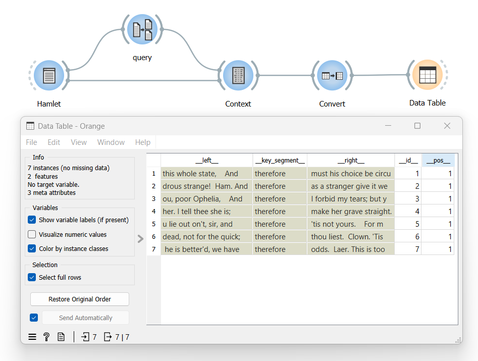
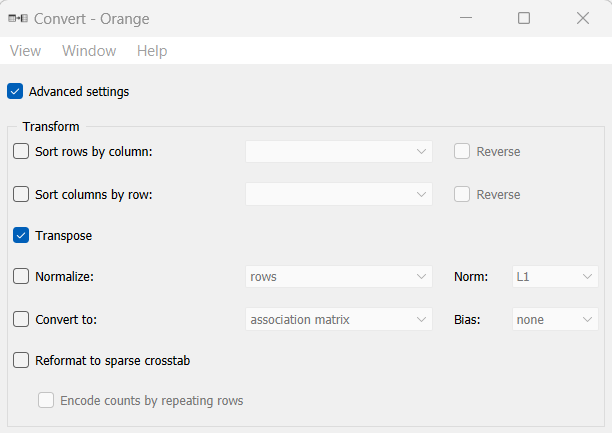

.. meta::
   :description: Orange Textable documentation, display table
   :keywords: Orange, Textable, documentation, table, display

Display table
=============

Goal
--------

Display an Orange Textable table.

Prerequisites
-----------------

Some text has been imported in Orange Textable (see :doc:`Cookbook: Text input <text_input>`)
and possibly further processed (see :doc:`Cookbook: Segmentation manipulation <segmentation_manipulation>`).
A table has been created by means of one of Orange Textable’s :doc:`table construction widgets <table_construction_widgets>`
(see :doc:`Cookbook: Text analysis <text_analysis>`).

Ingredients
---------------

  ==============  =================================  =================
   **Widget**      :doc:`Convert <convert>`           **Data Table**
   **Icon**        |convert_icon|                     |datatable_icon|
   **Quantity**    1                                  1
  ==============  =================================  =================

.. |convert_icon| image:: figures/Convert_36.png
.. |datatable_icon| image:: figures/DataTable.png

Procedure
-------------

.. _display_table_fig1:

   
   Figure 1: Display an Orange Textable table with instances of
   :doc:`Convert <convert>` and **Data Table**.

1. Create an instance of :doc:`Convert <convert>` and **Data Table** (the latter is found in the **Data** tab of Orange Canvas).

2. Drag and drop from the output (righthand side) of the widget that has been used to build a table, here :doc:`Context <context>`, to the input of :doc:`Convert <convert>` (lefthand side).

3. Connect :doc:`Convert <convert>` to **Data Table**.

4. Double-click on the icon of **Data Table** to open its interface and display the table.
 
Comment
-----------

- If the table is a document-term frequency table, you may want to change its default orientation to make it easier to read. To that effect, open the :doc:`Convert <convert>` instance’s interface, tick the **Advanced settings** checkbox, and in the **Transform** section, tick the **transpose** checkbox.

.. _display_table_fig2:

   Figure 2: Change the orientation of an Orange Textable frequency table
   using an instance of :doc:`Convert <convert>`.

See also
------------

- :doc:`Reference: Convert widget <convert>`
- :doc:`Reference: Table construction widgets <table_construction_widgets>`
- :doc:`Textable's Basics: Viewing and processing tables <viewing_processing_tables>`
- :doc:`Cookbook: Text input <text_input>`
- :doc:`Cookbook: Segmentation manipulation <segmentation_manipulation>`
- :doc:`Cookbook: Text analysis <text_analysis>`