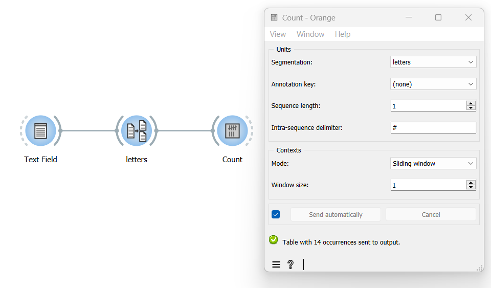

Examine the evolution of unit frequency along the text
==========================================================

Goal
--------

Examine how the frequency of segment types evolves from the beginning to
the end of a segmentation.

Prerequisites
-----------------

Some text has been imported in Orange Textable (see :doc:`Cookbook: Text input <text_input>`)
and it has been segmented in smaller units (see :doc:`Cookbook: Segment text in smaller units <segment_text>`).

Ingredients
---------------

  ==============  =======
   **Widget**      :doc:`Count <count>`
   **Icon**        |count_icon|
   **Quantity**    1
  ==============  =======

.. |count_icon| image:: figures/Count_36.png

Procedure
-------------

.. _examine_evolution_unit_frequency_along_text_fig1:

   Figure 1: Examine the evolution of unit frequency with an instance of :doc:`Count <count>`

1. Create an instance of
   :doc:`Count <count>`.

2. Drag and drop from the output (righthand side) of the widget that has
   been used to segment the text, here
   :doc:`Segment <segment>`
   (*letters*), to the input of
   :doc:`Count <count>`
   (lefthand side).

3. Double-click on the icon of
   :doc:`Count <count>`
   to open its interface.

4. In the **Units** section, select the segmentation whose units will be
   counted.

5. In the **Context** section, choose **Mode: Sliding window**.

6. Set the **Window size** parameter to the desired value; with the
   minimum value of 1, frequency will be counted separately at every
   successive position in the segmentation, whereas a larger value *n* >
   1 will have the effect that frequency will be counted in larger and
   partially overlapping spans (segments 1 to *n*, then 2 to *n* + 1,
   and so on), resulting in a smoother curve.

7. Click the **Send** button or tick the **Send automatically**
   checkbox.

8. A table showing the results is then available at the output of
   :doc:`Count <count>`;
   to display or export it, see :doc:`Cookbook: Table output <table_output>`.

Comment
-----------

-  It is also possible to define units as segment pairs (*bigrams*),
   triples (*trigrams*), and so on, by increasing the **Sequence
   length** parameter in the **Units** section.

-  If **Sequence length** is set to a value greater than 1, the string
   appearing in the **Intra-sequence delimiter** field will be inserted
   between the elements composing each *n*-gram in the column headers,
   which can enhance their readability. The default is ``#`` but you can
   change it to the delimiter of your choice.

See also
------------

-  :doc:`Reference: Count widget <count>`
-  :doc:`Cookbook: Segment text <segment_text>`
-  :doc:`Cookbook: Display table <display_table>`