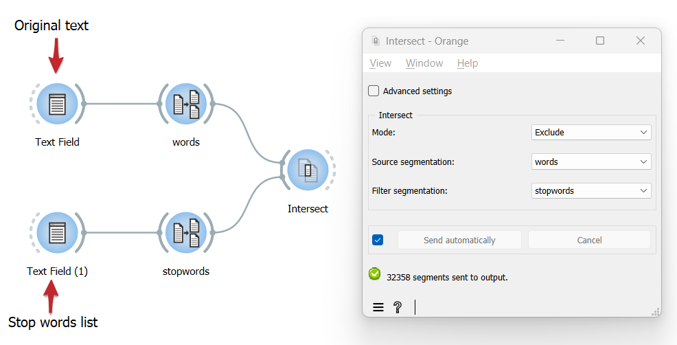

Exclude segments based on a stoplist
========================================

Goal
--------

Filter out segments based on a stoplist.

Prerequisites
-----------------

Some text has been imported in Orange Textable (see :doc:`Cookbook: Text input <text_input>`) and it has been segmented into words (see :doc:`Cookbook: Segment text in smaller units <segment_text>`).

Ingredients
---------------

  ==============  ================================ ========================== ===================================
   **Widget**      :doc:`Text Field <text_field>`   :doc:`Segment <segment>`   :doc:`Intersect <intersect>`
   **Icon**        |textfield_icon|                 |segment_icon|             |intersect_icon|
   **Quantity**    2                                 2                         1
  ==============  ================================ ========================== ===================================

.. |textfield_icon| image:: figures/TextField_36.png
.. |segment_icon| image:: figures/Segment_36.png
.. |intersect_icon| image:: figures/intersect_36.png

Procedure
-------------

.. _exclude_segments_based_on_stoplist_fig1:

         Segment and Intersect
   :scale: 80%

   Figure 1: Exclude segments based on a stoplist with instances of
   :doc:`Text Field <text_field>`, :doc:`Segment <segment>` and :doc:`Intersect <intersect>`

1. Create an instance of :doc:`Text Field <text_field>` and paste into it the stoplist you want to use.

2. Follow the indications given in :doc:`Cookbook: Segment text in smaller units <segment_text>` in order to segment the stoplist into words.

3. Create an instance of :doc:`Intersect <intersect>`.

4. Drag and drop from the output (righthand side) of the widget that emits the segmentation to be filtered, here :doc:`Segment <segment>` (*words*), to the input of :doc:`Intersect <intersect>` (lefthand side).

5. Likewise, connect :doc:`Segment <segment>` (*stopwords*) to :doc:`Intersect <intersect>`.

6. Double-click on the icon of :doc:`Intersect <intersect>` to open its interface. 

7. In the **Intersect** section, choose **Mode: Exclude**.

8. In the **Source segmentation** field, choose the segmentation to be filtered (here: *words*); in the **Filter segmentation** field, choose the segmentation containing the stopwords (here: `stopwords <http://members.unine.ch/jacques.savoy/clef/englishST.txt>`__).

9. Click the **Send** button or tick the **Send automatically** checkbox.

10. A segmentation containing the filtered segmentation is then available at the output of :doc:`Intersect <intersect>`; to display or export it, see :doc:`Cookbook: Text output <text_output>`.

Comment
-----------

- Stopword lists for various languages can be found `here <http://members.unine.ch/jacques.savoy/clef/>`__.

See also
------------

- :doc:`Textable's Basics: Using a segmentation to filter another <using_segmentation_filter_another>`
- :doc:`Reference: Intersect widget <intersect>`
- :doc:`Cookbook: Text input <text_input>`
- :doc:`Cookbook: Segment text in smaller units <segment_text>`
- :doc:`Cookbook: Text output <text_output>`