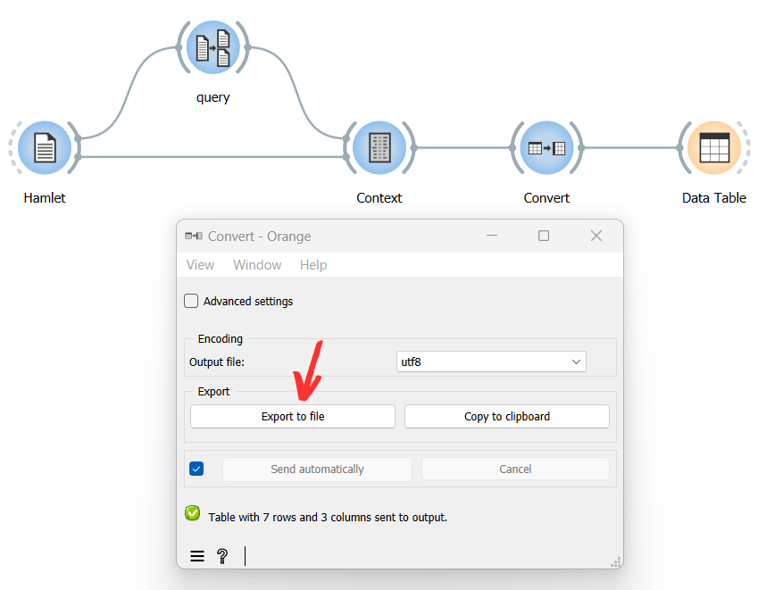

Export table
================

Goal
--------

Export an Orange Textable table in a text file in order to later import it in another program (e.g. spreadsheet software).

Prerequisites
-----------------

Some text has been imported in Orange Textable (see :doc:`Cookbook: Text input <text_input>`)
and possibly further processed (see :doc:`Cookbook: Segmentation manipulation <segmentation_manipulation>`).
A table has been created by means of one of Orange Textable’s :doc:`table construction widgets <table_construction_widgets>`
(see :doc:`Cookbook: Text analysis <text_analysis>`).

Ingredients
---------------

  ==============  ================
   **Widget**      :doc:`Convert <convert>`
   **Icon**        |convert_icon|
   **Quantity**    1
  ==============  ================

Procedure
-------------

.. _export_table_fig1:

   Figure 1: Export table with an instance of :doc:`Convert <convert>`

1. Create an instance of :doc:`Convert <convert>`.

2. Drag and drop from the output (righthand side) of the widget that has been used to build a table (here :doc:`Context <context>`), to the input of :doc:`Convert <convert>` (lefthand side).

3. Double-click on the icon of :doc:`Convert <convert>` to open its interface.

4. Select the desired encoding for the exported data (e.g. utf8).

5. Click the **Export to file** button to open the file selection dialog.

6. Select the location you want to export your file to and close the file selection dialog by clicking on **Ok**.

Comment
-----------

- If you rather want to *copy* the text content in order to later paste it in another program, click on **Copy to clipboard**; note that in this case, the encoding is by default utf8 and cannot be changed.

- The default column delimiter is \\t but this can be modified to either comma (,) or semi-colon (;) by ticking the **Advanced settings** checkbox in the :doc:`Convert <convert>` instance’s interface, then selecting the desired delimiter in the **Column delimiter** drop-down menu (**Export** section).

See also
------------

- :doc:`Reference: Convert widget <convert>`
- :doc:`Reference: Table construction widgets <table_construction_widgets>`
- :doc:`Cookbook: Text input <text_input>`
- :doc:`Cookbook: Segmentation manipulation <segmentation_manipulation>`
- :doc:`Cookbook: Text analysis <text_analysis>`