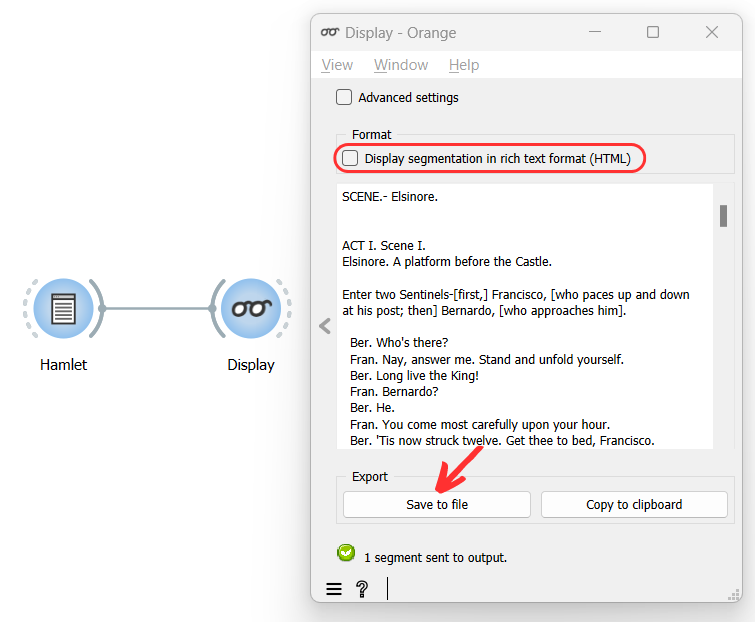

Export text content (and/or change text encoding)
=====================================================

Goal
--------

Export the content of a text (segmentation).

Prerequisites
-----------------

Some text has been imported in Orange Textable (see :doc:`Cookbook: Text input <text_input>`)
and possibly further processed (see :doc:`Cookbook: Segmentation manipulation <segmentation_manipulation>`).

Ingredients
---------------

  ==============  =======
   **Widget**      :doc:`Display <display>`
   **Icon**        |display_icon|
   **Quantity**    1
  ==============  =======

.. |display_icon| image:: figures/Display_36.png

Procedure
-------------

.. _export_text_content_fig1:

   
   Figure 1: Export text with an instance of :doc:`Display <display>`.

1. Create an instance of :doc:`Display <display>`.

2. Drag and drop from the output (righthand side) of the widget that
   emits the segmentation to be displayed, here :doc:`Text Field <text_field>`
   (*Hamlet*), to the :doc:`Display <display>`
   (lefthand side).

3. Double-click on the icon of :doc:`Display <display>`
   to open its interface and view the imported text.

4. Uncheck the **Display segmentation in rich text format (HTML)**
   checkbox.

5. Click on the **Save to file** button to open the file selection
   dialog.

6. Select the location you want to export your file to and close the
   file selection dialog by clicking on **Ok**.

Comment
-----------

-  The default output encoding is utf8; it can be changed by ticking the
   **Advanced Settings** checkbox.

-  If you rather want to *copy* the text content in order to later paste
   it in another program, click on **Copy to clipboard**.

-  If the input segmentation is large (>1000 segments), only the first 5
   segments and the last 5 segments are displayed, and thus exported, by
   default. If you want all segments exported, tick the **Advanced
   Settings** checkbox then uncheck **Limit number of displayed
   segments**.

-  More options for formatting the exported text are available by
   ticking the **Advanced settings** checkbox.

See also
------------

- :doc:`Reference: Display widget <display>`
- :doc:`Cookbook: Text input <text_input>`
- :doc:`Cookbook: Segmentation manipulation <segmentation_manipulation>`