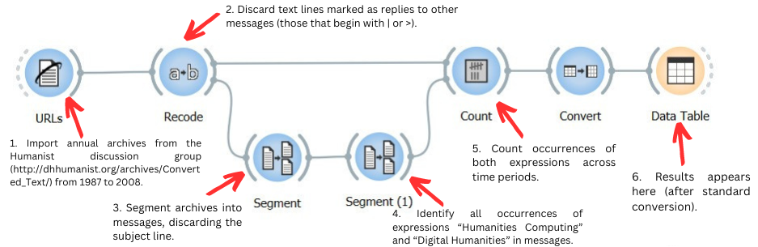
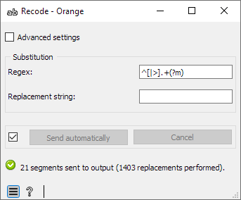
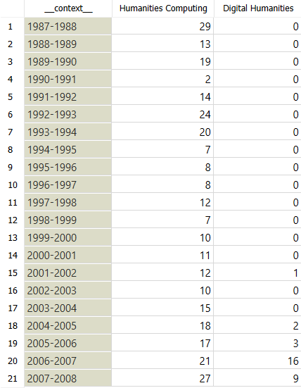

Illustration: mining Humanist
=================================

The following example is meant to show *what* Orange Textable typically
does, without considering (for now) every detail of *how* it does it.

In a paper reflecting on terminology in the field of Digital Humanities
[#]_, Patrik Svensson compares the evolution of the frequency of expressions
*Humanities Computing* and *Digital Humanities* over 20 years of
archives of the `Humanist discussion group <http://dhhumanist.org/>`_.
He uses these figures to show that while the former denomination remains
prevalent over these two decades, the latter has been quickly gaining
ground since the 2000s.

The same experiment can be run with Orange Textable, by building a
“visual program” like the one shown on :ref:`figure 1 <illustration_fig1>` below:

.. _illustration_fig1:

    Figure 1: Mining Humanist with an Orange Textable workflow.

Such a program is called a *workflow*. Its visible part consists of a
network of interconnected units called *widget instances*. Each instance
belongs to a type, e.g.
:doc:`URLs <urls>`, :doc:`Recode <recode>`, :doc:`Segment <segment>`,
and so on. Widgets are the basic blocks with which a variety of text
analysis applications can be built. Each corresponds to a fundamental
operation, such as “import data from an online source” (:doc:`URLs <urls>`)
or “replace specific text patterns with others” (:doc:`Recode <recode>`)
for example. Connections between instances determine the flow of data in
the workflow, and thus the order in which operations are carried on.
Several parallel paths can be constructed, as demonstrated here by the
:doc:`Recode <recode>` instance, which sends data to :doc:`Segment <segment>` as well as
:doc:`Count <count>`.

Widget instances can be individually parameterized in order to
“fine-tune” their operation. For example, double-clicking on the
:doc:`Recode <recode>` instance of :ref:`figure 1 <illustration_fig1>`
above displays the interface shown on :ref:`figure 2 <illustration_fig2>`
below. What this particular configuration means is that every line
beginning with symbol \| or >
(:doc:`Regex <note_regular_expressions>` field) should be replaced with 
an empty string (**Replacement string**):
in other words, remove those lines that are marked as being part of a
reply to another message. There is a fair amount of variation between
widget interfaces, but regular expressions play an important role in
several of them and Orange Textable’s flexibility owes a lot to them.

.. _illustration_fig2:

    Figure 2: Interface of the :doc:`Recode <recode>` widget.

After executing the workflow of :ref:`figure 1 <illustration_fig1>` above, the resulting frequencies can be viewed by double-clicking on the
**Data Table** instance, whose interface is shown on  :ref:`figure 3 <illustration_fig3>`
below. On the whole, these figures lend themselves to the same
interpretation as that of Patrik Svensson, but they differ wildly from
the frequencies he reports. This might be explained by the fact that, in
the present illustration, we have used *preprocessed* data made
available on the Humanist website, or it might be that we have not
processed the data exactly like Svensson did. The user can always refer
to the Orange Textable workflow (including the parameters of each
instance) to understand exactly the operations that it performs.
[#]_ In this sense, Orange Textable does not only attempt to make the
construction of text analysis programs easier; it aims to make
*communicating* and *understanding* such programs easier.

.. _illustration_fig3:

    Figure 3: Monitoring the frequency of *Humanities Computing* vs.
    *Digital Humanities*.

.. [#] Svensson, P. (2009). Humanities Computing as Digital Humanities.
       *Digital Humanities Quarterly 3(3)*. Available `here
       <http://digitalhumanities.org/dhq/vol/3/3/000065/000065.html>`_.

.. [#] The schema can be downloaded from :download:`here<schemas/humanist_for_textable_v3.37.0.ows.zip>`. Note that two decades of Humanist archives weigh dozens of megabytes and that retrieving these
       data from the Internet can take a few minutes depending on bandwidth.
       Please be patient if Orange Textable appears to be stalled when the
       schema is being opened.