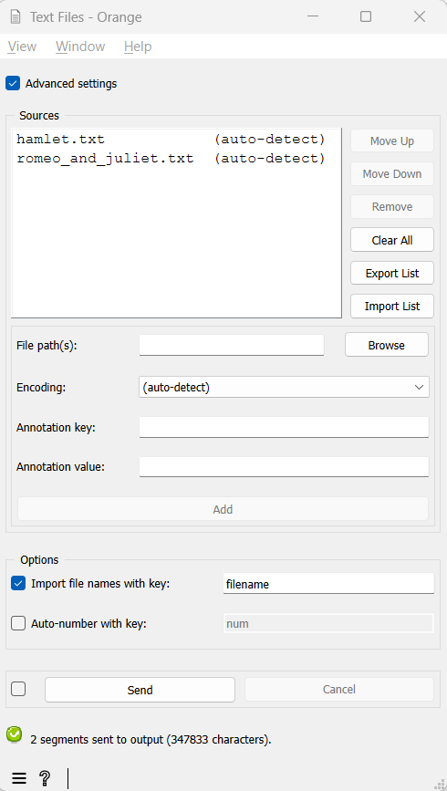

.. meta::
   :description: Orange Textable documentation, import text from file
   :keywords: Orange, Textable, documentation, import, text, file

Import text from file
=====================

Goal
-------

Import the content of one or more raw text files for further processing
with Orange Textable.

Ingredients
---------------

  ==============  =======
   **Widget**      :doc:`Text Files <text_files>`
   **Icon**        |text_files_icon|
   **Quantity**    1
  ==============  =======

.. |text_files_icon| image:: figures/TextFiles_36.png

Procedure
-------------

Single file
~~~~~~~~~~~~~~~

.. _import_text_file_fig1:

   Figure 1: Importing the content of a file using :doc:`Text Files <text_files>`.

1. Create an instance of :doc:`Text Files <text_files>`.

2. Double-click on it to open its interface.

3. Make sure the **Advanced settings** checkbox is *not* selected.

4. Click the **Browse** button to open the file selection dialog.

5. Select the file you want to import and close the file selection
   dialog by clicking **Ok**.

6. In the **Encoding** drop-down menu, select the encoding that
   corresponds to your file or **(auto-detect)** if unsure.

7. Click the **Send** button or tick the **Send automatically**
   checkbox.

8. A segmentation covering the file’s content is then available at the
   output of :doc:`Text Files <text_files>`;
   to display or export it, see :doc:`Cookbook: Text output <text_output>`.

Multiple files
~~~~~~~~~~~~~~~~~~

.. _import_text_file_fig2:
   

   Figure 2: Importing the content of several files using :doc:`Text Files <text_files>`.

1.  Create an instance of :doc:`Text Files <text_files>`.

2.  Double-click on it to open its interface.

3.  Make sure the **Advanced settings** checkbox *is* selected.

4.  If needed, empty the list of imported files by clicking the **Clear
    all** button.

5.  Click the **Browse** button to open the file selection dialog.

6.  Select the first file(s) you want to import. Select the encoding
    that corresponds to your file(s) or **(auto-detect)** if unsure.

7.  Click the **Add** button to add your first file(s) to the list of
    imported files.

8.  Repeat steps 5 to 7 for adding more files if needed.

9.  Click the **Send** button or tick the **Send automatically**
    checkbox.

10. A segmentation containing a segment covering each imported file’s
    content is then available at the output of :doc:`Text Files <text_files>`;
    to display or export it, see :doc:`Cookbook: Text output <text_output>`.

See also
------------

- :doc:`Reference: Text Files widget <text_files>`
- :doc:`Cookbook: Text output <text_output>`