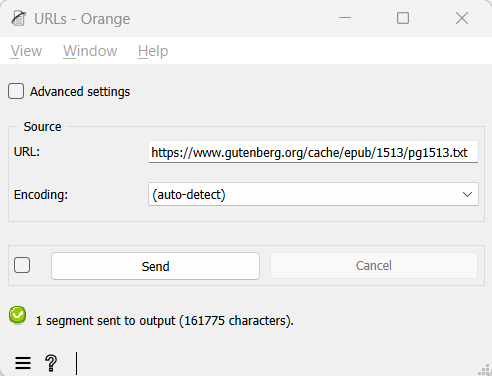

.. meta::
   :description: Orange Textable documentation, import text from internet location
   :keywords: Orange, Textable, documentation, import, text, internet, URL

Import text from internet location
======================================

Goal
--------

Import text content located at one or more URLs for further processing
with Orange Textable.

Ingredients
---------------

  ==============  =======
   **Widget**      :doc:`URLs <urls>`
   **Icon**        |urls_icon|
   **Quantity**    1
  ==============  =======

Procedure
-------------

Single URL
~~~~~~~~~~~~~~

.. _import_text_internet_location_fig1:

    Figure 1: Importing text from an internet location using the :doc:`URLs <urls>` widget.

1. Create an instance of
   :doc:`URLs <urls>`.

2. Double-click on it to open its interface.

3. Make sure the **Advanced settings** checkbox is *not* selected.

4. In the **URL** field, type the URL whose content you want to import
   (including the ``http://`` or ``https://`` prefix).

5. In the **Encoding** drop-down menu, select the encoding that
   corresponds to this URL or **(auto-detect)** if unsure.

6. Click the **Send** button or tick the **Send automatically**
   checkbox.

7. A segmentation covering the URL’s content is then available at the
   output of
   :doc:`URLs <urls>`;
   to display or export it, see :doc:`Cookbook: Text output <text_output>`.

Multiple URLs
~~~~~~~~~~~~~~~~~

.. _import_text_internet_location_fig2:

.. figure:: figures/urls_advanced_example.png
    :align: center
    :alt: Importing text from several internet locations using the URLs widget
    :scale: 80%

    Figure 2: Importing text from several internet locations using the
    :doc:`URLs <urls>` widget.

1.  Create an instance of
    :doc:`URLs <urls>`.

2.  Double-click on it to open its interface.

3.  Make sure the **Advanced settings** checkbox *is* selected.

4.  If needed, empty the list of imported URLs by clicking the **Clear
    all** button.

5.  In the **URL(s)** field, enter the URLs you want to import
    (including the ``http://`` or ``https://`` prefix), separated by the string
    ” / ” (space + slash + space).

6.  In the **Encoding** drop-down menu, select the encoding that
    corresponds to the set of selected URLs or **(auto-detect)** if
    unsure.

7.  Click the **Add** button to add the set of selected URLs to the list
    of imported URLs.

8.  Repeat steps 5 to 7 for adding more URLs if needed.

9.  Click the **Send** button or tick the **Send automatically**
    checkbox.

10. A segmentation containing a segment covering each imported URL’s
    content is then available at the output of
    :doc:`URLs <urls>`;
    to display or export it, see :doc:`Cookbook: Text output <text_output>`.

See also
------------

- :doc:`Reference: URLs widget <urls>`
- :doc:`Cookbook: Text output <text_output>`