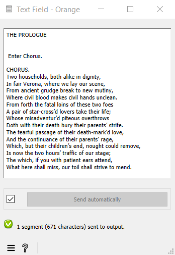

.. meta::
   :description: Orange Textable documentation, import text from keyboard
   :keywords: Orange, Textable, documentation, import, text, keyboard

Import text from keyboard
=============================

Goal
--------

Input text using keyboard for further processing with Orange Textable.

Ingredients
---------------

  ==============  =======
   **Widget**      :doc:`Text Field <text_field>`
   **Icon**        |text_field_icon|
   **Quantity**    1
  ==============  =======

Procedure
-------------

.. _import_text_keyboard_fig1:

   Figure 1: Importing a string using widget :doc:`Text Field <text_field>`.

1. Create an instance of :doc:`Text Field <text_field>`.

2. Double-click on it to open its interface.

3. Type or paste text in the text field.

4. Click the **Send** button or tick the **Send automatically**
   checkbox.

5. A segmentation covering the input text is then available at the
   output of :doc:`Text Field <text_field>`;
   to display or export it, see :doc:`Cookbook: Text output <text_output>`.

See also
------------

- :doc:`Textable's Basics: Keyboard input and segmentation display <keyboard_input_segmentation_display>`
- :doc:`Reference: Text Field widget <text_field>`
- :doc:`Cookbook: Text output <text_output>`