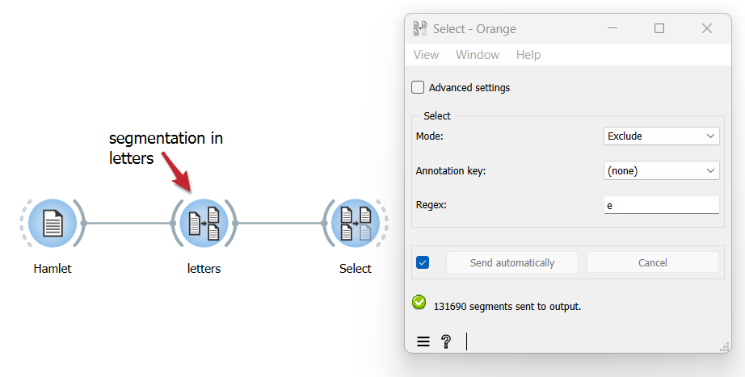

Include/exclude segments based on a pattern
===============================================

Goal
--------

Include or exclude segments from a segmentation using a regular expression

Prerequisites
-----------------

Some text has been imported in Orange Textable (see :doc:`Cookbook: Text input <text_input>`) and in all likelihood it has been segmented in smaller units (see :doc:`Cookbook: Segment text in smaller units <segment_text>`).

Ingredients
---------------

  ==============  ================  
   **Widget**      :doc:`Select <select>`   
   **Icon**        |select_icon|    
   **Quantity**    1                
  ==============  ================ 

.. |select_icon| image:: figures/Select_36.png

Procedure
-------------

.. _include_exclude_units_based_on_pattern_fig1:

   Figure 1: Using the :doc:`Select <select>` widget to include/exclude segments
   from a segmentation based on a regular expression
   

1. Create an instance of :doc:`Select <select>`.

2. Drag and drop from the output (righthand side) of the widget that emits the segmentation to be filtered, here :doc:`Segment <segment>` (*letters*), to the input of :doc:`Select <select>` (lefthand side).

3. Double-click on the icon of :doc:`Select <select>` to open its interface.

4. In the **Select** section, choose either **Mode:** **Include** or **Exclude**.

5. In the **Regex** field, insert the pattern that will select the units to be included or excluded, such as the single letter *e* in our example.

6. Click the **Send** button or tick the **Send automatically** checkbox.

7. A segmentation containing the selected segments is then available at the output of :doc:`Select <select>`; to display or export it, see :doc:`Cookbook: Text output <text_output>`.

Comment
-----------

- In the **Regex** field you can use all the syntax of Python’s regular expression (*cf.* :doc:`Regular expressions <note_regular_expressions>`).
- The :doc:`Select <select>` widget emits on a second output connection (not selected by default) a segmentation containing the segments that were *not* selected (see :doc:`Filtering segmentations using regexes <filtering_segmentations_regexes>` for instructions on how to access this other output segmentation).

See also
------------

- :doc:`Advanced Topics: Filtering segmentations using regexes <filtering_segmentations_regexes>`
- :doc:`Reference: Select widget <select>`
- :doc:`Cookbook: Text input <text_input>`
- :doc:`Cookbook: Segment text in smaller units <segment_text>`
- :doc:`Cookbook: Text output <text_output>`