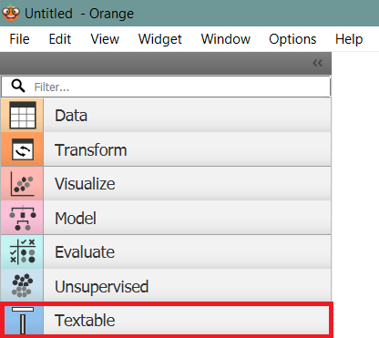

Installation
================

Python 3.x and Orange Canvas 3.x must imperatively be installed *before*
Orange Textable. After installation, Orange Textable appears in the form
of an additional tab in Orange Canvas.

   Figure 1: Additional Textable tab in Orange Canvas.

The installation procedure is slightly different on Windows and MacOS X. [#]_

.. toctree::
    windows_installation
    macosx_installation

.. [#] Several users have reported successful installation on Linux but the procedure is not documented here.
