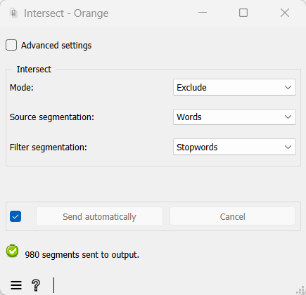

.. meta::
   :description: Orange Textable documentation, Intersect widget
   :keywords: Orange, Textable, documentation, Intersect, widget

.. _Intersect:

Intersect
=========

.. image:: figures/Intersect_54.png

In-/exclude segments based on another segmentation.

Signals
-------

Inputs:

* ``Segmentation`` (multiple)

  Segmentation out of which a subset of segments should be selected
  ("source" segmentation), or containing the segments that will be
  in-/excluded from the former ("filter" segmentation").

Outputs:

* ``Selected data`` (default)

  Segmentation containing the selected segments

* ``Discarded data``

  Segmentation containing the discarded segments

Description
-----------

This widget inputs several segmentations and selects the segments of one of
them ("source" segmentation) on the basis of the segments present in another
("filter" segmentation). It also emits on an output connection (not selected
by default) a segmentation containing the segments that were *not* selected.

Basic interface
~~~~~~~~~~~~~~~

The **Intersect** section of the widget's basic interface (see :ref:`figure 1
<intersect_fig1>` above) allows the user to specify if the segments of the
source segmentation that correspond to a type present in the filter
segmentation should be included (**Mode: Include**) in the output segmentation
or excluded (**Mode: Exclude**) from it. This section is also designed to
select the source segmentation (**Source segmentation**) and the filter
segmentation (**Filter segmentation**) among the input segmentations. [#]_

.. _intersect_fig1:

    Figure 1: **Intersect** widget (basic interface).

The **Source annotation** key drop-down menu allows the user to select an
annotation key from the source segmentation; thus the segments whose
annotation value for this key corresponds to a type present in the filter
segmentation will be in-/excluded. If the value *(none)* is selected, the
segment content will be decisive.

Thus in :ref:`figure 1 <intersect_fig1>` above, the widget inputs two
segmentations. The first (**Source segmentation**), whose label is *words*, is
the result of the segmentation of a text in words, as performed with the
:ref:`Segment` widget for instance. The second (**Filter segmentation**),
whose label is *stopwords*, is the result of the segmentation in words of a
list of so-called "stopwords" (articles, pronouns, prepositions,
etc.)--typically deemed irrelevant for information retrieval.

The **Send** button triggers the emission of a segmentation to the output
connection(s). When it is selected, the **Send automatically** checkbox
disables the button and the widget attempts to automatically emit a
segmentation at every modification of its interface or when its input data are
modified (by deletion or addition of a connection, or because modified data is
received through an existing connection).

Below the **Send** button, the number of segments in the output
segmentation are indicated, or the reasons why no segmentation is emitted (no input data,
no selected input segment, etc.).

Advanced interface
~~~~~~~~~~~~~~~~~~

The main difference between the widget's basic and advanced interface is that
in the latter, section **Intersect** includes a **Filter annotation key**
drop-down menu and a **Source annotation key**. 

If a given annotation key of the filter segmentation is
selected in the drop-down menu of the **Filter annotation key**, 
the corresponding annotation value (rather than *content*) types
will condition the in-/exclusion of the source segmentation segments.
Since the **Source annotation key** drop-down menu is set on *(none)*,
the content of input segments will determine the next steps (rather than the
values of some annotation key). Concretely, the source segmentation segments
(namely the words from the text) whose content matches that of a segment from
the filter segmentation (namely a stopword) will be excluded (**Mode:
Exclude**) from the output segmentation. By contrast, choosing the value
**Include** would result in including as output only the stopwords from the
text.

The advanced interface also offers two additional controls in section
**Options**. The **Auto-number with key** checkbox enable the program to
automatically number the segments from the output segmentation and to
associate their number to the annotation key specified in the text field on
the right. The **Copy annotations** checkbox copies every annotation from the
input segmentation to the output segmentation.

Messages
--------

Information
~~~~~~~~~~~

*Data correctly sent to output: <n> segments.*
    This confirms that the widget has operated properly.

*Settings were* (or *Input has*) *changed, please click 'Send' when ready.*
    Settings and/or input have changed but the **Send automatically** checkbox
    has not been selected, so the user is prompted to click the **Send**
    button (or equivalently check the box) in order for computation and data
    emission to proceed.

*No data sent to output yet: no input segmentation.*
    The widget instance is not able to emit data to output because it receives
    none on its input channel(s).

*No data sent to output yet, see 'Widget state' below.*
    A problem with the instance's parameters and/or input data prevents it
    from operating properly, and additional diagnostic information can be
    found in the **Widget state** box at the bottom of the instance's
    interface (see `Warnings`_ below).

Warnings
~~~~~~~~

*No label was provided.*
    A label must be entered in the **Output segmentation label** field in
    order for computation and data emission to proceed.
    
*No annotation key was provided for auto-numbering.*
    The **Auto-number with key** checkbox has been selected and an annotation
    key must be specified in the text field on the right in order for
    computation and data emission to proceed.
    
Examples
--------

* :doc:`Getting started: Using a segmentation to filter another
  <using_segmentation_filter_another>`
* :doc:`Cookbook: Exclude segments based on a stoplist
  <exclude_segments_based_on_stoplist>`

Footnotes
---------

.. [#] It should be noted that the interface does not prevent the user from
       selecting the same segmentation as source and filter, which can only
       make sense if different values are selected in the **Source annotation
       key** and **Filter annotation key** menus (the latter being only
       available when the **Advanced settings** checkbox is selected).

.. [#] Here it concerns the segmentation containing the selected segments and
       emitted on the default output channel; the segmentation containing the
       discarded segments receives the same label prepended with *NEG\_*.

