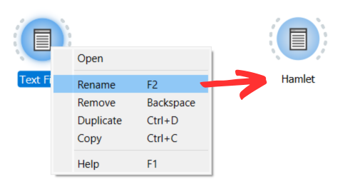
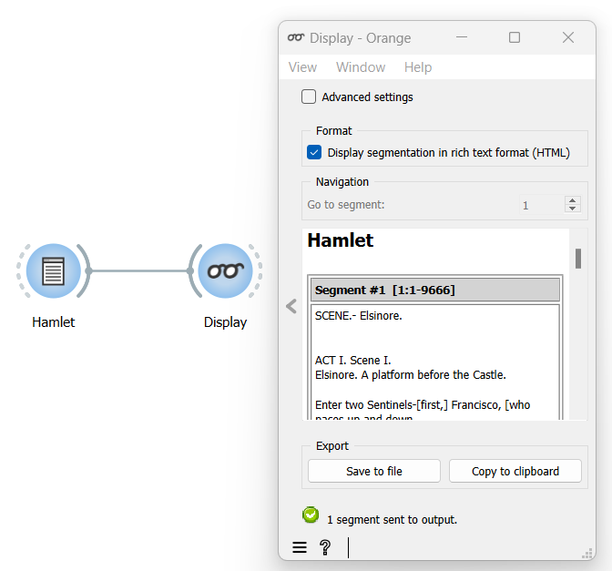

.. meta::
   :description: Orange Textable documentation, keyboard input, widget labelling and segmentation display
   :keywords: Orange, Textable, documentation, keyboard, input, label, segmentation, display

Keyboard input, widget labelling and segmentation display
================================================================

Typing or pasting text in a :doc:`Text Field <text_field>`
widget is the simplest way to import a string in Orange Textable. As a
result, the widget creates a segmentation with a single segment covering
the entire string. (see :ref:`figure 1 <keybord_input_fig1>`
below):

.. _keybord_input_fig1:

.. figure:: figures/text_field_example.png
   :align: center
   :alt: Example usage of text field
   :scale: 75%

   Figure 1: Typing text in widget :doc:`Text Field <text_field>`.

Each segmentation is identified by a label which is the name of the
widget that creates the segmentation. It is a good habit to rename
widgets to make the label more meaningful. To do so, right-click on the
widget, select **Rename** or press **F2**, then enter the new name.

.. _keybord_input_fig2:

   Figure 2: Typing an extract of *Hamlet* in widget :doc:`Text Field <text_field>` and
   giving it a label (*Hamlet*).

This widget’s simplicity makes it most adequate for pedagogic purposes.
Later, we will discover other, more powerful ways of importing strings
such as the :doc:`Text Files <text_files>` and
:doc:`URLs <urls>` widgets. These import widgets create a segmentation with one segment for
each imported file or URL.

The :doc:`Display <display>` widget can be used to visualize the details of a segmentation. By
default, it shows the segmentation’s label followed by each successive
segment’s content (see :ref:`figure 3 <keybord_input_fig3>` below).

.. _keybord_input_fig3:

   Figure 3 : Viewing *Hamlet* in widget :doc:`Display <display>`.

The numbers between square brackets after the segment number constitute
the *address* of the segment, consisting of three elements: 1) string
index 2) initial position within the string 3) final position. The text
corresponding to a given segment is called the segment’s *content*.

By default, :doc:`Display <display>` passes its input data without modification to its output connections. It
is very useful for viewing intermediate results in an Orange Textable
workflow and making sure that other widgets have processed data as
expected.

See also
-----------------

- :doc:`Reference: Text field widget <text_field>`
- :doc:`Reference: Display widget <display>`
- :doc:`Cookbook: Import text from keyboard <import_text_keyboard>`
- :doc:`Cookbook: Display text content <display_text_content>`