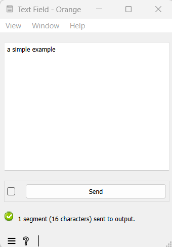
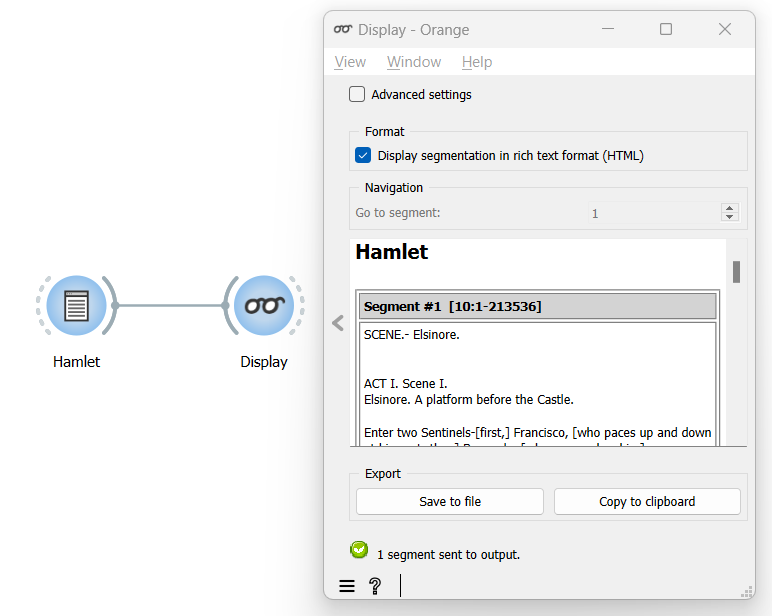

.. meta::
   :description: Orange Textable documentation, keyboard input and
                 segmentation display
   :keywords: Orange, Textable, documentation, keyboard, input, segmentation,
              display

Keyboard input, widget labelling and segmentation display
===========================================================

Typing text in a :ref:`Text Field` widget is the simplest way to
import a string in Orange Textable. As a result, the widget creates a segmentation with a single segment covering the entire string. (see
:ref:`figure 1 <keyboard_input_segmentation_fig1>` below):

.. _keyboard_input_segmentation_fig1:

    Figure 1: Typing some simple examples in widget :ref:`Text Field`.
	
Each segmentation is identified by a label which is the name of the widget that creates the segmentation. 
You can rename this widget to make the label more meaningful (see :ref: `figure 2 <keyboard_input_segmentation_fig2>` below): 

.. _keyboard_input_segmentation_fig2:

.. figure:: figures/Text_field_labelling.png
	:align: center
	:alt: Example Widget Label

	Figure 2: Typing an extract of *Salammbô* in widget :ref: `Text Field` and giving it a label (Flaubert).

As we will see later, a segmentation can also store annotations associated with segments. 
    
This widget’s simplicity makes it most adequate for pedagogic purposes. 
Later, we will discover other, more powerful ways of importing strings such as Text Files and URLs. 
Those importation widgets create a segmentation with one segment for each imported file or URL.

The :ref:`Display` widget can be used to visualize the details of a segmentation. 
By default, it shows the segmentation’s label followed by each successive segment’s address [#]_ and content. 
A segmentation sent by a :ref:`Text Field` instance will contain a single segment
covering the whole string (see :ref:`figure 3
<keyboard_input_segmentation_fig3>` below).

.. _keyboard_input_segmentation_fig3:

    Figure 3 : Viewing *Salammbô* in widget :ref:`Display`.
    
By default, :ref:`Display` passes its input data without
modification to its output connections. It is very useful for viewing
intermediate results in an Orange Textable workflow and making sure that other
widgets have processed data as expected.
    
See also
--------

* :ref:`Reference: Text Field widget <Text Field>`
* :ref:`Reference: Display widget <Display>`
* :doc:`Cookbook: Import text from keyboard <import_text_keyboard>`
* :doc:`Cookbook: Display text content <display_text_content>`

Footnotes
---------

[#] A segment is basically a substring of characters. Every segment has an address consisting of three elements:
1) string index
2) initial position within the string
3) final position
In the case of a simple example, address (1, 3, 8) refers to substring simple, (1, 12, 12) to character a, and (1, 1, 16) to the entire string. 
The substring corresponding to a given address is called the segment’s content.

