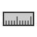
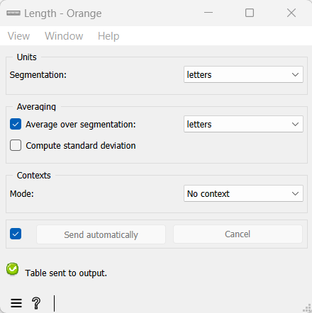

.. meta::
   :description: Orange Textable documentation, Length widget
   :keywords: Orange, Textable, documentation, Length, widget

.. _Length:

Length
======

Compute the (average) length of segments.

Signals
-------

Inputs:

* ``Segmentation`` (multiple)

  Segmentation whose segments constitute the units of length measurement, 
  the contexts whose lengths will be measured, or the units over which length
  will be averaged
  

Outputs:

* ``Textable table``

  Table in the internal format of Orange Textable

Description
-----------

This widget inputs one or several segmentation, measures the length of one
(eventually within the segments defined by another segmentation), and sends
the results in table format. It also allows the user to calculate the average
length of segments of a segmentation based on the units defined by another
segmentation.

The tables produced by the **Length** widget have at least 2 columns, and at
most 4. The first column contains the headers corresponding to the contexts --
which are essentially defined in the same way as in the :ref:`Count` widget.
The second column gives the length indications (in which case the header is
*__length__*) or the average length (header *__length_average__*). In the
latter case, the third column may then contain the corresponding standard
deviations if their display is required by the user (header
*__length_std_deviation__*), and the last column will indicate the number of
elements on which the average calculation is done (header *__length_count__*).

To take a simple example, consider two segmentations of the string *a simple
example* [#]_:

A) label = *words*

===========  =======  =====  ==================  =================
 content      start    end    *part of speech*    *word category*
===========  =======  =====  ==================  =================
 *a*          1        1      *article*           *grammatical*
 *simple*     3        8      *adjective*         *lexical*
 *example*    10       16     *noun*              *lexical*
===========  =======  =====  ==================  =================

B) label = *letters* (extract)

=========  =======  =====  ===================
 content    start    end    *letter category*
=========  =======  =====  ===================
 *a*        1        1      *vowel*
 *s*        3        3      *consonant*
 *i*        4        4      *vowel*
 ...        ...      ...    ...
 *e*        16       16     *vowel*
=========  =======  =====  ===================

Essentially here two basic configurations are considered. The first is when we
are simply interested in the length of a given segmentation, for example
*letters*:

.. csv-table::
    :header: *__context__*, *__length__*
    :stub-columns: 1
    :widths: 2 2

    *__global__*,    14

In what follows, we will designate with the terms *units of measurement* the
segments whose count is interpreted as a length measure, namely in this
example the segments of the segmentation *letters*.

The second basic configuration is when we wish to know the *average* length of
the segments of a segmentation, for example *words*, in terms of measure
units belonging to another segmentation (here *letters*):

.. csv-table::
    :header: *__context__*, *__length_average__*, *__length_std_deviation__*, *__length_count__*
    :stub-columns: 1
    :widths: 2 3 4 3

    *__global__*,   4.66666650772,  2.62466931343,  3
    
In this case, we will name *averaging units* the segments whose lengths are
measured and averaged. Note that the average length calculation presupposes
that at least one measure unit is *contained* within the averaging unit, in
the sense that the following three conditions are met: (a) the segment
corresponding to the unit and the context are both be associated to the same
string, (b) the initial position of the unit segment in the string is higher
or equal to that of the context segment, and (c) conversely the final position
of the unit is lower or equal to that of the context.

These two elementary configurations (length measurement and average length
calculation) can then be combined with two ways of specifying contexts -- i.e.
two ways of defining table rows. The first mode consists of defining the
contexts based on the content or the annotations of a given segmentation; for
example, here is the length of the *words* segments (contexts) in terms of
those of *letters* (units of measurement):

.. csv-table::
    :header: *__context__*, *__length__*
    :stub-columns: 1
    :widths: 2 2

    *a*,        1
    *simple*,   6
    *example*,  7
    
It should be noted that the segment *types* define the row headers, as
illustrated in the following example, where the same segmentations are used
but the contexts are defined by the annotation values associated with the key
*word type*:

.. csv-table::
    :header: *__context__*, *__length__*
    :stub-columns: 1
    :widths: 2 2

    *grammatical*,  1
    *lexical*,      13
    
The average length calculation is also applicable when the contexts are
defined on the basis of a segmentation. In this case, we will generally use
three different segmentations to define the units of measurement, the
averaging units, and the contexts; for example, it could be to calculate the
average length of words (in number of letters) in different texts. To stay in
the frame of our example based on only two segmentations, we can exploit the
fact that all segments are contained in themselves and calculate the average
length of words (in number of letters) depending on the *word types*
annotations (in other words we here use a single segmentation to determine the
contexts and the averaging units):

.. csv-table::
    :header: *__context__*, *__length_average__*, *__length_std_deviation__*, *__length_count__*
    :stub-columns: 1
    :widths: 2 3 4 3
    
    *grammatical*,  1,  0,  1
    *lexical*,  6.5,  0.5,  2

The second context specification mode lies on the concept of a "window" of *n*
segments that we progressively slide from the beginning to the end of the
segmentation. For example, by setting the window size to 2 segments, we can
examine the average length of words (in number of letters) in successive
bigrams of the *words* segmentation (identified by their position):

.. csv-table::
    :header: *__context__*, *__length_average__*, *__length_std_deviation__*, *__length_count__*
    :stub-columns: 1
    :widths: 2 3 4 3
    
    *1*,  3.5,  2.5,  2
    *2*,  6.5,  0.5,  2

By construction, each cell of the column *__length_count__* will then contain
the same value, or the window size. Based on this observation, it is rather
easy to convince oneself that this latter context specification mode only
makes sense when we are interested in the evolution of an *average* length
throughout a segmentation.

We now move on to the presentation of the widget interface (see :ref:`figure 1
<length_fig1>`). It contains three separate sections for the specification of
the units of measurement (**Units**), of the averaging units (**Averaging**),
and of the contexts (**Contexts**).

The **Units** section only contains a single drop-down menu (**Segmentation**)
used to select among the input segmentation the one whose segments will
provide the units of measurement.

In the **Averaging** section, the **Average over segmentation** checkbox
triggers the calculation of the average length. The drop-down menu on the
right allows the user to select the segmentation whose segments will
constitute the averaging units. The **Compute standard deviation** checkbox
allows the user to calculate, other than the average length, its standard
deviation. It should be noted that for large segmentations, this option is
likely to spectacularly extend the calculation time.

.. _length_fig1:

    Figure 1: **Length** widget (**No context** mode).
    
The **Contexts** section is available in several variants depending on the
value selected in the **Mode** drop-down menu. This latter option allows the
user to choose among the context specification modes described above. The **No
context** mode corresponds to the case where the length measurement or the
average length calculation are globally applied to the entire segmentation
that defines the units of measurement (specified in the **Units** section).

The **Sliding window** mode (:ref:`figure 2 <length_fig2>`) implements the
notion of a "sliding window" introduced above. It allows the user to observe
the evolution of the average length throughout the averaging unit
segmentation. The only parameter is the size of the window (in number of
segments), set by means of the **Window size** cursor.

.. _length_fig2:

.. figure:: figures/count_mode_sliding_window_example.png
    :align: center
    :alt: Length widget in mode "Sliding window"

    Figure 2: **Length** widget (**Sliding window** mode).

.. _length_fig3:

.. figure:: figures/count_mode_containing_segmentation.png
    :align: center
    :alt: Length widget in mode "Containing segmentation"

    Figure 3: **Length** widget (**Containing segmentation** mode).

Finally, the **Containing segmentation** mode (see :ref:`figure 3
<length_fig3>`) corresponds to the case where the contexts are defined by the
segment types appearing in a segmentation (that will most often be distinct
from the segmentation providing the units of measurement and the averaging
units). This segmentation is selected among the input segmentation by means of
the **Segmentation** drop-down menu. The **Annotation key** menu shows the
possible annotation keys associated to the selected segmentation; if one of
these keys is selected, the corresponding types of annotation values will
constitute the row headers; if on the other hand the value *(none)* is
selected, the *content* of the segments will be used. The **Merge contexts**
checkbox allows the user to measure the length or to calculate the average
length globally in the entire segmentation that defined the contexts.

The **Send** button triggers the emission of a table in the internal format
of Orange Textable to the output connection(s). When it is selected, the
**Send automatically** checkbox disables the button and the widget attempts
to automatically emit a segmentation at every modification of its interface or
when its input data are modified (by deletion or addition of a connection, or
because modified data is received through an existing connection).

The informations below the **Send** button indicate if a table has been correctly emitted, or the
reasons why no table is emitted (no input data).

Messages
--------

Information
~~~~~~~~~~~

*Data correctly sent to output.*
    This confirms that the widget has operated properly.

*Settings were* (or *Input has*) *changed, please click 'Send' when ready.*
    Settings and/or input have changed but the **Send automatically** 
    checkbox has not been selected, so the user is prompted to click the 
    **Send** button (or equivalently check the box) in order for computation 
    and data emission to proceed.

*No data sent to output yet: no input segmentation.*
    The widget instance is not able to emit data to output because it receives
    none on its input channel(s).

*No data sent to output yet, see 'Widget state' below.*
    A problem with the instance's parameters and/or input data prevents it
    from operating properly, and additional diagnostic information can be
    found in the **Widget state** box at the bottom of the instance's
    interface (see `Warnings`_ below).

Warnings
~~~~~~~~

*Resulting table is empty.*
    No table has been emitted because the widget instance couldn't find a
    single element in its input segmentation(s). A likely cause for this 
    problem (when using the **Containing segmentation** mode) is that the unit
    and context segmentations do not refer to the same strings, so that the 
    units are in effect *not* contained in the contexts. This is typically a
    consequence of the improper use of widgets :ref:`Preprocess` and/or
    :ref:`Recode` (see :ref:`anchor_to_caveat`).
        
Footnotes
---------

.. [#] By convention, we do not indicate here the string index associated with
       each segment but only its start and end positions, along with the
       various annotation values associated with it; moreover, for the sake of
       readability, we do indicate the content of each segment, though it is
       not formally part of the segmentation (but rather of the string to
       which the segmentation refers).

