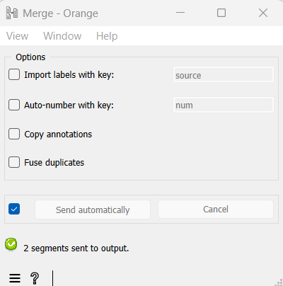

.. meta::
   :description: Orange Textable documentation, merging segmentations
   :keywords: Orange, Textable, documentation, merging, segmentations

Merging segmentations together
==============================

Computerized text analysis often implies consolidating various text
sources into a single *corpus*. In Orange Textable, this amounts to
grouping segmentations together, and it is the purpose of the
:doc:`Merge <merge>` widget.

To try out this widget, create on the canvas two instances of 
:doc:`Text Field <text_field>`, an instance of
:doc:`Merge <merge>`, and an instance of
:doc:`Display <display>` (see :ref:`figure 1 <merging_segmentations_together_fig1>`
below). Type a different string in each :doc:`Text Field <text_field>`
instance (e.g. *a simple example* and *another example*) and assign it a
distinct label (e.g. *text_string* and *text_string2*). Eventually,
connect the instances as shown on :ref:`figure 1 <merging_segmentations_together_fig1>`.

.. _merging_segmentations_together_fig1:

    Figure 1: Grouping *a simple example* with *another example* using
    widget :doc:`Merge <merge>`.

The interface of widget :doc:`Merge <merge>`
(see :ref:`figure 2 <merging_segmentations_together_fig2>` below) features several options. We will return later to their purpose,
let’s leave all boxes unchecked for now.

.. _merging_segmentations_together_fig2:

    Figure 2: Interface of widget :doc:`Merge <merge>`.

:ref:`Figure 3 <merging_segmentations_together_fig3>` above shows the resulting merged segmentation, as displayed by widget
:doc:`Display <display>`.
As can be seen, :doc:`Merge <merge>` makes it easy to concatenate several strings into a single segmentation.
If the incoming segmentations contained several segments, each of them
would appear in the output segmentation.

.. _merging_segmentations_together_fig3:

    Figure 3: Merged segmentation.

.. _merging_segmentations_together_ex:

**Exercise:** Can you add a new instance of :doc:`Merge <merge>`
to the workflow illustrated on :ref:`figure 1 <merging_segmentations_together_fig1>`
above and modify the connections (but not the configuration of existing
widgets) so that the segmentation given in :ref:`figure 4 <merging_segmentations_together_fig4>`
below appears in the :doc:`Display <display>`
widget? (:ref:`solution <solution_merging_segmentations_together_ex>`)

.. _merging_segmentations_together_fig4:

    Figure 4: The segmentation requested in the :ref:`exercise <merging_segmentations_together_ex>`.

.. _solution_merging_segmentations_together_ex:

**Solution:** (:ref:`back to the exercise <merging_segmentations_together_ex>`)

    Figure 5: Solution to the :ref:`exercise <merging_segmentations_together_ex>`.

See also
-----------------
   
- :doc:`Reference: Merge widget <merge>`
- :doc:`Cookbook: Merge several texts <merge_several_texts>`