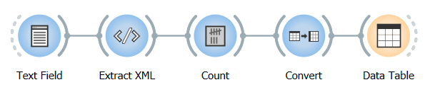
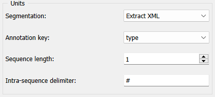

.. meta::
   :description: Orange Textable documentation, merging units with XML annotations
   :keywords: Orange, Textable, documentation, XML, merge, annotations

Merging units with XML annotations
==================================

Annotations can also be used for merging units, notably during counting
operations. Consider again the example of annotations
extracted from XML data developed :doc:`here <converting_xml_markup_annotations>`.
The segmentation produced by :doc:`Extract XML <extract_xml>`
can be sent to an instance of
:doc:`Count <count>`
as in the workflow shown on :ref:`figure 1 <merging_units_annotations_fig1>`
below.

.. _merging_units_annotations_fig1:

    Figure 1: Counting segments extracted from XML data.

If the *type* annotation key is selected in section **Units** of widget
:doc:`Count <count>`’s
interface (see :ref:`figure 2 <merging_units_annotations_fig2>`
below), the annotation values corresponding to this key (namely part of
speech tags) will be counted in place of the segments’ content.

.. _merging_units_annotations_fig2:

    Figure 2: Merging units using annotation values.

The resulting table is as follows:

+----------+---+
| **NOUN** | 3 |
+----------+---+
| **DET**  | 1 |
+----------+---+
| **PREP** | 1 |
+----------+---+

Of course, annotations may be used to merge units *and* contexts
simultaneously.

See also
-----------------

- :doc:`Advanced Topics: Converting XML markup to annotations <converting_xml_markup_annotations>`
- :doc:`Reference: Extract XML widget <extract_xml>`
- :doc:`Reference: Count widget <count>`