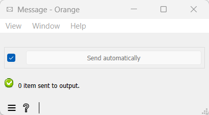

.. meta::
   :description: Orange Textable documentation, Message widget
   :keywords: Orange, Textable, documentation, Message, widget

.. _Message:

Message
=======

.. image:: figures/Message_54.png

Parse JSON data in segmentation and use them to control other widgets.

Signals
-------

Inputs:

- ``Segmentation``

  Segmentation containing a single segment with the JSON data to be parsed

Outputs:

- ``Message``

  *JSONMessage* object that can be sent to other widgets

Description
-----------

This widget inputs a segmentation containing a single segment whose content
is in `JSON <http://www.json.org/>`_ format. After validation, the data is
converted to a *JSONMessage* object and emitted to the widget's
output connections. Provided that the data conforms to one of the formats
described in section :doc:`JSON im-/export format <json_import_export>`, the
*JSONMessage* object can be sent to an instance of the corresponding widget
(either :doc:`Text Files <text_files>`, :doc:`urls`, :doc:`Recode <recode>`, or :doc:`Segment <segment>`) and
used to control its behavior remotely.

.. _message_fig1:

    Figure 1: Interface of the **Message** widget.

The widget's interface offers no user-controlled option (see :ref:`figure 1
<message_fig1>` above). 

The **Send** button triggers the emission of a **JSONMessage** object to the
output connection(s). When it is selected, the **Send automatically** checkbox
disables the button and the widget attempts to automatically emit a
segmentation when its input data are modified (by deletion or addition of a
connection, or because modified data is received through an existing
connection).

The informations generated below the **Send** button indicate the number of items
present in the parsed JSON data, or the reasons why no *JSONObject* can be
emitted (no input or invalid data, input segmentation containing more than one
segment).

Messages
--------

Information
~~~~~~~~~~~

*<n> items sent to output.*
    This confirms that the widget has operated properly.

Warnings
~~~~~~~~

*Widget needs input.*
    The widget instance is not able to emit data to output because it receives
    none on its input channel(s).

*Settings were* (or *Input has*) *changed, please click 'Send' when ready.*
    Settings and/or input have changed but the **Send automatically** checkbox
    has not been selected, so the user is prompted to click the **Send**
    button (or equivalently check the box) in order for computation and data
    emission to proceed.

*Please make sure that input contains only one segment.*
    The input segmentation must contain exactly 1 segment.
    
Errors
~~~~~~

*Please make sure that input contains valid JSON data.*
    The input JSON data couldn't be correctly parsed. Please use a JSON
    validator to check the data's well-formedness.
    
See also
--------

- :doc:`Reference: Text Files widget <text_files>`, :ref:`text_files_remote_control_ref`
- :doc:`Reference: URLs widget <urls>`, :ref:`urls_remote_control_ref`
- :doc:`Reference: Segment widget <segment>`, :ref:`segment_remote_control_ref`
- :doc:`Reference: Recode widget <recode>`, :ref:`recode_remote_control_ref`
- :doc:`Reference: JSON im-/export format <json_import_export>`
