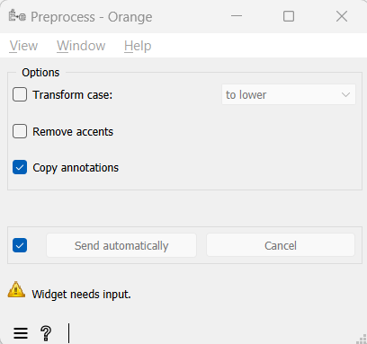
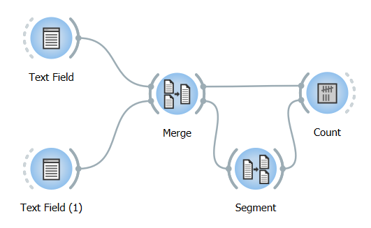
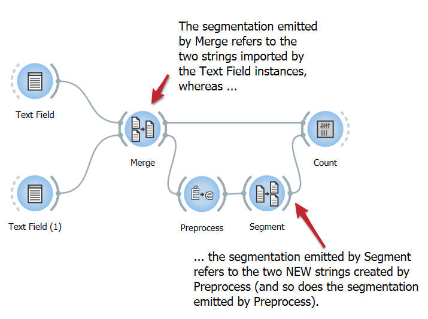
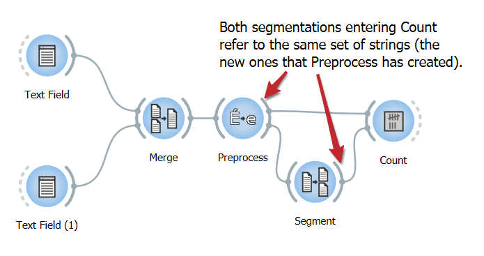

.. meta::
   :description: Orange Textable documentation, Preprocess widget
   :keywords: Orange, Textable, documentation, Preprocess, widget

.. _Preprocess:

Preprocess
==========

.. image:: figures/Preprocess_54.png

Basic text preprocessing.

Signals
-------

Inputs:

- ``Segmentation``

  Segmentation covering the text that should be preprocessed

Outputs:

- ``Text data``

  Segmentation covering the modified text

Description
-----------

This widget inputs a segmentation, creates a modified copy of the content of
the segmentation, and outputs a new segmentation corresponding to the modified
data. The possible modifications are on the case (lower case/upper case) and
the replacing of accentuated characters by their non-accentuated equivalents.

.. _preprocess_fig1:

    Figure 1: Interface of the **Preprocess** widget. 

Note that **Preprocess** creates a copy of each modified segment, which
increases the program's memory footprint; moreover this widget can only work
on segmentations without any overlap, which means no part of the text is
covered by more than one segment.

The **Transform case** checkbox triggers the systematic modification of the case: select **to lower** to convert every
character to lower case and **to upper** to convert them to upper case. The
**Remove accents** checkbox controls the replacement of accentuated character
by their non-accentuated equivalents (é -> e, ç -> c, etc.).

The **Copy annotations** button copies all the annotations of the input segmentation to the output
segmentation.

The **Send** button triggers the emission of a segmentation to the output
connection(s). When it is selected, the **Send automatically** checkbox
disables the button and the widget attempts to automatically emit a
segmentation at every modification of its interface or when its input data are
modified (by deletion or addition of a connection, or because modified data is
received through an existing connection).

The **Cancel** button interrupts the current process and therefore returns the widget to its precedent state.

Below the **Send** button, the user finds the number of segments present in the output
segmentation, or the reasons why no segmentation is emitted (no input data,
overlaps in the input segmentation, etc.).

.. _anchor_to_caveat:

Caveat
------

As one of the rare widgets of Textable that do create new *strings* and not
only new *segmentations*, **Preprocess** is prone to a very specific and
possibly disconcerting type of error, which can be best understood by studying
an example.

Suppose that you wish to count word frequency in the content of two
:doc:`Text Field <text_field>` instances--a scenario similar to that illustrated in section
:doc:`Counting in specific contexts <counting_specific_contexts>`. You could
use :doc:`Merge <merge>` to combine the :doc:`Text Field <text_field>` instances' output in a
single segmentation (see :ref:`figure 2 <preprocess_fig2>` below), then
segment the latter into words with :doc:`Segment <segment>`. You would eventually
feed both the segmentation emitted by :doc:`Segment <segment>` (specifying units) and
by :doc:`Merge <merge>` (specifying contexts) to an instance of :doc:`Count <count>` for
building the frequency table.

.. _preprocess_fig2:

    Figure 2: Counting words in the content of two :doc:`Text Field <text_field>` instances.

Moreover, suppose that you want to convert the input texts to lower case
before counting word frequency. An intuitive way of performing this is by
inserting a **Preprocess** instance between :doc:`Merge <merge>` and :doc:`Segment <segment>` as
on :ref:`figure 3 <preprocess_fig3>` below. However, because **Preprocess**
creates a *new* string for each input segment and emits a segmentation that
refers to these new strings, this raises a rather insidious issue.

.. _preprocess_fig3:

    Figure 3: WRONG way of inserting a **Preprocess** instance in the schema.

To no effect, :doc:`Count <count>` will attempt to find occurrences of the units
specified by the segmentation received from :doc:`Segment <segment>` in the contexts
specified by the segmentation received from :doc:`Merge <merge>`; since those actually
belong to distinct strings, none of these units occurs in any of these
contexts and the frequency table will remain hopelessly empty (as indicated by
the warning symbol on top of the :doc:`Count <count>` widget instance).

Luckily, a small wiring modification suffices to entirely solve the problem:
the connection between :doc:`Merge <merge>` and :doc:`Count <count>` should simply be replaced
by a *direct* connection between **Preprocess** and :doc:`Count <count>`, as on
:ref:`figure 4 <preprocess_fig4>` below. This way, units and contexts refer
to the same set of strings and occurrences of the ones can be properly counted
in the others.

.. _preprocess_fig4:

    Figure 4: RIGHT way of inserting **Preprocess**.

Messages
--------

Information
~~~~~~~~~~~

*<n> segments sent to output.*
    This confirms that the widget has operated properly.

Warnings
~~~~~~~~

*Widget needs input.*
    The widget instance is not able to emit data to output because it receives
    none on its input channel(s).
    
*Settings were* (or *Input has*) *changed, please click 'Send' when ready.*
    Settings and/or input have changed but the **Send automatically** checkbox
    has not been selected, so the user is prompted to click the **Send**
    button (or equivalently check the box) in order for computation and data
    emission to proceed.

*Operation cancelled by user.*
    The user has cancelled the operation.

Errors
~~~~~~

*Please make sure that input segments are not overlapping.*
    At least two of the input segments cover the same substring, which this
    widget cannot handle. Make sure every input segment covers a distinct 
    substring.

Examples
--------

- :doc:`Textable's Basics: Merging segmentations together <merging_segmentations_together>`
- :doc:`Textable's Basics: Annotating by merging <annotating_merging>`
- :doc:`Cookbook: Merge several texts <merge_several_texts>`
- :doc:`Cookbook: Convert text to lower or upper case <convert_text_to_lower_upper_case>`
- :doc:`Cookbook: Remove accents from text <remove_accents_from_text>`

See also
--------

- :doc:`Textable's Basics: Counting in specific contexts <counting_specific_contexts>`
- :doc:`Textable's Basics: Tagging table rows with annotations <tagging_table_rows_label_segment>`
- :doc:`Reference: Text Field widget <text_field>`
- :doc:`Reference: Merge widget <merge>`
- :doc:`Reference: Segment widget <segment>`
- :doc:`Reference: Count widget <count>`

