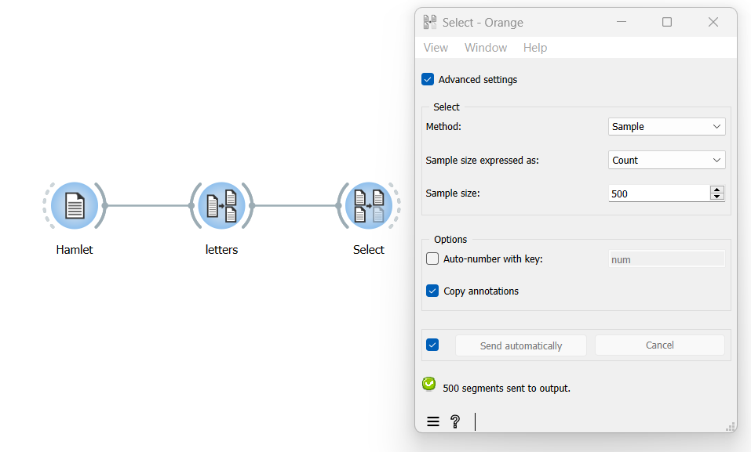

Create a random selection or sample of segments
===================================================

Goal
--------

Create a random sample of segments.

Prerequisites
-----------------

Some text has been imported in Orange Textable (see :doc:`Cookbook: Text input <text_input>`) and in all likelihood it has been segmented in smaller units (see :doc:`Cookbook: Segment text in smaller units <segment_text>`).

Ingredients
---------------

  ==============  ==============
   **Widget**      :doc:`Select <select>` 
   **Icon**        |select_icon|  
   **Quantity**    1               
  ==============  ==============

.. |select_icon| image:: figures/Select_36.png

Procedure
-------------

.. _create_random_selection_sample_of_segments_fig1:

         Select

   Figure 1: Create a random selection or sample of segments with an instance
   of :doc:`Select <select>`

1. Create an instance of :doc:`Select <select>`.

2. Drag and drop from the output (righthand side) of the widget that emits the segmentation to be sampled, here :doc:`Segment <segment>` (*letters*), to the input of :doc:`Select <select>` (lefthand side).

3. Double-click on the icon of :doc:`Select <select>` to open its interface.

4. Tick the **Advanced settings** checkbox.

5. In the **Select** section, choose **Sample** in the **Method** drop-down menu.

6. Under **Sample size expressed as**, choose whether you want to express sample size in terms of **Count** (i.e. number of tokens) or of **Proportion** (i.e. percentage of tokens).

7. In the **Sample size** control, choose the number of segments that will be randomly sampled (respectively, choose the percentage of segments in the **Sampling rate (%)** control).

8. Click the **Send** button or tick the **Send automatically** checkbox.

9. A segmentation containing the sampled segments is then available at the output of :doc:`Select <select>`; to display or export it, see :doc:`Cookbook: Text output <text_output>`.

Comment
-----------

- The :doc:`Select <select>` widget emits on a second output connection (not selected by default) a segmentation containing the segments that were *not* selected (see :doc:`Filtering segmentations using regexes <filtering_segmentations_regexes>` for instructions on how to access this other output segmentation).

See also
------------

- :doc:`Reference: Select widget <select>`
- :doc:`Cookbook: Text input <text_input>`
- :doc:`Cookbook: Segment text in smaller units <segment_text>`
- :doc:`Cookbook: Text output <text_output>`