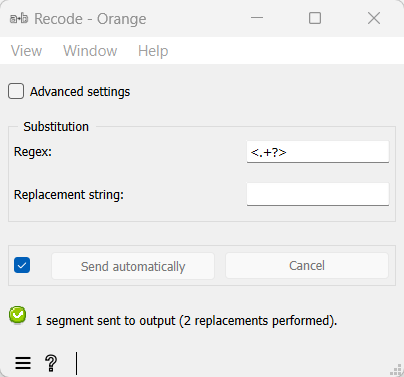

.. meta::
   :description: Orange Textable documentation, Recode widget
   :keywords: Orange, Textable, documentation, Recode, widget

.. _Recode:

Recode
======

.. image:: figures/Recode_54.png

Custom text recoding using regular expressions.

Signals
-------

Inputs:

* ``Segmentation``

  Segmentation covering the text that should be recoded

* ``Message``

  JSON Message controlling the list of substitutions

Outputs:

* ``Recoded text data``

  Segmentation covering the recoded text

Description
-----------

This widget inputs a segmentation, creates a modified copy of its content, and
outputs a new segmentation corresponding to the modified data. The
modifications applied are defined by *substitutions*, namely pairs
composed of a regular expression (designed to identify portions of text that
should be modified) and a replacement string.

It is possible to "capture" text portions using parentheses appearing in the
regular expressions, in order to insert them in the replacement strings, where
sequences ``&1``, ``&2``, etc. correspond to the successive pairs of
parentheses (numbered on the basis of the position of the opening
parenthesis).

Note that **Recode** creates a copy of each modified segment, which
increases the program's memory footprint; moreover this widget can only work
on segmentations without any overlap, which means no part of the text is
covered by more than one segment.

The interface of **Recode** is available in two versions, according to
whether or not the **Advanced Settings** checkbox is selected.

Basic interface
~~~~~~~~~~~~~~~

The basic version of the widget is limited to the application of a single
substitution. Section **Substitution** (see :ref:`figure 1
<recode_fig1>` below) allows the user to specify the regular expression
(**Regex**) and the corresponding replacement string (**Replacement string**).
If the replacement string is left empty, the text parts identified by the
regular expression will simply be deleted; it is the case in the example of
:ref:`figure 1 <recode_fig1>`, which leads to the deletion of XML/HTML
tags. [#]_

.. _recode_fig1:

    Figure 1: **Recode** widget (basic interface).

The **Send** button triggers the emission of a segmentation to the output
connection(s). When it is selected, the **Send automatically** checkbox
disables the button and the widget attempts to automatically emit a
segmentation at every modification of its interface or when its input data are
modified (by deletion or addition of a connection, or because modified data is
received through an existing connection).

Below the **Send** button, the user finds all the indications regarding the current status of the
widget instance (see `Messages`_ below, section `Information`_).

Advanced interface
~~~~~~~~~~~~~~~~~~

In its advanced version, the **Recode** widget allows the user to define
several substitutions and to determine the order in which they should
successively be applied to each segment of the input segmentation.

.. _recode_fig2:

    Figure 2: **Recode** widget (basic interface).

The advanced interface (see :ref:`figure 2 <recode_fig2>` above) presents
similarities with that of the :ref:`Text Files`, :ref:`URLs`, and
:ref:`Segment` widgets. The **Substitutions** section allows the user to
define the substitutions applied to each successive input segment and to
determine their application order. In the list displayed at the top of the
window, each line specifies a substitution, and the columns indicate for each
substitution (a) the corresponding regular expression, (b) the (possibly
empty) replacement string, and (c) the options associated with the regular
expression. [#]_

On :ref:`figure 2 <recode_fig2>` above, we can see that three substitutions
have been specified. The first deletes XML/HTML tags (it replaces them with
the empty string). The second replaces occurrences of British English forms
(*behaviour*, *colour*, and *neighbour*, possibly capitalized, since the
*Ignore case* option is selected) with their American English variants
(*behavior*, *color*, and *neighbor*), while the last replaces sequences
like *a X of mine* with *my X*; thus they illustrate the possibility to
"capture" text portions through parentheses appearing in the regular
expression.

To take a concrete example, the successive application of these three
substitutions to string

::

 	<example>I've just met a neighbour of mine.</example>

will produce in turns the modified versions

::

    I've just met a neighbour of mine.

::

    I've just met a neighbor of mine.

::

    I've just met my neighbor.

The first buttons on the right of the substitution list allow the user to
modify the order in which they are successively applied to each segment of the
input segmentation (**Move Up** and **Move Down**), to delete a substitution
from the list (**Remove**) or to empty it entirely (**Clear All**). Except for
**Clear All**, all of these buttons require the selection of an entry in the
list beforehand. **Import List** enables the user to import a list of
substitutions in JSON format (see :doc:`JSON im-/export format <json_format>`,
:doc:`Substitution list <json_substitution_list>`) and to add them to those
already selected. **Export List** enables the user on the contrary to export
the list of substitutions in a JSON format file.

The remaining part of the **Substitutions** section allows the user to add new
substitutions to the list. To define a new substitution, one must specify the
regular expression (**Regex**) and the corresponding replacement string
(**Replacement string**); the latter can be left empty, in which case the text
portions identified by the regular expression will simply be deleted. The
**Ignore case (i)**, **Unicode dependent (u)**, **Multiline (m)** and **Dot
matches all (s)** checkboxes control the application of the corresponding
options to the regular expression. Adding the new substitution to the list is
achieved by clicking on the **Add** button.

The **Options** section allows the user to define the output segmentation
label. The **Copy annotations** checkbox copies every annotation of the input
segmentation to the output segmentation.

The **Send** button triggers the emission of a segmentation to the output
connection(s). When it is selected, the **Send automatically** checkbox
disables the button and the widget attempts to automatically emit a
segmentation at every modification of its interface or when its input data are
modified (by deletion or addition of a connection, or because modified data is
received through an existing connection).

Below the **Send** button, the user finds all the indications regarding the current status of the
widget instance (see `Messages`_ below, section `Information`_).

.. _recode_remote_control_ref:

Remote control
~~~~~~~~~~~~~~

**Recode** is one the widgets that can be controlled by means of the
:ref:`Message` widget. Indeed, it can receive in input a message consisting
of a substitution list in JSON format (see :doc:`JSON im-/export format
<json_format>`, :doc:`Substitution list <json_substitution_list>`), in which
case the list of substitutions specified in this message replaces those
previously specified (if any). Note that removing the incoming connection from
the **Message** instance will not, by itself, remove the list of substitutions
imported in this way from the **Recode** instance's interface; conversely,
this list of files can be modified using buttons **Move up/down**, **Remove**,
etc. even if the incoming connection from the **Message** instance has not
been removed. Finally, note that if a **Recode** instance has the basic
version of its interface activated when an incoming connection is created from
an instance of :ref:`Message`, it automatically switches to the advanced
interface.

Caveat
------

As one of the rare widgets of Textable that do create new *strings* and not
only new *segmentations*, **Recode** is prone to a very specific and possibly
disconcerting type of error, which can be best understood by studying the
example given in the documentation of :ref:`Preprocess` (section
:ref:`anchor_to_caveat`), where all that is said about :ref:`Preprocess` also
applies to **Recode**.

Messages
--------

Information
~~~~~~~~~~~

*Data correctly sent to output: <n> segments.*
    This confirms that the widget has operated properly.

*Settings were* (or *Input has*) *changed, please click 'Send' when ready.*
    Settings and/or input have changed but the **Send automatically** checkbox
    has not been selected, so the user is prompted to click the **Send**
    button (or equivalently check the box) in order for computation and data
    emission to proceed.

*No data sent to output yet: no input segmentation.*
    The widget instance is not able to emit data to output because it receives
    none on its input channel(s).

*No data sent to output yet, see 'Widget state' below.*
    A problem with the instance's parameters and/or input data prevents it
    from operating properly, and additional diagnostic information can be
    found in the **Widget state** box at the bottom of the instance's
    interface (see `Warnings`_ and `Errors`_ below).

Warnings
~~~~~~~~

*No label was provided.*
    A label must be entered in the **Output segmentation label** field in
    order for computation and data emission to proceed.

*Input segmentation is overlapping.*
    The instance's input segmentation contains overlapping segments, which
    preempts the application of recoding operations.

*JSON message on input connection doesn't have the right keys and/or values.*
    The widget instance has received a JSON message on its ``Message`` input
    channel and the keys and/or values specified in this message do not match
    those that are expected for this particular widget type (see :doc:`JSON
    im-/export format <json_format>`, :doc:`Substitution list
    <json_substitution_list>`).

*JSON parsing error.*
    The widget instance has received data on its ``Message`` input channel and
    the data couldn't be correctly parsed. Please use a JSON validator to 
    check the data's well-formedness.

Errors
~~~~~~

*Regex error: <error_message>.*
    The regular expression entered in the **Regex** field is invalid.

*Regex error: <error_message> (substitution #<n>).*
    The *n*-th regular expression in the **Substitutions** list is invalid.

*Reference to unmatched group in replacement string.*
    A replacement string specified by the user contains a reference to a
    numbered variable (``&1``, ``&2``, ...) which turns out to not always have
    a matching element.

Examples
--------

* :doc:`Cookbook: Replace all occurrences of a string/pattern
  <replace_all_occurrences_of_string_pattern>`

See also
--------

* :doc:`Reference: JSON im-/export format <json_format>`, :doc:`Substitution
  list <json_substitution_list>`
* :ref:`Reference: Message widget <Message>`
* :ref:`Reference: Preprocess (section "Caveat") <anchor_to_caveat>`
* :doc:`Getting started: A note on regular expressions
  <note_regular_expressions>`

Footnotes
---------

.. [#] For more details concerning the regular expression syntax, see the
       `Python documentation <http://docs.python.org/library/re.html>`_.
       Note that option ``-u`` (*Unicode dependent*) is activated by default.

.. [#] For more details on the effect of options ``-i``, ``-u``, ``-m``, and
       ``-s``, see the
       `Python documentation <http://docs.python.org/library/re.html>`_.

