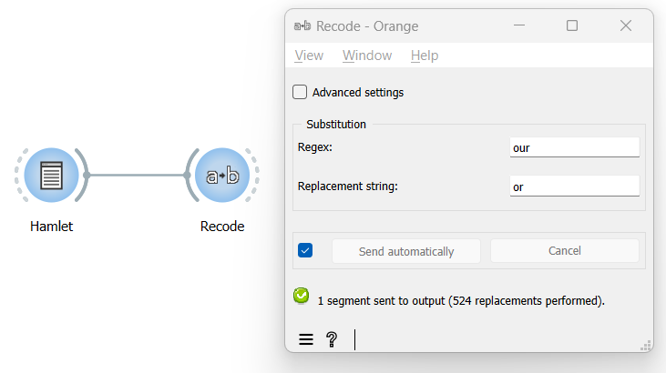

Replace all occurrences of a string/pattern
===============================================

Goal
--------

Replace all occurrences of a string (or pattern) in a text with another
string.

Prerequisites
-----------------

Some text has been imported in Orange Textable (see :doc:`Cookbook: Text input <text_input>`)
and possibly further processed (see :doc:`Cookbook: Segmentation manipulation <segmentation_manipulation>`).

Ingredients
---------------

  ==============  =======
   **Widget**      :doc:`Recode <recode>`
   **Icon**        |recode_icon|
   **Quantity**    1
  ==============  =======

.. |recode_icon| image:: figures/Recode_36.png

Procedure
-------------

.. _replace_all_occurrences_of_string_pattern_fig1:

   Figure 1: Replace all occurrences of a string with an instance of :doc:`Recode <recode>`.

1. Create an instance of :doc:`Recode <recode>`.

2. Drag and drop from the output (righthand side) of the widget that
   emits the segmentation to be modified, here :doc:`Text Field <text_field>`
   (*Hamlet*), to the input of :doc:`Recode <recode>`
   (lefthand side).

3. Double-click on the icon of :doc:`Recode <recode>`
   to open its interface.

4. In the **Substitution** section, insert the string that will be
   replaced in the **Regex** field.

5. In the **Replacement string** field insert the replacement string.

6. Click the **Send** button or tick the **Send automatically**
   checkbox.

7. A segmentation containing the modified text is then available at the
   output of :doc:`Recode <recode>`;
   to display or export it, see :doc:`Cookbook: Text output <text_output>`.

Comment
-----------

-  In the **Regex** field you can use all the syntax of Python’s regular
   expression (*cf.* Regular expressions).

-  In our example, we choose to replace all occurrences of British
   *-our* with American *-or* (for example, from *colour* to *color*);
   unless otherwise specified (typically using word boundary “anchor”
   ``\b``), replacements will also occur within words, i.e. *coloured* to
   *colored*.

See also
------------

- :doc:`Reference: Recode widget <recode>`
- :doc:`Cookbook: Text input <text_input>`
- :doc:`Cookbook: Segmentation manipulation <segmentation_manipulation>`
- :doc:`Cookbook: Text output <text_output>`