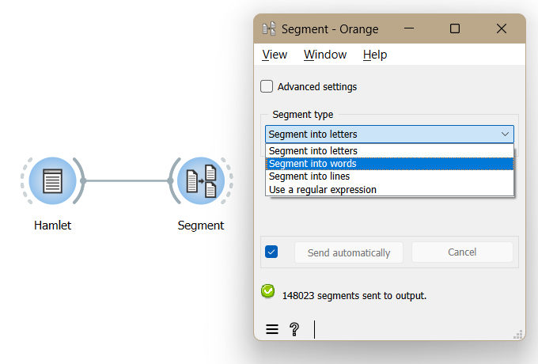

Segment text in smaller units
=================================

Goal
--------

Segment text in smaller units (e.g. lines, words, letters, etc.).

Prerequisites
-----------------

Some text has been imported in Orange Textable (see :doc:`Cookbook: Text input <text_input>`) 
and possibly further processed (see :doc:`Cookbook: Segmentation manipulation <segmentation_manipulation>`).

Ingredients
---------------

  ==============  =======
   **Widget**      :doc:`Segment <segment>`
   **Icon**        |segment_icon|
   **Quantity**    1
  ==============  =======

.. |segment_icon| image:: figures/Segment_36.png

Procedure
-------------

.. _segment_text_fig1:

   Figure 1: Segment text in words with an instance of :doc:`Segment <segment>`.

1. Create an instance of :doc:`Segment <segment>`.

2. Drag and drop from the output (righthand side) of the widget that emits the segmentation to be segmented, here :doc:`Text Field <text_field>` (*Hamlet*), to the input of :doc:`Segment <segment>` (lefthand side).

3. Double-click on the icon of :doc:`Segment <segment>` to open its interface.

4. In the **Segment type** section, you can choose to segment the text into letters, words or lines using the drop-down menu. 

5. Click the **Send** button or tick the **Send automatically** checkbox.

6. A segmentation containing a segment for each specified unit (e.g. line) is then available at the output of :doc:`Segment <segment>`; to display or export it, see :doc:`Cookbook: Text output <text_output>`.

Comment
-----------

- You can also segment text using any kind of pattern that can be described by Python regular expressions (*cf.* Regular expressions) with the **Use a regular expression** option.

See also
------------

- :doc:`Textable's Basics: Segmenting data into smaller units <segmenting_data_smaller_units>`
- :doc:`Reference: Segment widget <segment>`
- :doc:`Cookbook: Text input <text_input>`
- :doc:`Cookbook: Segmentation manipulation <segmentation_manipulation>`
- :doc:`Cookbook: Text output <text_output>`