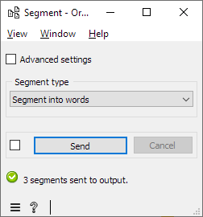

.. meta::
   :description: Orange Textable documentation, segmenting data
   :keywords: Orange, Textable, documentation, segmenting, data

Segmenting data into smaller units
==================================

We have seen previously how to combine several segmentations into a
single one. We will often be performing the inverse operation: create a
segmentation whose segments are *parts* of another segmentation’s
segments. Typically, we will be segmenting strings into words,
characters, or any kind of text units that will be later counted,
measured, and so on. This is precisely the purpose of widget
:doc:`Segment <segment>`.

To try it out, create a new workflow with an instance of :doc:`Text Field <text_field>`
connected to
:doc:`Segment <segment>`,
itself connected to
:doc:`Display <display>`
(see :ref:`figure 1 <segmenting_data_smaller_units_fig1>`
below). In what follows, we will suppose that the string typed in :doc:`Text Field <text_field>`
is *a simple example*.

.. _segmenting_data_smaller_units_fig1:

.. figure:: figures/segment_example_schema.png
    :align: center
    :alt: Schema illustrating the usage of widget Segment

    Figure 1: A workflow for testing the
    :doc:`Segment <segment>`
    widget

The interface of
:doc:`Segment <segment>`
(see :ref:`figure 2 <segmenting_data_smaller_units_fig2>`
below) illustrates a feature shared by most Orange Textable widgets: the
**Advanced settings** checkbox triggers the display of more complex
controls offering more possibilities to the user. For now we will stick
to the basic settings and leave this box unchecked.

.. _segmenting_data_smaller_units_fig2:

    Figure 2: Interface of the :doc:`Segment <segment>` widget, configured for word segmentation

:doc:`Segment <segment>`
offers several parameters in the drop-down menu named segment type. Try
using them to segment the text into lines, letters, or words, then check
the result in
:doc:`Display <display>`.

The option of using a regular expression is quite powerful and we will
return to it later in this tutorial..

See also
-----------------

- :doc:`Reference: Segment widget <segment>`
- :doc:`Cookbook: Segment text in smaller units <segment_text>`