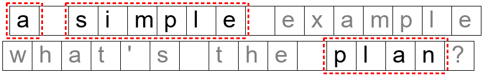

.. meta::
   :description: Orange Textable documentation, strings, segments, and segmentations
   :keywords: Orange, Textable, documentation, string, segment, segmentation

Strings, segments, and segmentations
===========================================

The main purpose of Orange Textable is to go from text strings to data
tables. As we will see, there are several methods for importing text
strings, the simplest of which is keyboard input using widget 
:doc:`Text Field <text_field>`.
Whenever a new string is imported, it is assigned a unique
identification number (called *string index*) and stays in memory as
long as the widget that imported it.

Consider the following string of 16 characters (note that whitespace
counts as a character too).

   
   Figure 1 : A sample string.

What makes the transition from text strings to data tables possible is
the concept of a *segmentation*. A segmentation is a string analysis
based on an ordered list of *segments*. For instance, a string like “a
simple example” above can be analyzed in many different ways: 3 words,
16 characters, 14 letters, 6 vowels, 3 *e*\ ’s, 2 *mple*\ ’s, etc.

In these examples, all the segments of a given segmentation refer to the
same string. However, the segments of a segmentation can cover different
strings, as in the example below, where the segmentation “a”, “simple”,
“plan” spans two strings (“a simple example” and “what’s the plan”). All
segments referring to a given string must be grouped together, in the
order in which they appear in the string.

   Figure 2 : A segmentation can span several strings.