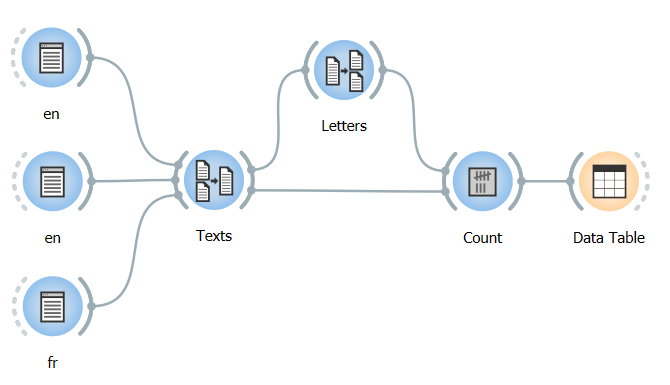

Tagging table rows with annotations
===========================================

There are several situations in which annotations attached to a segment
can be used in place of this segment’s content. A particularly common
case consists in using annotations for tagging the rows of a table built
with a table construction widget.

Consider the example of the texts in English and French introduced :doc:`here <annotating_merging>`.
Suppose that after having merged them into a single segmentation with
:doc:`Merge <merge>`
(*Texts*) (**Import labels with key:** *language*), we segment these
three texts into letters with
:doc:`Segment <segment>`
(*Letters*), as in the workflow shown on :ref:`figure 1 <tagging_table_rows_annotations_fig1>`
below; both segmentations (*Texts* and *Letters*) can then be sent to an
instance of
:doc:`Count <count>` 
for building a table with the frequency of each letter in each text.

.. _tagging_table_rows_annotations_fig1:

    Figure 1: Workflow for counting letter frequency in three texts.

Let us suppose, first, that the instance of
:doc:`Count <count>`
is configured as shown on :ref:`figure 2 <tagging_table_rows_annotations_fig2>`
below, so that the definition of contexts–that is, rows of the frequency
table–is based on the content of the three texts.

.. _tagging_table_rows_annotations_fig2:

    Figure 2: Counting letter frequency in texts.

Here is the resulting table, disregarding possible variations in row
and/or column order:

.. csv-table:: Table 1: Letter frequency in three texts.
    :header: "", *a*, *t*, *e*, *x*, *i*, *n*, *g*, *l*, *s*, *h*, *o*, *r*, *u*, *f*, *ç*
    :stub-columns: 1
    :widths: 7 2 2 2 2 2 2 2 2 2 2 2 2 2 2 2

    *a text in english*,       1, 2, 2, 1, 2, 2, 1, 1, 1, 1, 0, 0, 0, 0, 0
    *another text in english*, 1, 3, 3, 1, 2, 3, 1, 1, 1, 2, 1, 1, 0, 0, 0
    *un texte en français*,    2, 2, 3, 1, 1, 3, 0, 0, 1, 0, 0, 1, 1, 1, 1

As can be seen, the default header of each row is the entire content of
each text. While this may not be a problem in a pedagogic example like
this one, it is easy to see why it would compromise the table’s
readability in a real application, where texts often contain thousands
or even millions of characters. To avoid that, it is useful to tag the
table’s rows with annotation values attached to segments rather than
with these segments’ content. To that effect, the desired annotation key
must be selected in the **Contexts** section of widget
:doc:`Count <count>`’s
interface.
 
.. _tagging_table_rows_annotations_fig3:

    Figure 3: Tagging contexts with annotation values.

In the example of :ref:`figure 3 <tagging_table_rows_annotations_fig3>`
above, key *language* has been selected, so that the resulting frequency
table looks like this:

.. csv-table:: Table 2: Letter frequency in two text types.
    :header: "", *a*, *t*, *e*, *x*, *i*, *n*, *g*, *l*, *s*, *h*, *o*, *r*, *u*, *f*, *ç*
    :stub-columns: 1
    :widths: 3 2 2 2 2 2 2 2 2 2 2 2 2 2 2 2

    *en*, 2, 5, 5, 2, 4, 5, 2, 2, 2, 3, 1, 1, 0, 0, 0
    *fr*, 2, 2, 3, 1, 1, 3, 0, 0, 1, 0, 0, 1, 1, 1, 1

Besides the substitution of segment content by annotation values in row
headers, this example demonstrates an important consequence of this
manipulation: contexts associated with the same annotation value are, in
effect, collapsed together so that they form a single row. If this
behavior is not desired, it can be avoided by assigning distinct
annotation values to the contexts that must be kept separated (e.g. by
labelling the :doc:`Text Field <text_field>`
instances that contain English texts *en_1* and *en_2*).

See also
------------------

- :doc:`Textable's Basics: Annotating by merging <annotating_merging>`
- :doc:`Reference: Merge widget <merge>`
- :doc:`Reference: Count widget <count>`
- :doc:`Reference: Table construction widgets <table_construction_widgets>`