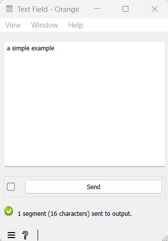

.. meta::
   :description: Orange Textable documentation, Text Field widget
   :keywords: Orange, Textable, documentation, Text Field, widget

.. _Text Field:

Text Field
==========

Import text data from keyboard.

Signals
-------

Inputs:

- ``Text data``

  Segmentation containing text to be edited

Outputs:

- ``Text data``

  Segmentation covering the text displayed in the widget
  
Description
-----------

This widget allows the user to import text from keyboard. It emits a
segmentation containing a single unannotated segment covering the whole string.
Secondarily, **Text Field** can be used to manually edit a previously imported
string.

The interface of the widget mainly consists in a text field editable by the
user (see :ref:`figure 1 <text_field_fig1>` below). The standard editing functions (copy, paste, cancel, etc.) are
accessible through a right-click on the field or keyboard shortcuts.

.. _text_field_fig1:

    Figure 1: Interface of the *Text field* widget.

The **Send** button triggers the emission of a segmentation to the output
connections. When it is selected, the **Send automatically** checkbox
disables the button and the widget attempts to automatically emit a
segmentation at every modification of its interface.

It should be noted that the text field's content is normalized in three ways:

- it is systematically converted to Unicode
- it is subjected to the `canonical Unicode decomposition-recomposition 
  <http://unicode.org/reports/tr15>`_ technique (Unicode sequences such as 
  ``LATIN SMALL LETTER C (U+0063)`` + ``COMBINING CEDILLA (U+0327)`` are 
  systematically replaced by the combined equivalent, e.g. ``LATIN SMALL LETTER 
  C WITH CEDILLA (U+00C7)``)
- various forms of line endings (in particular ``\r\n`` and ``\r``) are 
  converted to a single form (namely ``\n``) 

When **Text Field** receives a segmentation in input, the contents of all incoming segments are concatenated (without
adding any delimiters) and the resulting string replaces the current textual
content of the widget (if any). This allows the user to manually edit text
that has been previously imported in Orange Textable. Some points are worth
noting:

- This operation creates a distinct string from the one that has been
  previously imported: it really amounts to *copying* the original string and
  making the copy available for manual edition. As such, it is prone to a very
  specific and possibly disconcerting type of error, which can be best
  understood by studying the example given in the documentation of
  :doc:`Preprocess <preprocess>` (section :ref:`anchor_to_caveat`), where what is said
  about :doc:`Preprocess <preprocess>` also applies to **Text Field**.
  
- Modifications brought from within the interface of **Text Field** to a
  string imported in this way will be lost if the **Text Field** instance
  receives a new input on its incoming connection. In particular, this will
  happen if the schema is saved and later re-opened. To avoid any loss of
  data, the safest way to operate is to remove the incoming connection
  as soon as it has been created and the string has been copied in the
  **Text Field** instance's interface; indeed, removing the incoming
  connection will not remove the imported string from the instance's
  interface, where it can then be edited without risking to overwrite it.

Messages
--------

Information
~~~~~~~~~~~

*1 segment (<n> characters) sent to output.*
    This confirms that the widget has operated properly.

Warnings
~~~~~~~~

*Settings were changed, please click ‘Send’ when ready.*
  Settings and/or input have changed but the **Send automatically** checkbox
  has not been selected, so the user is prompted to click the **Send** button
  (or equivalently check the box) in order for computation and data
  emission to proceed.

*Please type or paste some text above.*
    The user should enter text in the field so that a segmentation can be
    output.

Examples
--------

- :doc:`Textable's Basics: Keyboard input and segmentation display <keyboard_input_segmentation_display>`
- :doc:`Cookbook: Import text from keyboard <import_text_keyboard>`

See also
--------

- :ref:`Reference: Preprocess (section "Caveat") <anchor_to_caveat>`

