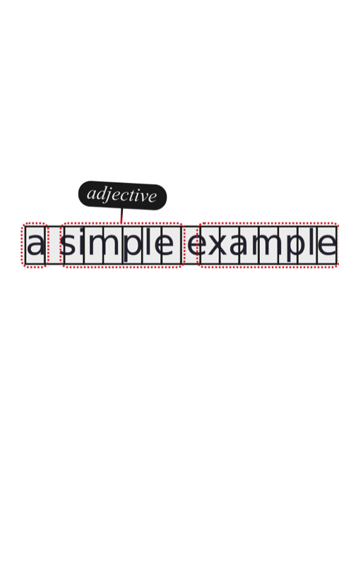
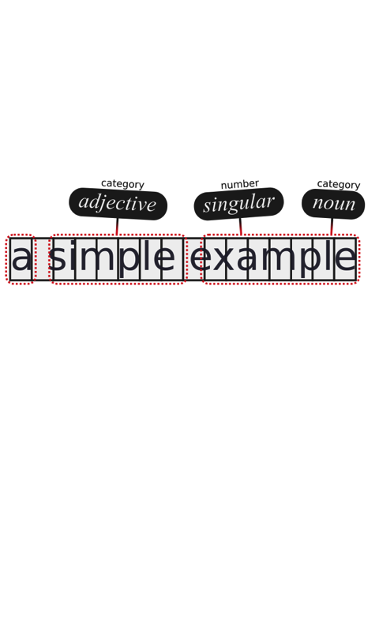

.. meta::
   :description: Orange Textable documentation, Uses of annotating segmentations
   :keywords: Orange, Textable, documentation, annotations, uses

The uses of annotating segmentations
====================================
Annotations are bits of information attached to text segments. 
They let you go beyond what's in the text, and extend Orange Textable's analytic capacities
from textual content to user-provided interpretative information and metadata.

In Orange Textable, an *annotation* is a piece of information attached to a segment. 
Annotations consist of two parts : *key* and *value* . For instance, in
the now classical case of the word segmentation of *a simple example* (see :ref: `figure 1<uses_annotating_segmentations_fig1>` below), 
segment *simple* could be associated with the annotation *{part of speech : adjective}*;
this annotation's key is *part of speech* and its value is *adjective* . 

.. _uses_annotating_segmentations_fig1 :	
	

	
Figure 1 : Annotating *simple* as an adjective.

A segment can have zero, one, or several annotations attached to it.
The same segment could be simultaneously associated with another annotation such as
*{word category : lexical}* , or any *{key : value}* pair deemed relevant.

.. _uses_annotating_segmentations_fig2 :	

Figure 2 : Segments with various annotations

Note that annotations keys are unique : Since they serve to recognize various annotation values attached to a single segment, 
annotation keys cannot be duplicated within the segment. On :ref: `figure 2 <uses_annotating_segmentations_fig2>` above, 
"simple" can only have one value at a time for key "category" .

Even though we have carefully ignored them so far, annotations play a
fundamental role in text data processing and analysis. They make it possible
to go beyond the basic level of forms that are "physically" present in a text
and tap into the more abstract--and often more interesting--level of the
*interpretation* of these forms.

For instance, the texts composing a given corpus could be annotated with
respect to their genre ( *novel* , *short story* , and so on), and the parts of
these texts might be annotated with regard to their discourse type
( *narrative* , *description* , *dialogue* , and so on). Such data could be
exploited to study the distribution of discourse types as a function of genre,
which would be at best extremely difficult, if ever possible, without having
encoded the relevant information by means of annotations.

In the following section, we will see a simple method for creating annotations in Orange Textable using the :ref: `Merge` widget, 
and then various ways of exploiting such annotations.

