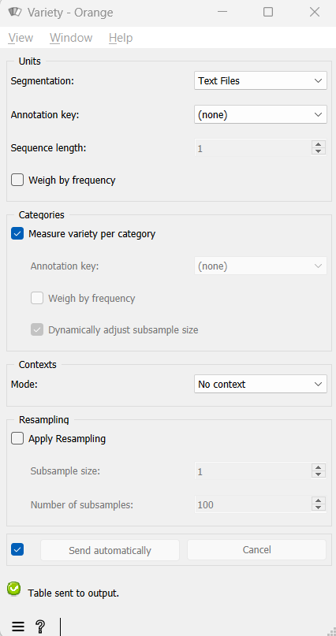

.. meta::
   :description: Orange Textable documentation, Variety widget
   :keywords: Orange, Textable, documentation, Variety, widget

.. _Variety:

Variety
=======

.. image:: figures/Variety_54.png

Measure the variety of segments.

Signals
-------

Inputs:

* ``Segmentation``

  Segmentation whose segments constitute the units of variety measurement, or
  the contexts in which variety will be measured

  

Outputs:

* ``Textable table``

  Table in the internal format of Orange Textable

Description
-----------

This widget inputs one or several segmentations, measures the variety of the
segments of one of the segmentations (eventually within the segments defined
by another segmentation), and sends the result in table format; it also allows
the user to calculate the average variety by category (based on the
annotation values of the segments). In order to make these two measures less
dependent on the length of segmentations, it is possible to calculate their
average value on a number of subsamples of fixed size.

The tables produced by the **Variety** widget have at least 2 columns, and at
most 4. The first column contains the headers corresponding to the contexts
-- which are essentially defined in the same way as in the :ref:`Count` and
:ref:`Length` widgets. The second column gives the variety measures and its
header is *__variety__*, unless resampling has been applied (in which case the
header will be *__variety_average__*). In the latter case, the third column
will contain the corresponding standard deviation (header
*__variety_std_deviation__*) and the last column the number of subsamples
(header *__variety_count__*).

To take a simple example, consider two segmentations of the string *a simple
example* [#]_:

A) label = *words*

===========  =======  =====  ==================  =================
 content      start    end    *part of speech*    *word category*
===========  =======  =====  ==================  =================
 *a*          1        1      *article*           *grammatical*
 *simple*     3        8      *adjective*         *lexical*
 *example*    10       16     *noun*              *lexical*
===========  =======  =====  ==================  =================

B) label = *letters* (extract)

=========  =======  =====  ===================
 content    start    end    *letter category*
=========  =======  =====  ===================
 *a*        1        1      *vowel*
 *s*        3        3      *consonant*
 *i*        4        4      *vowel*
 ...        ...      ...    ...
 *e*        16       16     *vowel*
=========  =======  =====  ===================

The most elementary measure made by the widget is that of the number of types
or *variety*. For example, for the segmentation *letters*, by defining the
units based on the content of the segments:

.. csv-table::
    :header: *__context__*, *__variety__*
    :stub-columns: 1
    :widths: 2 2
    
    *__global__*,  8

Naturally, it is possible to define types based on the values associated to an
annotation key, for example *letter category*:

.. csv-table::
    :header: *__context__*, *__variety__*
    :stub-columns: 1
    :widths: 2 2
    
    *__global__*,  2

It is also possible to *weigh* the variety according to the frequency of
types. To do this, we can calculate the *perplexity* of the segment
distribution, that is to say the exponential of the entropy on this
distribution. This measure is equal to the variety only if the segment types
have a uniform frequency; it decreases and tends towards 0 as the segment
distribution departs from uniformity and gradually becomes deterministic. As
an example, here is the perplexity for *letter category*:

.. csv-table::
    :header: *__context__*, *__variety__*
    :stub-columns: 1
    :widths: 4 5
    
    *__global__*,  1.97962633005

The difference observed between the variety with or without weighing (1.96 vs
2) shows the deviation from uniformity in the distribution of letter
categories in this example.

Rather than looking at the variety (weighed or not) of the segment types *in
general*, we can look at their average variety within a *category*. For
example, we can ask what is the average variety of letters *depending on the
letter category*:

.. csv-table::
    :header: *__context__*, *__variety__*
    :stub-columns: 1
    :widths: 2 2
    
    *__global__*,  4.0

On average, in our example, a type of letter (*consonant or vowel*) is thus
represented by 4.0 distinct letters -- as long as we give the same weight to
each category. The alternative consists of weighing the categories according
to their frequency, which would result in our case in giving more weight to
the variety of consonants (whose frequency is 9) than to that of the vowels
(whose frequency is 6) in our average calculation:

.. csv-table::
    :header: *__context__*, *__variety__*
    :stub-columns: 1
    :widths: 4 5
    
    *__global__*,  4.14285714286

From the increase observed compared to the case where the categories are not
weighed, we can deduce that the number of distinct consonants is higher than
that of the vowels.

To sum up, weighing (or not) the frequencies of units is the basis of the
distinction between variety and perplexity; moreover, in the case where we
calculate the average variety/perplexity per category, it is possible to weigh
(or not) by the frequency of categories.

The different variety measures presented above can then be combined with the
same *context* (i.e. table rows) specification modes as in the
:ref:`Length` widget: the first mode consists in defining the contexts based
on the content or the annotations of a given segmentation; the second lies on
the concept of a "window" of *n* segments that we progressively "slide" from
the beginning to the end of the segmentation.

All variety measures (weighed or not, simple or by category) are sensitive to
the sample size, which in our case means the segmentation length. As such,
they are in principle not directly comparable among/between of different
lengths. Consider for example the (unweighted) variety of *letters* (units) in
*words* (contexts):

.. csv-table::
    :header: *__context__*, *__variety__*
    :stub-columns: 1
    :widths: 2 2
    
    *a*,  1
    *simple*,   6
    *example*,  6
 
To reduce the effect of this dependence to the segmentation length, it is
possible to adopt the following strategy: draw a set number of subsamples in
each segmentation to compare and report the average variety by subsample. For
example, by setting the size of the subsamples to 2 segments, and by drawing
100 subsamples for each word, we obtain the following results: [#]_

.. csv-table::
    :header: *__context__*, *__variety_average__*, *__variety_std_deviation__*, *__variety_count__*
    :stub-columns: 1
    :widths: 2 3 4 3
    
    *a*,        ---,   ---,             ---
    *simple*,   1.59,  0.491833305094,  100
    *example*,  1.52,  0.499599839872,  100

Here, we can see that the variety average in *simple* is very slightly higher
than in *example* because *simple* is a shorter word and has no repeating
letters. Moreover, since the article *a* is only one letter, our operation
cannot build subsamples of 2 letters to compute and report their average
variety, hence the missing values for variety average, standard deviation and
count.

.. _variety_fig1:

    Figure 1: **Variety** widget.

We now move on to the presentation of the widget interface (see :ref:`figure 1
<variety_fig1>`). It has four separate sections, for unit specification
(**Units**), category specification (**Categories**), context
specification (**Contexts**), and resampling parameters (**Resampling**).

In the **Units** section, the **Segmentation** drop-down menu allows the user
to select among the input segmentations the one whose segments will be the
basis of the variety calculation. The **Annotation key** menu shows the
possible annotation keys associated to the chosen segmentation; if one of
these keys is selected, the corresponding annotation values will be used; if
on the other hand the value *(none)* is selected, the content of the segments
will be used. The **Sequence length** drop-down menu allows the user to
indicate if the widget should consider the isolated segments or the
*n--grams*. Finally, the **Weigh by frequency** checkbox allows the user to
enable the weighing of the units by their frequency (thus the perplexity
measure rather than the variety). Checking the **Dynamically adjust subsample size** box 
permits a more robust variety estimation. This calculation uses the RMSP subsample size 
adjustment method described in Xanthos and Guex 2015.

In the **Categories** section, the **Measure diversity per category** checkbox
triggers the calculation of the average diversity by category. The
**Annotation key** drop-down menu allows the user to select the annotation
key whose values will be used for the category definitions. The **Weigh by
frequency** checkbox allows the user to enable the weighing by the category
frequency.

The **Contexts** section is available in several variants depending on the
value selected in the **Mode** drop-down menu. The latter allows the user to
choose among the context specification modes described above. The **No
context** mode corresponds to the case where the variety measure is applied
globally to the entire unit segmentation.

The **Sliding window** mode (see :ref:`figure 2 <variety_fig2>`) implements
the notion of a "sliding window" introduced earlier. It allows the user to
observe the evolution of variety throughout the segmentation. The only
parameter is the window size (in number of segments), set by means of the
**Window size** cursor.

.. _variety_fig2:

.. figure:: figures/count_mode_sliding_window_example.png
    :align: center
    :alt: Variety widget in mode "Sliding window"

    Figure 2: **Variety** widget (**Sliding window** mode).

.. _variety_fig3:

.. figure:: figures/count_mode_containing_segmentation.png
    :align: center
    :alt: Variety widget in mode "Containing segmentation"

    Figure 3: **Variety** widget (**Containing segmentation** mode).

Finally, the **Containing segmentation** mode (see :ref:`figure 3
<variety_fig3>`) corresponds to the case where the contexts are defined by the
segment types appearing in a given segmentation. This segmentation is selected
among the input segmentations by means of the **Segmentation** drop-down menu.
The **Annotation key** menu shows the possible annotation keys associated to
the selected segmentation; if one of these keys is selected, the corresponding
annotation values will constitute the row headers; if on the other hand the
value *(none)* is selected, the *content* of the segments will be used. The
**Merge contexts** checkbox allows the user to measure the variety globally in
the entire segmentation that defines the contexts.

In the **Resampling** section, the **Apply resampling** checkbox allows the
user to enable the calculation of the average diversity in subsamples of
fixed size. The number of segments by subsample is determined by the
**Subsample size** cursor, and the number of subsamples with
**Number of subsamples**.

The **Send** button triggers the emission of a table in the internal format
of Orange Textable, to the output connection(s). When it is selected, the
**Send automatically** checkbox disables the button and the widget attempts
to automatically emit a segmentation at every modification of its interface or
when its input data are modified (by deletion or addition of a connection, or
because modified data is received through an existing connection).

The informations given under the **Send** button indicate if a table has been correctly emitted, or the
reasons why no table is emitted (no input data, typically).

Messages
--------

Information
~~~~~~~~~~~

*Data correctly sent to output.*
    This confirms that the widget has operated properly.

*Settings were* (or *Input has*) *changed, please click 'Send' when ready.*
    Settings and/or input have changed but the **Send automatically** 
    checkbox has not been selected, so the user is prompted to click the 
    **Send** button (or equivalently check the box) in order for computation 
    and data emission to proceed.

*No data sent to output yet: no input segmentation.*
    The widget instance is not able to emit data to output because it receives
    none on its input channel(s).

*No data sent to output yet, see 'Widget state' below.*
    A problem with the instance's parameters and/or input data prevents it
    from operating properly, and additional diagnostic information can be
    found in the **Widget state** box at the bottom of the instance's
    interface (see `Warnings`_ below).

Warnings
~~~~~~~~

*Resulting table is empty.*
    No table has been emitted because the widget instance couldn't find a
    single element in its input segmentation(s). A likely cause for this 
    problem (when using the **Containing segmentation** mode) is that the unit
    and context segmentations do not refer to the same strings, so that the 
    units are in effect *not* contained in the contexts. This is typically a
    consequence of the improper use of widgets :ref:`Preprocess` and/or
    :ref:`Recode` (see :ref:`anchor_to_caveat`).
        
Footnotes
---------

.. [#] By convention, we do not indicate here the string index associated with
       each segment but only its start and end positions, along with the
       various annotation values associated with it; moreover, for the sake of
       readability, we do indicate the content of each segment, though it is
       not formally part of the segmentation (but rather of the string to
       which the segmentation refers).
.. [#] The example has an instructive purpose; in practice we will typically
       use a clearly higher subsample size, for example 50 segments or more.

