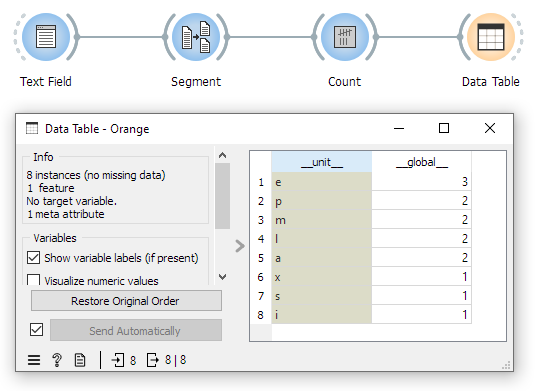

.. meta::
   :description: Orange Textable documentation, viewing and processing tables
   :keywords: Orange, Textable, documentation, table, view, processing

Viewing and processing tables
=============================

To view a table built by a :doc:`table construction widget <table_construction_widgets>`,
simply connect it with a *Data Table* instance (from the *Data* tab of Orange 
Canvas), as shown on :ref:`figure 1 <viewing_processing_tables_fig1>` below.

.. _viewing_processing_tables_fig1:

    Figure 1: Viewing a table with the *Data Table* widget.

Likewise, further processing and analyzing such a table requires connecting the 
:doc:`table construction widget <table_construction_widgets>` that generated it
with widgets from other tabs of Orange Canvas, such as *Transform*, *Visualize*,
*Unsupervised*, and so on. The reader is referred to 
`the documentation of Orange Canvas <https://orangedatamining.com/docs/>`_
for instructions on how to conduct data analysis with its widgets.

Orange Textable's :doc:`Convert <convert>` widget is a utility widget that can
be used to sort, transpose, normalize, and otherwise transform tables produced by
:doc:`table construction widget <table_construction_widgets>` before sending them
to Orange widgets. It can also be used to easily export tables in tab-delimited
format (either to a file or to the clipboard) for further processing by 
third-party software.

See also
--------

* :doc:`Reference: Convert widget <convert>`
* :doc:`Reference: Table construction widgets <table_construction_widgets>`
* :doc:`Cookbook: Table output <table_output>`
* :doc:`Cookbook: Export table <export_table>`
