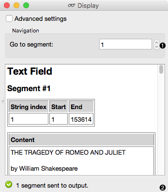

Display
=======

.. figure:: icons/display.png

Display or export the details of a segmentation.

Signals
-------

**Inputs**:

-  Segmentation 

Segmentation to be displayed or exported

**Outputs**:

-  Bypassed segmentation (default)

Exact copy of the input segmentation

- Displayed segmentation

Segmentation covering the entire string displayed in the widget's interface

Description
-----------

The **Display** widget is used to display or export the content of an inputted segmentation on screen. The user can choose to annotate the segments or just output them without any modification. The widget is available in two versions, according to whether or not the *Advanced Settings* checkbox is selected.

Basic interface
---------------

The widget formats the input segmentation in HTML and displays for each segment its number, its complete address (string index, start and end positions) as well as its annotation.

1. Directly show a particular segment by using *Go to segment*.
2. Information about the output.

The **Display** widget does not possess a *Send* option, because its main feature is the visualization of the input segmentation's content and annotations. 

Advanced interface
------------------

The advanced interface enables custom formatting and provides the user with the means to produce a personalized rendering of his data. The formatting of each segment is determined by a string which the user enters in the *Format field*. 

1. Tick the box in front of *Apply custom formatting* to personalize the rendering of your data: 

	- The *Header* section enables you to specify the string that will be inserted at the beginning of the formatted segmentation.
	- Determine the format of each segment. The string entered in the *Format field* can contain a text that will be reproduced as it is in the rendered output, as well as references to variables to insert in the output. These references take the following general form: %(variable_name)format. 
	- The string entered in the *Segment delimiter* section will be inserted between each segment of the formatted segmentation. The sequence *n*  is used for line breaks and the sequence *t* is used for tabulation.
	- The *Footer* section enables you to specify the string that will be inserted at the end of the formatted segmentation.

2. Export the displayed segmentation (standard HTML or user-defined format). You can select the encoding and save the formatted content in a separate file. By selecting the *Copy to clipboard* option the displayed segmentation can be pasted in another application (utf-b encoding is used by default).

3. Send to file.

4. Information about the number of segments in the widget's output. 

If the checbox in front of *Apply custom formatting* is not ticked, the *Navigation section is enabled and the user can view particular segments by using the *Go to segment* control. 

Examples
--------

We first used the Project Gutenberg `website <https://www.gutenberg.org/>`_ to download Shakespeare's `Romeo and Juliet <https://www.gutenberg.org/ebooks/1112>`_ in the plain text format. We imported the file to Orange Canvas by using the **Text Files** widget. We edited the text in the **Text Field** widget and then divided the segmentation into segments according to lines by using the **Segment** widget. We then chose to display our data in the **Display** widget.

.. figure:: images/display-example1.png

To illustrate another use of this widget we decided to make use of the *Export* option. We took advantage of the text from the example above and exported the newly created segmented file to our computer.  

.. figure:: images/display-example2.png

