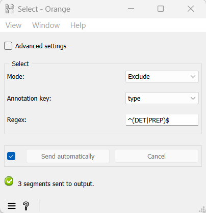

XML annotation-based selection using a regex
===================================================

Another common way of exploiting annotations consists in using them to
select the segments that will be in-/excluded by an instance of
:doc:`Select <select>`
(see :doc:`Filtering segmentations using regexes <filtering_segmentations_regexes>`)
or :doc:`Intersect <intersect>`
(see :doc:`Using a segmentation to filter another <using_segmentation_filter_another>`).
Thus, in the case of the XML data example introduced
:doc:`here <converting_xml_markup_annotations>`
(and further developed
:doc:`there <merging_units_annotations>`),
we might insert an instance of
:doc:`Select <select>`
between those of :doc:`Extract XML <extract_xml>`
and
:doc:`Count <count>`
(see :ref:`figure 1 <annotation_based_selection_fig1>`
below) in order to include only “content words”.

.. _annotation_based_selection_fig1:

  Figure 1: Inserting an instance of :doc:`Select <select>` to filter a segmentation.

In this simplified example, the :doc:`Select <select>`
instance could thus be parameterized (as indicated on :ref:`figure 2 <annotation_based_selection_fig1>`
below), so as to exclude (**Mode: Exclude**) those segments whose
annotation value for key *type* (**Annotation key**: *type*) is *DET* or
*PREP* (**Regex:** ``^(DET|PREP)$``).

.. _annotation_based_selection_fig2:

  Figure 2: Excluding segments based on annotation values with :doc:`Select <select>`.

See also
-----------------

- :doc:`Textable's Basics: Using a segmentation to filter another <using_segmentation_filter_another>`
- :doc:`Advanced Topics: Converting XML markup to annotations <converting_xml_markup_annotations>`
- :doc:`Advanced Topics: Merging units with annotations <merging_units_annotations>`
- :doc:`Advanced Topics: Filtering segmentations using regexes <filtering_segmentations_regexes>`
- :doc:`Reference: Select widget <select>`
- :doc:`Reference: Intersect widget <intersect>`
- :doc:`Reference: Extract XML widget <extract_xml>`
