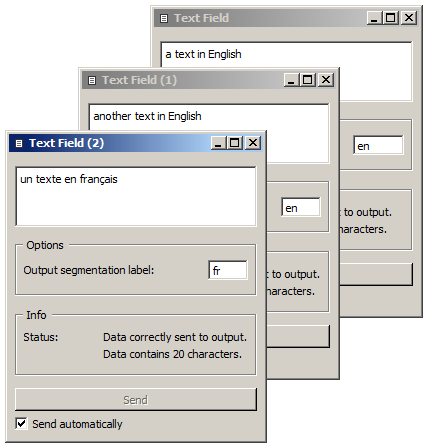
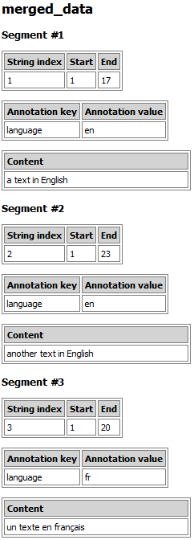

.. meta::
   :description: Orange Textable documentation, annotating by merging
   :keywords: Orange, Textable, documentation, annotation, merge

Annotating by merging
=====================

Widget :ref:`Merge` makes it possible to convert the labels of its input
segmentations into annotation values. Suppose for instance that three
instances of :ref:`Text field` have been created: two instances containing a
text in English, and one containing a text in French. We might want to merge
these three segmentations into a single one, where each segment would be
associated with an annotation whose key is *language* and whose value is
either *en* or *fr*. The first step would then be to indicate in the label of
each :ref:`Text field` instance the desired annotation value for this text, as
shown on :ref:`figure 1 <annotating_merging_fig1>` below.

.. _annotating_merging_fig1:

    Figure 1: Specifying annotations values using the label of :ref:`Text Field` instances.

The three instances of :ref:`Text field` should then be connected to an
instance of :ref:`Merge` as shown on :ref:`figure 2 <annotating_merging_fig2>`
below.

.. _annotating_merging_fig2:

.. figure:: figures/merge_annotations_example_schema.png
    :align: center
    :alt: Creating annotations with Merge

    Figure 2: Example schema for creating annotations with :ref:`Merge`.

One must still specify, in the interface of :ref:`Merge`, the annotation key
to which values *en* and *fr* should be associated. This can be done by
entering the string *language* in field **Import labels with key**, having
previously ensured that labels would actually be converted into annotation
values by checking the box at the left of this line (see :ref:`figure 3
<annotating_merging_fig3>` below).

.. _annotating_merging_fig3:

.. figure:: figures/merge_annotations_example.png
    :align: center
    :alt: Importing labels as annotation values with Merge

    Figure 3: Importing labels as annotation values with :ref:`Merge`.

The result of these operations can be viewed using an instance of
:ref:`Merge`, whose output is shown on
:ref:`figure 4 <annotating_merging_fig4>` below. Note that for each segment in
the merged segmentation, an annotation value *en* or *fr* associated with key
*language* is displayed between the segment's address and its content.

.. _annotating_merging_fig4:

    Figure 4: Annotations created with :ref:`Merge`.

See also
--------

* :ref:`Reference: Text Field widget <Text Field>`
* :ref:`Reference: Merge widget <Merge>`
