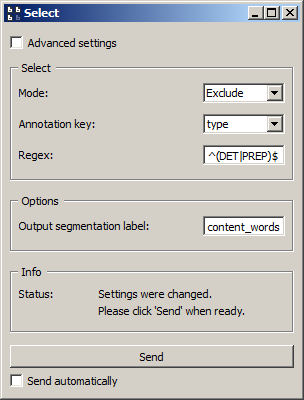

.. meta::
   :description: Orange Textable documentation, annotation-based selection
   :keywords: Orange, Textable, documentation, annotation, selection

Annotation-based selection
==========================

Another common way of exploiting annotations consists in using them to select
the segments that will be in-/excluded by an instance of :ref:`Select` (see
:doc:`Partitioning segmentations <partitioning_segmentations>`) or
:ref:`Intersect` (see
:doc:`Using a segmentation to filter another <using_segmentation_filter_another>`).
Thus, in the case of the XML data example introduced
:doc:`here <converting_xml_markup_annotations>` (and further developed
:doc:`there <merging_units_annotations>`), we might insert an instance of
:ref:`Select` between those of :ref:`Extract XML` and :ref:`Count` (see
:ref:`figure 1 <annotation_based_selection_fig1>` below) in order to include
only "content words".

.. _annotation_based_selection_fig1:

.. figure:: figures/annotation_based_selection_schema.png
    :align: center
    :alt: Inserting an instance of Select to filter a segmentation
    :scale: 80%

    Figure 1: Inserting an instance of :ref:`Select` to filter a segmentation.

In this simplified example, the :ref:`Select` instance could thus be
parameterized as indicated on :ref:`figure 2
<annotation_based_selection_fig1>` below), so as to exclude (**Mode:
Exclude**) those segments whose annotation value for key *type* (**Annotation
key**: *type*) is *DET* or *PREP* (**Regex:** ``^(DET|PREP)$``).

.. _annotation_based_selection_fig2:

    Figure 2: Excluding segments based on annotation values with :ref:`Select`.

See also
--------

* :doc:`Getting started: Partitioning segmentations
  <partitioning_segmentations>`
* :doc:`Getting started: Using a segmentation to filter another
  <using_segmentation_filter_another>`
* :doc:`Getting started: Converting XML markup to annotations
  <converting_xml_markup_annotations>`
* :doc:`Getting started: Merging units with annotations
  <merging_units_annotations>`
* :ref:`Reference: Select widget <Select>`
* :ref:`Reference: Intersect widget <Intersect>`
* :ref:`Reference: Extract XML widget <Extract XML>`
* :ref:`Reference: Count widget <Count>`
