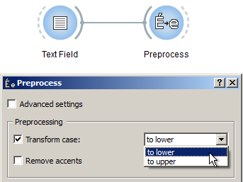

.. meta::
   :description: Orange Textable documentation, cookbook, convert text to
                 lower or upper case
   :keywords: Orange, Textable, documentation, cookbook, convert, text,
              lower case, upper case

Convert text to lower or upper case
===================================

Goal
----

Convert text to lower or upper case.

Prerequisites
-------------

Some text has been imported in Orange Textable (see :ref:`Cookbook: Text input
<cookbook_toc_text_input_ref>`) and possibly further processed (see
:ref:`Cookbook: Segmentation manipulation
<cookbook_toc_segmentation_manipulation_ref>`).

Ingredients
-----------

  ==============  =======
   **Widget**      :ref:`Preprocess`
   **Icon**        |preprocess_icon|
   **Quantity**    1
  ==============  =======

.. |preprocess_icon| image:: figures/Preprocess_36.png

Procedure
---------

.. _convert_text_lower_upper_case_fig1:

   Figure 1: Convert text to lower or upper case with an instance of 
   :ref:`Preprocess`.

 
1. Create an instance of :ref:`Preprocess` on the canvas.
2. Drag and drop from the output connection (righthand side) of the widget
   instance that emits the segmentation to be modified (e.g.
   :ref:`Text Field`) to the :ref:`Preprocess` instance's input connection
   (lefthand side).
3. Open the :ref:`Preprocess` instance's interface by double-clicking on its
   icon on the canvas.
4. In the **Processing** section, tick the **Transform case** checkbox.
5. Choose **to lower** or **to upper** in the drop-down menu on the right.
6. Click the **Send** button (or make sure the **Send automatically**
   checkbox is selected).
7. A segmentation containing the modified text is then available on the
   :ref:`Preprocess` instance's output connections; to display or export it,
   see :ref:`Cookbook: Text output <cookbook_toc_text_output_ref>`.

See also
--------

* :ref:`Reference: Preprocess widget <Preprocess>`
* :ref:`Cookbook: Text input <cookbook_toc_text_input_ref>`
* :ref:`Cookbook: Segmentation manipulation
  <cookbook_toc_segmentation_manipulation_ref>`
* :ref:`Cookbook: Text output <cookbook_toc_text_output_ref>`

