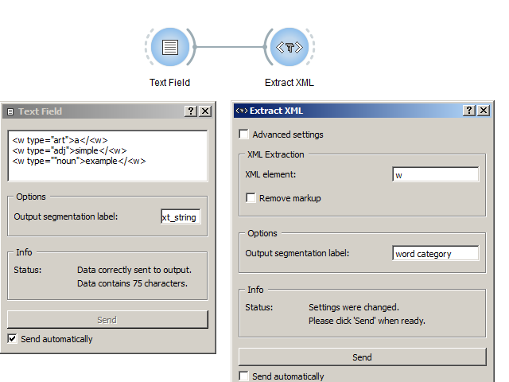

.. meta::
   :description: Orange Textable documentation, convert XML tags into Orange 
                 Textable annotations
   :keywords: Orange, Textable, documentation, cookbook, convert, XML, tags,
              markup, annotations

Convert XML tags into Orange Textable annotations
=================================================

Goal
----

Convert XML markup into Orange Textable data structures such as segments and
their annotations.

Prerequisites
-------------

Some text containing XML markup has been imported in Orange Textable (see
:ref:`Cookbook: Text input <cookbook_toc_text_input_ref>`) and possibly
further processed (see :ref:`Cookbook: Segmentation manipulation
<cookbook_toc_segmentation_manipulation_ref>`).

Ingredients
-----------

  ==============  =================== 
   **Widget**      :ref:`Extract XML` 
   **Icon**        |extract_xml_icon|  
   **Quantity**    1               
  ==============  ===================

.. |extract_xml_icon| image:: figures/ExtractXML_36.png

Procedure
---------

.. _convert_XML_tags_into_Orange_Textable_annotations_fig1:

         Extract XML
   :scale: 80%

   Figure 1: Convert XML tags into Orange Textable annotations with an
   instance of :ref:`Extract XML`

1. Create an instance of :ref:`Extract XML` on the canvas.
2. Drag and drop from the output connection (righthand side) of the widget
   instance that emits the data containing XML markup (e.g. :ref:`Text Field`)
   to the :ref:`Extract XML` widget instance's input connection (lefthand
   side).
3. Open the :ref:`Extract XML` instance's interface by double-clicking on its
   icon on the canvas.
4. In the **XML Extraction** section, insert the desired **XML element** 
   (here ``w``).
5. Click the **Send** button (or make sure the **Send automatically**
   checkbox is selected).
6. A segmentation containing a segment for each occurrence of the specified
   tag is then available on the :ref:`Segment` instance's output connections;
   to display or export it, see :ref:`Cookbook: Text output
   <cookbook_toc_text_output_ref>`.

 
Comment
-------

* The XML tags that have been retrieved are actually discarded from the
  resulting segmentation: only their content is included in the output.
* The attributes of the XML tags are automatically converted to annotations
  associated with the created segments.
* Note that it is only possible to extract instances of a single XML element
  type at a time (here ``w``).
* However, it is possible to chain several :ref:`Extract XML` instances in
  order to successively extract instances of different XML elements. For
  example, a first instance to extract ``div`` type elements, a second to
  extract ``w`` type elements, and so on. In this case, it is important to
  make sure that the **Remove markup** option is *not* selected.

See also
--------

* :doc:`Getting started: Converting XML markup to annotations
  <converting_xml_markup_annotations>`
* :ref:`Reference: Extract XML widget <Extract XML>`
* :ref:`Cookbook: Text input <cookbook_toc_text_input_ref>`
* :ref:`Cookbook: Segmentation manipulation
  <cookbook_toc_segmentation_manipulation_ref>`
* :ref:`Cookbook: Text output <cookbook_toc_text_output_ref>`

