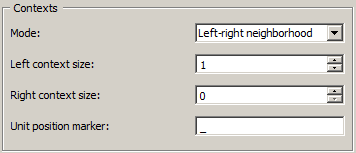

.. meta::
   :description: Orange Textable documentation, counting in specific contexts
   :keywords: Orange, Textable, documentation, count, context, contigency
              table, document-term matrix, term-document matrix

Counting in specific contexts
=============================

Section **Contexts** of widget :ref:`Count`'s interface lets the
user define the *contexts* in which units should be counted. Thus, while
the settings of section **Units** affect the *columns* of the resulting table,
those of section **Contexts** affect its *rows*.

In the example of the :doc:`previous section <counting_segment_types>`,
setting **Mode** to **No context** indicated that units were to be counted
*globally* in the selected segmentation; as a result, the resulting table
contained a single row (aside from the header row). Orange Textable offers
three other modes corresponding to three different definitions of contexts.

.. _counting_specific_contexts_fig1:

.. figure:: figures/count_mode_sliding_window_example.png
    :align: center
    :alt: Interface of widget Count, Sliding window mode

    Figure 1: Interface of widget :ref:`Count`, Sliding window mode.

When **Mode** is set to **Sliding window** (see
:ref:`figure 1 <counting_specific_contexts_fig1>` above), context is defined
as a "window" of *n* consecutive segments which "slides" from the beginning
to the end of the segmentation. In the case of the letter segmentation of
*a simple example* (as obtained with the schema illustrated in
the :doc:`previous section <counting_segment_types>`), setting the number
of segments in the window (**Window size**) to 5 yields the following
successive contexts: *asimp*, *simpl*, *imple*, *mplee*, *pleex*, and so on
(see :ref:`table 1 <counting_specific_contexts_table1>` below). This mode is
useful for studying the evolution of unit frequencies throughout a
segmentation.

.. _counting_specific_contexts_table1:

.. csv-table:: Table 1: Frequency of letters in a "sliding window" of size 5.
    :header: "", *a*, *e*, *i*, *m*, *l*, *p*, *s*, *x*
    :stub-columns: 1
    :widths: 3 3 3 3 3 3 3 3 3

    *1*,    1,    0,    1,    1,    0,    1,    1,    0
    *2*,    0,    0,    1,    1,    1,    1,    1,    0
    *3*,    0,    1,    1,    1,    1,    1,    0,    0
    *4*,    0,    2,    0,    1,    1,    1,    0,    0
    *5*,    0,    2,    0,    0,    1,    1,    0,    1
    *6*,    1,    2,    0,    0,    1,    0,    0,    1
    *7*,    1,    2,    0,    1,    0,    0,    0,    1
    *8*,    1,    1,    0,    1,    0,    1,    0,    1
    *9*,    1,    0,    0,    1,    1,    1,    0,    1
    *10*,   1,    1,    0,    1,    1,    1,    0,    0

When **Mode** is set to **Left-right neighborhood** (see :ref:`figure 2
<counting_specific_contexts_fig2>`), context is defined on the basis of
adjacent segment types occurring to the left and/or right of each position.

.. _counting_specific_contexts_fig2:

    Figure 2: Interface of widget :ref:`Count`, Left-right neighborhood mode.

For instance, setting **Left context size** to 1 and **Right context size**
to 0 amounts to counting the frequency of each segment type given the type
that occurs immediately to its left. This particular table is often called
"transition matrix" (see :ref:`table 2 <counting_specific_contexts_table2>`
below). The string selected in the **Unit position marker** string is used
to indicate the position where units appear in the context. Thus,
:ref:`table 2 <counting_specific_contexts_table2>` shows that both *m* and *s*
appear once immediately to the right of an *a* (i.e. in context *a_*).
To take another example, setting **Right context size** to 2, we would find
that *e* occurs once both in context *l_ex* and *e_xa*.

.. _counting_specific_contexts_table2:

.. csv-table:: Table 2: Frequency of letter (row) to letter (column) transitions.
    :header: "", *a*, *e*, *i*, *m*, *l*, *p*, *s*, *x*
    :stub-columns: 1
    :widths: 3 3 3 3 3 3 3 3 3

    *a_*,    0,    0,    0,    1,    0,    0,    1,    0
    *s_*,    0,    0,    1,    0,    0,    0,    0,    0
    *i_*,    0,    0,    0,    1,    0,    0,    0,    0
    *m_*,    0,    0,    0,    0,    0,    2,    0,    0
    *p_*,    0,    0,    0,    0,    2,    0,    0,    0
    *l_*,    0,    2,    0,    0,    0,    0,    0,    0
    *e_*,    0,    1,    0,    0,    0,    0,    0,    1
    *x_*,    1,    0,    0,    0,    0,    0,    0,    0

Finally, when **Mode** is set to **Containing segmentation**, unit types are
counted whithin the segment types of a second segmentation, as illustrated in
table 2 :ref:`here <segmentations_tables_table2>` (frequency of letters
whithin words). Segment *A* is considered to be contained within segment *B*
if the following three conditions are met:

- A and B refer to the same string (their addresses have the same string index)
- A's initial position is greater than or equal to B's initial position
- A's final position is lesser than or equal to B's initial position

To try this mode out, modify the schema used in the
:doc:`previous section <counting_segment_types>` as illustrated on
:ref:`figure 3 <counting_specific_contexts_fig3>` below.

.. _counting_specific_contexts_fig3:

.. figure:: figures/count_mode_containing_segmentation_example_schema.png
    :align: center
    :alt: Schema for testing the Count widget (Containing segmentation mode)
    :scale: 80 %

    Figure 3: Schema for testing the :ref:`Count` widget (Containing segmentation mode).

The first instance of :ref:`Segment` produces a word segmentation (**Regex:**
``\w+`` and **Output segmentation label:** *words*) which the second instance
(*Segment (1)*) further decomposes into letters (**Regex:** ``\w`` and
**Output segmentation label:** *letters*). The instance of :ref:`Count` is
configured as shown on :ref:`figure 4 <counting_specific_contexts_fig4>`
below. The resulting table is the same as table 2
:ref:`here <segmentations_tables_table2>` (possibly with a different ordering
of columns).

.. _counting_specific_contexts_fig4:

.. figure:: figures/count_mode_containing_segmentation_example.png
    :align: center
    :alt: Interface of widget Count, Containing segmentation mode

    Figure 4: Configuration of widget :ref:`Count` for counting letters in words.

Note that in this mode, checking the **Merge contexts** box still restricts
counting to those units that are contained whithin the segments of another
segmentation, but without treating each context type separately. In the
case of letters whithin words, there is no difference between this mode and
mode **No context** (see :doc:`previous section <counting_segment_types>`).
It does however make a difference in the case of letter bigram counting,
because those bigrams that straddle a word boundary will be excluded in this
case (contrary to what can be seen in table 1
:ref:`here <counting_segment_types_table1>`).

See also
--------

* :doc:`Getting started: Counting segment types <counting_segment_types>`
* :doc:`Getting started: From segmentations to tables <segmentations_tables>`
* :ref:`Reference: Count widget <Count>`
* :doc:`Cookbook: Count unit frequency <count_unit_frequency>`
* :doc:`Cookbook: Count occurrences of smaller units in larger segments
  <count_occurrences_smaller_units_larger_segments>`
* :doc:`Cookbook: Count transition frequency between adjacent units
  <count_transition_frequency_adjacent_units>`
* :doc:`Cookbook: Examine the evolution of unit frequency along the text
  <examine_evolution_unit_frequency>`
